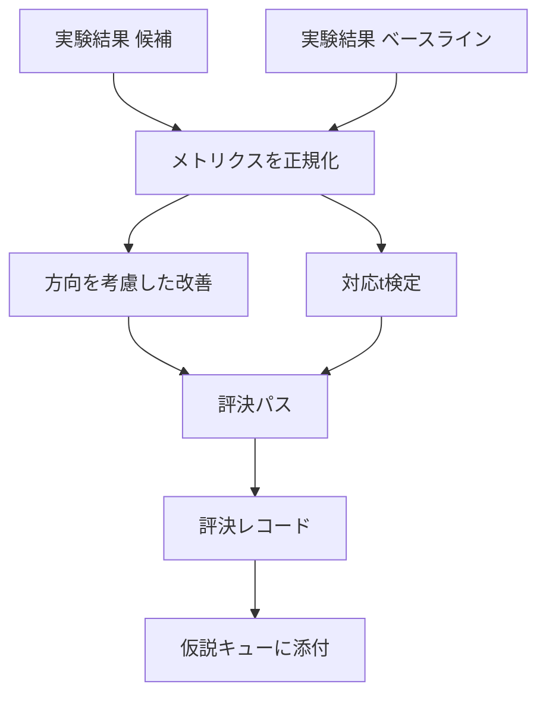

# 結果評価者

> ランナーは数字を出しました。評価者はその数字が改善か後退かノイズかを決定します。メトリクスを1行の結論に変換する評決パスを構築します。


## 学習目標
- 方向を考慮した改善と固定しきい値を使用して候補実行をベースラインと比較する。
- シードごとのメトリクスに対してスクラッチからの対応t検定を実行し、結果のp値を読む。
- ダウンストリームのレポートが線形メトリクスとブレンドできるよう、対数スケールのメトリクスを正規化する。
- オーケストレーターがレッスン50のキューに添付できる仮説ごとの評決を出力する。
- 同じ入力が常に同じ評決を生成するよう、すべてのステップを純粋にする。

## なぜ対応検定か

ランナーからの単一の数字は変化が本物かどうかを示しません。異なるシードでの同じ設定が異なるパープレキシティを与えます。変化はノイズかもしれません。正しい比較は対応です：同じシードで同じデータ、候補で1回とベースラインで1回実行します。各シードが差異を寄与します。それらの差異の平均が効果です。それらの差異の標準誤差がノイズフロアです。

レッスンはテストをスクラッチから実装します。`scipy.stats`はありません。数学は1スクリーンで読めるほど小さいです。

```text
diffs    = [a_i - b_i for i in seeds]
mean     = sum(diffs) / n
variance = sum((d - mean) ** 2 for d in diffs) / (n - 1)
t_stat   = mean / sqrt(variance / n)
df       = n - 1
p_value  = two_sided_p(t_stat, df)
```

両側p値は正則化された不完全ベータ関数を使います。レッスンはLentz連分数を使う小さな実装をシップします。全体で60行のstdlib数学です。

## 方向を考慮した改善

一部のメトリクスは上がると改善されます（精度、スループット）。他は下がると改善されます（損失、パープレキシティ、ウォールタイム）。評価者は各メトリクスに`direction`フィールドを持ちます。

```text
if direction == "higher_is_better":
    improvement = (candidate - baseline) / abs(baseline)
elif direction == "lower_is_better":
    improvement = (baseline - candidate) / abs(baseline)
```

改善は符号付きです。higher_is_betterメトリクスの負の改善は候補が悪いことを意味します。評決パスは符号と大きさを一緒に読みます。

フラットしきい値（`improvement_threshold=0.02`、2%）が変化が呼び出すのに十分大きいかどうかを決定します。それ以下ではp値に関係なく評決は「ノイズ」です。ループはユーザーが測定できない変化に興味がありません。

## アーキテクチャ



評価者は3つの独立した計算を実行し、評決パスでそれらを結合します。各計算は共有状態のない純粋な関数です。

## 対数正規化

パープレキシティは損失の指数です。損失の0.1の低下はパープレキシティのはるかに大きな低下です。2つの設定間でパープレキシティを直接比較するのは問題ありませんが、1つのレポートで線形メトリクスとブレンドするには正規化が必要です。

レッスンは`scale`フィールドが`"log"`のメトリクスを改善を計算する前に自然対数を取ることで正規化します。しきい値は対数空間で適用されます。パープレキシティの32から28への低下は`log(28) - log(32) = -0.133`で、lower_is_betterメトリクスでは2%のしきい値をはるかに上回ります。

```text
if scale == "log":
    a = log(candidate)
    b = log(baseline)
else:
    a = candidate
    b = baseline
```

`scale="linear"`（デフォルト）のメトリクスは変換をスキップします。同じコードパスが両方を処理します。

## シードごとの対応検定

レッスン52のランナーは実行ごとに1つの最終メトリクスブロブを出力します。対応検定では評価者は候補のシードごとに1つと、ベースラインのシードごとに1つのブロブが必要です。オーケストレーターは候補とベースラインの両方の設定下で複数のシードにわたって同じ実験を実行し、評価者に2つのリスト`ExperimentResult`レコードを渡します。

評価者はシードでペアリングします（シードは`result.metrics["seed"]`に保持されます）そして要求されたメトリクスを歩きます。2つのリスト間でシードが一致しない場合、評価者は`PairingError`を発生させます。オーケストレーターは再実行すべきです。

## Verdictの形状

```text
Verdict
  hypothesis_id          : int
  metric                 : str
  direction              : "higher_is_better" | "lower_is_better"
  scale                  : "linear" | "log"
  candidate_mean         : float
  baseline_mean          : float
  improvement            : float       (符号付き、割合。方向ルールを参照)
  p_value                : float | None  (n < 2の場合None)
  significance_threshold : float
  improvement_threshold  : float
  verdict                : "improved" | "regressed" | "noise" | "failed"
  rationale              : str
```

評決パスは小さな決定テーブルです：

```text
1. 候補結果にterminal != "ok"があれば: verdict = "failed"
2. そうでなければ|improvement| < improvement_thresholdなら: verdict = "noise"
3. そうでなければp_valueがNoneまたはsignificanceより大きければ: verdict = "noise"
4. そうでなければimprovement > 0なら: verdict = "improved"
5. そうでなければ: verdict = "regressed"
```

rationaleはオーケストレーターが仮説IDに対してログできる1行の人間が読めるセンテンスです。

## コードの読み方

`code/main.py`は`MetricSpec`、`Verdict`、`Evaluator`、t統計と不完全ベータヘルパー、決定論的デモを定義します。t検定は純粋なstdlib数学で実装されています。numpyはメトリクスリストを読み平均と分散を計算するためにのみ使われます。

`code/tests/test_evaluator.py`は改善パス、後退パス、ノイズパス（小さい改善）、ノイズパス（低n）、失敗terminalパス、対数正規化パス、既知の参照値に対するt検定、ペアリングエラーをカバーします。

## ここでの位置づけ

レッスン50が仮説キューを生成しました。レッスン51は文献が解決したものをフィルタリングしました。レッスン52は候補とベースラインの設定下でシードにわたって実験を実行しました。レッスン53はそれらの実行を読んで評決を書きます。オーケストレーターは4つを縫い合わせます：

```text
for hypothesis in queue:
    literature = retrieval.search(hypothesis.text)
    if literature_settles(hypothesis, literature):
        attach(hypothesis, verdict="settled")
        continue
    candidates = runner.run_all(specs_for(hypothesis))
    baselines  = runner.run_all(baseline_specs_for(hypothesis))
    metric_spec = MetricSpec("perplexity", direction=LOWER, scale=LOG)
    verdict = evaluator.evaluate(hypothesis.id, metric_spec, candidates, baselines)
    attach(hypothesis, verdict)
```

そのオーケストレーターはこのレッスンにはありません。4つのレッスンは各自が定義するデータクラスを超えたグルーなしに合成されます。
