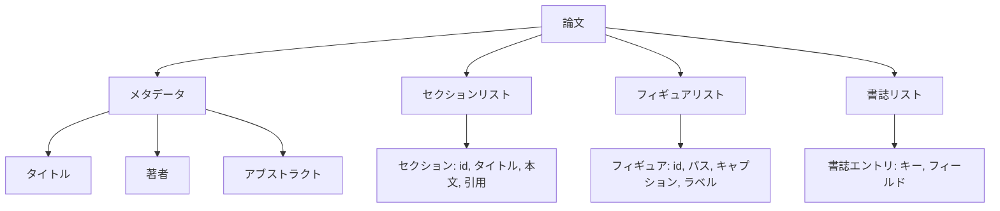
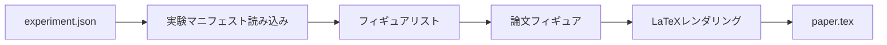
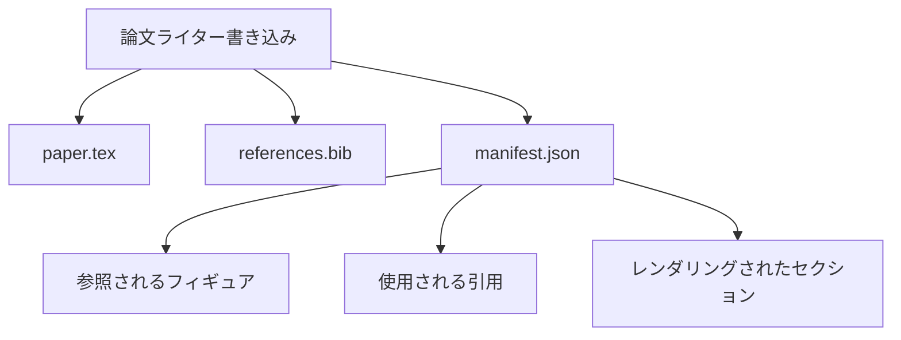

# 論文ライター

> LaTeXスケルトンは研究者と植字工の間の契約です。契約が破れるとドキュメントはコンパイルされず、失敗は大きな声で叫ばれます。まずスケルトンを構築してから埋めます。

## 学習目標

- 研究論文を自由形式のドキュメントではなく、既知のセクショングラフを持つ構造化されたアーティファクトとして扱う。
- アブストラクト、セクション、フィギュアスロット、書誌キーを散文が書かれる前に宣言するLaTeXスケルトンを生成する。
- 確定的なスロットメカニズムを通じて実験出力（パスとキャプション）からフィギュアをスケルトンに注入する。
- モデルなしでハーネスをテスト可能にするため、構造化されたアウトラインから各セクションを埋めるモック散文生成器を組み込む。
- 参照されるすべてのフィギュアと使用されるすべての引用をリストするマニフェストとともに、単一の`paper.tex`と`references.bib`を出力する。

## なぜまずスケルトンか

散文として始まるドラフトは構造的な負債を積み上げます。イントロダクションが関連研究に入れるべき3段落が伸びます。フィギュアが定義前に参照されます。書誌が同じ論文に3つのキーで終わります。著者が気付くころには、書き直しコストが執筆コストより高くなります。

スケルトンはそれを逆転させます。構造はデータとして事前に宣言されます。セクションは名前と順序を持つスロットです。フィギュアはIDとキャプションを持つスロットです。書誌キーは指す項目とともにトップで宣言されます。散文はそれらのスロットに1つずつ生成されます。ハーネスは、散文が書かれる前に、すべてのフィギュアにスロットがあり、すべての引用に項目があり、すべてのセクションが目次に現れることを検証できます。

これは以前のレッスンがプラン、ツール呼び出し、トレースに適用したのと同じ規律です。構造が契約です。

## 論文の形状

すべてのフィールドはプレーンなPythonデータです。レンダラーは`Paper`からLaTeX文字列への純粋な関数です。ハーネスはレンダリング前に論文を内省できます：セクション数、欠けているフィギュアファイルのリスト、すべての`\cite{key}`に一致する`BibEntry`があるかチェック。

## レンダー契約

レンダラーは3つのプロパティを保証します。まず、スケルトンのすべてのフィギュアスロットは`fig:<id>`の形の安定したラベルを持つ`\begin{figure}`ブロックを出力します。次に、すべてのセクションはクロスリファレンスが機能するよう`sec:<id>`の形の安定したラベルを持つ`\section{}`を出力します。3番目に、書誌は`references.bib`が論文に宣言された項目のみを含む（それ以上でも以下でもない）`\bibliography`ブロックを出力します。

これらのいずれかに違反するとレンダーエラーになり、警告ではありません。スケルトンが契約です。サイレントにフィギュアを削除するレンダーは契約違反です。

## 実験からのフィギュア注入

このトラックの以前のレッスンはJSONマニフェストとして実験出力を生成しました。各マニフェストはパスと短いキャプションを持つアーティファクトのリストを持ちます。論文ライターはそのマニフェストを読み`Figure`レコードを生成します。

注入は確定的です。フィギュアIDは実験名と単調カウンターから導出されます。キャプションはマニフェストから来ます。パスは論文の出力ディレクトリに対して正規化され、実験出力がディスク上の別の場所にあってもLaTeXがコンパイルされます。

## モック散文生成器

レッスンはモデルを呼び出しません。`MockProseGenerator`はアウトラインの形状を読んで散文を確定的に出力します。アウトラインの形状はセクションごとの1つの短い文字列です。生成器はその文字列をセクションタイトルが織り込まれた2つの短い段落に展開します。生成された散文はアウトラインが宣言するときにフィギュアと引用を名前で呼び出します。

これはライターのすべての動作をテストするのに十分です。本物の実装では生成器をモデル呼び出しに交換します。その周りのハーネスは変わりません。散文生成器を呼び出し可能として宣言することの価値がそれです。テストは確定的なものを代替し、本番はモデルのものを代替し、パイプラインの残りは同一です。

## マニフェスト出力

ライターは出力ディレクトリに3つのファイルを出力します。

マニフェストはダウンストリームの評価者や批評ループが読むものです。LaTeXをパースしません。マニフェストを読みます。次のレッスンの批評ループはこのマニフェストを入力として取り、フィードバックリストを生成します。だからマニフェストが契約の一部でLaTeXが違う理由です。

## 検証ゲート

ライターはファイルを書く前に4つのゲートを実行します。

1. すべてのフィギュアIDが論文内で一意であること。
2. すべてのセクションの`cites`フィールドが論文で宣言された書誌キーを参照していること。
3. アブストラクトが空でないこと。
4. タイトルが空でないこと。

失敗したゲートは精密な理由を持つ`PaperValidationError`を発生させます。ハーネスはその理由を失敗モードとして表面化します。部分的な書き込みはありません：3つのファイルすべてが出力されるか、何も出力されないかです。

## コードの読み方

`code/main.py`は`Paper`、`Section`、`Figure`、`BibEntry`、`PaperValidationError`、`MockProseGenerator`、`PaperWriter`、`render_latex`関数を定義します。`write`メソッドは出力ディレクトリを取り`paper.tex`、`references.bib`、`manifest.json`を出力します。`read_experiment_manifest`ヘルパーは実験マニフェストのリストを`Figure`レコードに変換します。

`code/tests/test_paper_writer.py`はカバーします：セクションなしのスケルトンレンダー、2セクション2フィギュアを持つフルレンダー、欠けている引用ゲート、重複フィギュアIDゲート、マニフェスト内容、LaTeX文字列契約（すべてのセクションが`\section{}`を出力し、すべてのフィギュアが`\begin{figure}`を出力する）。

## さらに進んで

本物の実装が必要とする2つの拡張。まず、マルチフォーマットレンダー：同じ`Paper`の形状がブログ投稿用Markdownとプレビュー用HTMLにコンパイルされます。レンダラーは`Paper`上のストラテジーになります。次に、引用エンリッチメント：ライターは引用キーからBibTeX項目をフェッチします（DOIのローカルキャッシュがある場合）。どちらも価値を加え、どちらもスケルトン契約に触れずに追加できます。

スケルトンが賭けです。セクション、フィギュア、引用をデータとして宣言し、スロットに散文を生成し、LaTeXとともにマニフェストを出力します。他のすべての改善がその上に合成されます。
