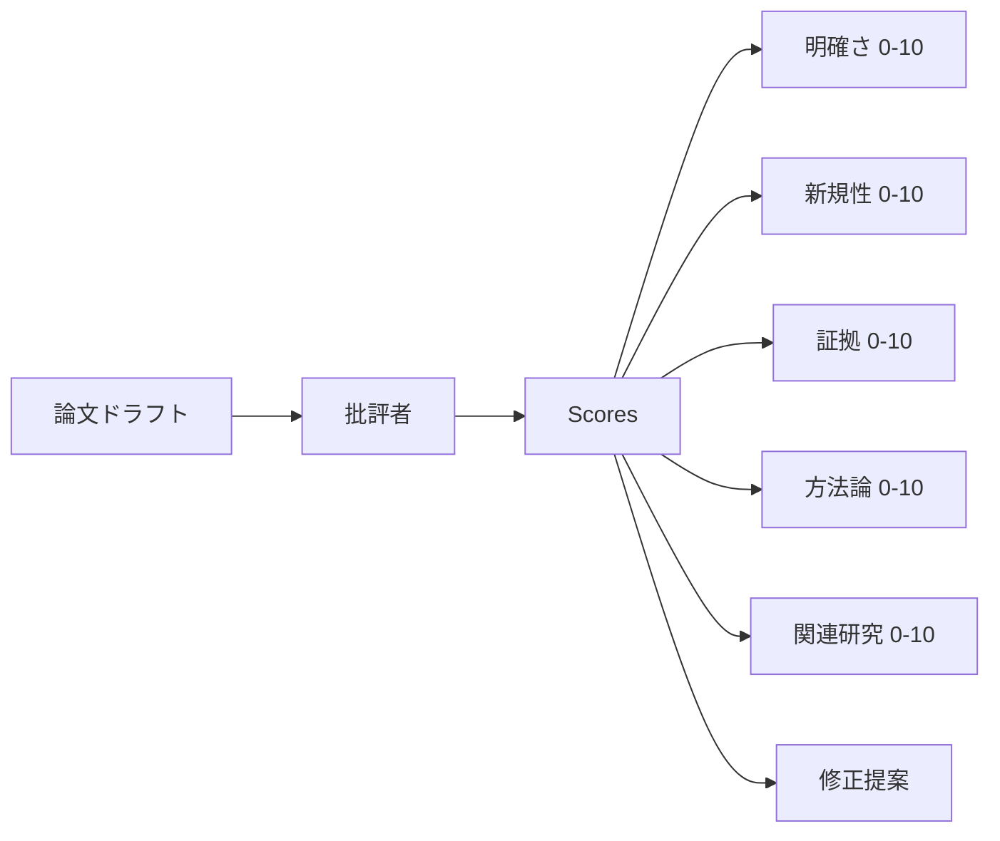
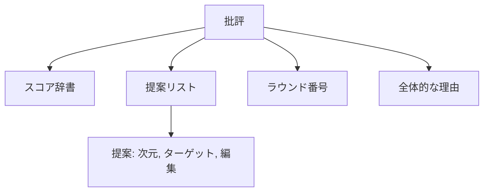
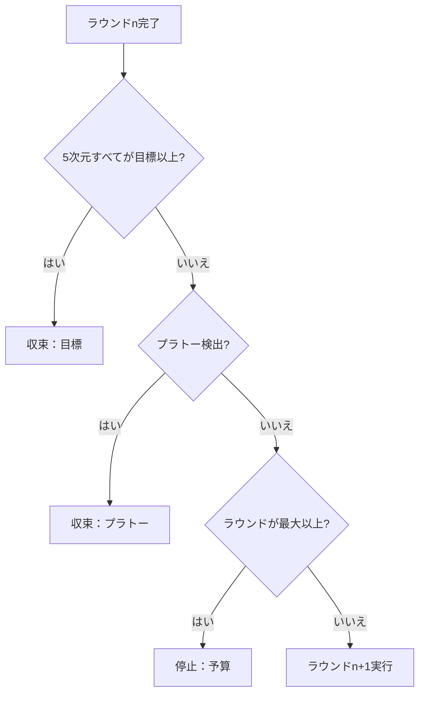
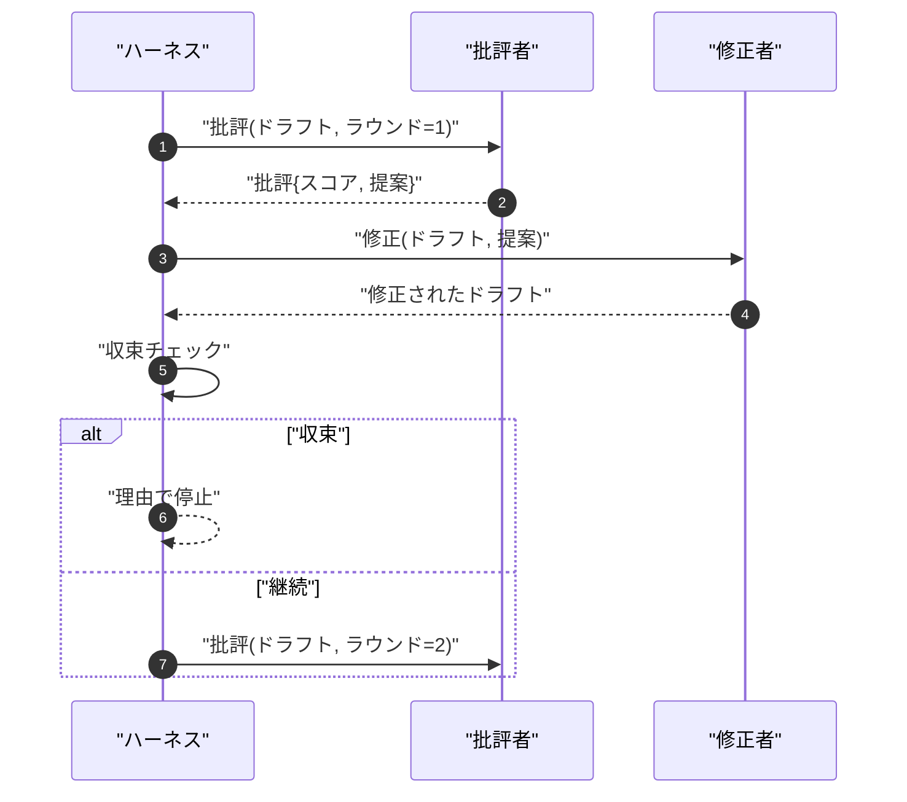

# 批評ループ

> 最初の回で「良く見える」と返す批評者は壊れています。常に「改善が必要」と返す批評者も壊れています。面白い批評者は収束するもので、その収束を設計しなければなりません。


## 学習目標

- 5つの固定された次元で論文ドラフトをスコアリングする：明確さ、新規性、証拠、方法論、関連研究。
- 各ラウンドの批評を自由形式の書き直しではなく構造化された修正差分として適用する。
- ラウンド間でスコアを比較して収束を検出する。プラトー、目標達成、または予算枯渇で停止する。
- 収束しない批評者が永遠に実行されないよう、最大イテレーション予算でラウンドを制限する。
- ダッシュボードまたは次のステージがスコア軌跡をレンダリングできるよう、ラウンドごとのトレースを出力する。

## なぜ5つの固定された次元か

自由形式の批評者は提案の段落を返すモデルです。次のラウンドの修正は段落を周囲のコンテキストとして扱います。書き直しが批評に対応したかどうかは検証不能です。批評に構造がなかったからです。

5つの次元がハーネスに契約を与えます。



スコアはベクトルです。ハーネスはラウンド間で各次元を監視します。明確さを上げるが証拠を下げる修正は証拠のリグレッションであり、収束チェックはそれを見ます。モデルのみの批評者はその保証を提供できません。

## 批評の形状



すべての提案は改善する次元、ターゲットとするセクション、修正者が適用できる`edit`指示を持ちます。修正者も呼び出し可能です。レッスンはedit指示をセクションへの追記操作として解釈する確定的な修正者を搭載しています。モデル駆動の修正者は同じフィールドをプロンプトとして解釈します。契約は変わりません。

## 収束ルール（順番に）

批評ループは3つの条件のいずれかが発動すると終了します。



目標は最も厳しいケースです。5次元すべて（明確さ、新規性、証拠、方法論、関連研究）が`>= target_score`（デフォルト`8.0`）に達するまで、ループは成功を返しません。高い平均で1つの弱い次元があっても不十分です。プラトー検出は現在のラウンドの平均を前のラウンドの平均と比較します。改善が`plateau_epsilon`（デフォルト`0.1`）を下回ることが2連続ラウンドで続くと、ループは`plateau`で終了します。予算はラウンドのハードキャップ（デフォルト`5`）で`budget`で終了します。

順序が重要です。目標はプラトーに勝り、プラトーは予算に勝ります。ラウンド3でプラトーのトリガーも起こりそうな同じイテレーションで目標に達した場合、結果は`plateau`ではなく`target`です。

## プラトー検出が2ラウンドにわたって実行される理由

1ラウンドのプラトーはノイズです。本物の批評者は、確定的なスコアリングでさえも、どの提案がどの順番で適用されたかに依存して各イテレーションで若干異なるスコアを返します。2連続のプラトーラウンドを要求することでそのノイズをフィルタリングします。ハーネスがプラトーを報告した場合、ドラフトは本当に改善が止まっています。

## このレッスンの確定的批評者

レッスンはモデルを呼び出しません。搭載された批評者は3つのシグナルに基づいてドラフトをスコアリングする呼び出し可能です：平均セクション本文長（明確さ）、フィギュア数と引用数（証拠）、論文メタデータの`originality_tag`フィールド（新規性）。修正者は各スコアを上げる方法を知っています。

```text
明確さ    平均セクション本文長が増えると成長
新規性    originality_tagが"high"に設定されると成長
証拠      セクションのfigure_refsが空でないと成長
方法論    "Method"というタイトルのセクションが本文を持つと成長
関連研究  "Related Work"というタイトルのセクションが本文を持つと成長
```

修正者は各提案をターゲットへの追記として解釈します。ラウンド1後、ハーネスはスコアが上がることを観測できます。テストはこのプロパティを使ってループがギャップを減らすことをアサートします。

## 完全なループ契約



ハーネスはラウンドカウンター、トレース、収束チェックを所有します。批評者はスコアを所有します。修正者は差分を所有します。3つのどれも他の状態には触れません。

## トレース出力

すべてのラウンドがラウンド番号、スコアベクトル、提案数、収束評決を持つ1つのトレースイベントを出力します。完全なトレースは最終ドラフトとともに返されます。ダウンストリームのダッシュボードはスコア対ラウンドチャートをレンダリングできます。次のレッスンのイテレーションスケジューラーはトレースを読んでブランチが保持する価値があるかを決定します。

## 悪い批評者から保護する予算

スコアを改善しない提案を生成し続ける批評者はループを最大イテレーション上限にロックします。トレースはそれを見えるようにします：5ラウンド、スコアフラット、評決`budget`。ユーザーはそれを批評者のバグとして読み、ドラフトのバグとしてではありません。代替として最終ドラフトのみを表面化すると診断が隠れます。トレースファーストの設計がそれを表面化します。

## コードの読み方

`code/main.py`は`Critique`、`Suggestion`、`Critic`プロトコル、`Reviser`プロトコル、`CriticLoop`、確定的批評者とマッチング修正者を返す`make_deterministic_critic_pair`ファクトリーを定義します。最小限の`Paper`の形状が含まれているのでレッスンは単独で成立します。

`code/tests/test_critic_loop.py`はカバーします：ラウンド1後の単調な改善、調整されたドラフトでの目標収束、2つのフラットラウンド後のプラトー検出、提案が改善しない場合の予算枯渇、修正者による提案適用、トレース形状。

## さらに進んで

本物の実装が必要とする2つの拡張。まず、次元の重み付け：ワークショップ向けの論文は方法論より新規性を高く重みます。ジャーナルは逆を重みます。収束チェックが加重平均になります。次に、ペア批評者：1人がスコアし、第2の批評者が修正者が見る前に提案を裁定します。どちらも価値を加え、どちらも同じ`Critique`の形状で合成されます。

賭けはスコアベクトルです。批評が構造化されれば、他のすべての改善（収束ルール、ダッシュボード、ペア批評者）がループを変えずに入ります。
