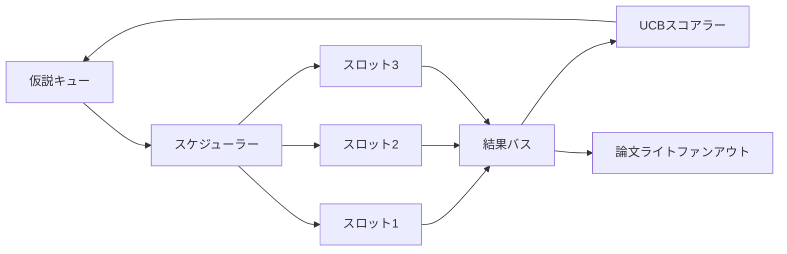
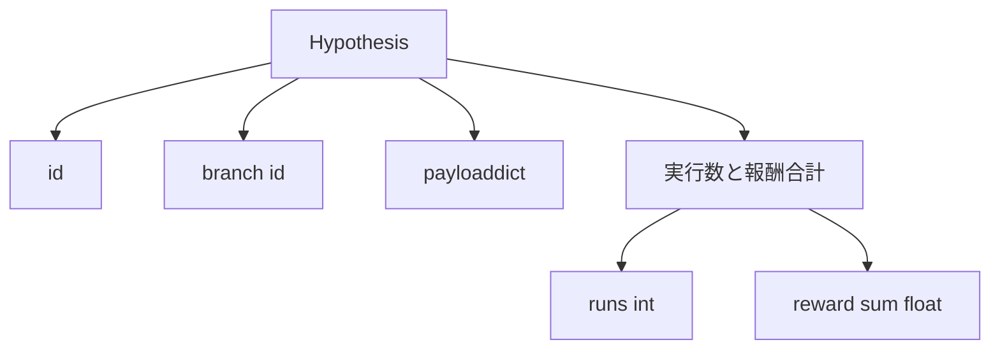
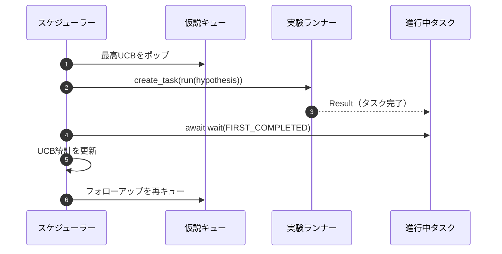

# イテレーションスケジューラー

> スケジューラーのないリサーチループは妄想を持つキューです。スケジューラーはループが何の探索をやめるかを決める場所であり、その決定がすべてのゲームです。


## 学習目標

- リサーチワークフローを、結果がファンバックする並列実験スロットに供給する仮説キューとしてモデル化する。
- スケジューラーがすべてのスロットを常にビジーに保てるよう、asyncioで複数の実験を並行実行する。
- スケジューラーが探索を放棄せずに低収益ブランチを剪定できるよう、UCBで各仮説ブランチをスコアリングする。
- 高収益ブランチがフォローアップ仮説を生み出すよう、完了した結果を論文ライトステージと再キューステージにファンアウトする。
- ブランチスコア、スロット占有率、剪定決定を持つイテレーションごとのトレースを表面化する。

## なぜワークリストではなくスケジューラーか

フラットなワークリストは投稿順にジョブを実行します。各ジョブが独立している場合はそれで問題ありません。リサーチは独立していません：実験3の発見が実験4と5の優先度を変えます。結果のファンインを読んでキューを並び替えるスケジューラーは、計算単位あたりにより有用な作業を完了させます。

興味深い設計上の選択はスコアリングルールです。貪欲なスコアラーは常に現在のリーダーを選び、探索しません。均一なスコアラーは決して活用しません。UCB（上限信頼限界）は中間の道です：試行の少ないブランチのためのキャパシティを確保しながらリーダーを活用します。

## システムの形状



キューは仮説を保持します。スケジューラーはスロットが空いたとき最高UCBの仮説を選びます。各スロットは非同期に実験を実行します。完了した実験はその結果をバスにファンします。バスは起源のブランチのUCB統計を更新し、ブランチの収益が閾値を超えると論文ライトステージにファンアウトします。

## 仮説の形状



`branch`はUCB統計のキーです。複数の仮説がブランチを共有できます（ブランチはリサーチの方向、仮説はその中の1つの試行）。`runs`はそのブランチの完了実験数、`reward_sum`は累積報酬です。UCBは両方を読みます。

## UCBスコアリング

このレッスンで使用されるUCB式はクラシックなUCB1です。

```text
ucb(branch) = mean_reward(branch) + c * sqrt( ln(total_runs) / runs(branch) )
```

`total_runs`はすべてのブランチで完了したすべての実験の数です。`c`は探索の重み；レッスンのデフォルトは`sqrt(2)`です。実行数がゼロのブランチは`+inf`を取るため、未試行のブランチは常に最初にスケジュールされます。高い平均報酬のブランチは他のブランチが追いつくまで高いスコアを保ちます；多くの試行で大した報酬を得ないブランチはより少ない試行の代替に追い越されます。

剪定ゲートはピッカーとは別です。剪定は、少なくとも`prune_after_runs`試行（デフォルト`3`）の後に平均報酬が絶対フロア（デフォルト`0.2`）を下回ると、ブランチを将来のスケジュールから除外します。これによりキューが制限されます。

## asyncioによる並列スロット

スケジューラーは`asyncio.create_task`で実験を駆動します。各タスクは`Result`を返す`async def`呼び出し可能な実験ランナーを実行します。メインループは`asyncio.wait(..., return_when=asyncio.FIRST_COMPLETED)`で進行中のタスクのセットを待機し、各完了時にスコアリング更新を発火します。



3つのスロットが並行実行します。メインループは単一の実験でブロックしません。スケジューラーはキューが空になりかつタスクが進行中でなくなるまで、スロットが空くとすぐに新しいタスクを開始し続けます。

## ファンアウト：論文トリガー

ブランチの平均報酬が`paper_threshold`（デフォルト`0.7`）を超え、そのブランチがまだ論文を生成していない場合、スケジューラーは出力リストに`paper.trigger`イベントをファンします。ダウンストリームではレッスン54の論文ライターがこれを受け取ります。このレッスンではトリガーはリストとして取得されるため、テストでアサートできます。

## ファンアウト：フォローアップ仮説

高収益の結果が着地すると、スケジューラーはユーザーが提供した`expander`を呼び出して同じブランチに1つ以上のフォローアップ仮説を生成します。expanderは`Result`から`list[Hypothesis]`への純粋な関数です。レッスンは報酬が論文閾値を超えた結果に対して2つのフォローアップを生成する確定的なexpanderを搭載しています。

## 予算

2つの予算がスケジューラーを暴走ループから保護します。

```text
max_experiments    : すべてのブランチで実行された実験の合計数
max_seconds        : ウォールクロックキャップ（asyncio時間）
```

いずれかが発動すると、スケジューラーは新しいタスクのスケジュールを停止し、進行中のものを待ち、最終トレースを返します。トレースには`stop_reason`が含まれます。

## トレースと最終レポート

各スケジュール決定（選択、ディスパッチ、結果、剪定、ファンアウト）は1つのイベントを出力します。最終レポートはブランチごとの統計、総実行数、総ウォールクロック、発火した論文トリガーをまとめます。次のレッスン（エンドツーエンドデモ）はこのレポートを読んで論文ライターを駆動します。

## コードの読み方

`code/main.py`は`Hypothesis`、`Result`、`BranchStats`、`IterationScheduler`、そして予測可能な報酬を持つasyncio実験ランナーを返す`make_deterministic_runner`ファクトリーを定義します。ランナーは固定`delay_ms`（デフォルト`5ms`）スリープするため、並行性が観察可能です。

`code/tests/test_scheduler.py`はカバーします：UCBが未試行ブランチを最初に選ぶ、並列スロット占有率、閾値を超えたときの論文トリガー、低収益試行後のブランチ剪定、ファンアウトフォローアップ仮説、予算終了（実験数とウォールクロックの両方）。

## さらに進んで

本物の実装が必要とする3つの拡張。まず、セッション横断の永続UCB統計：現在の統計はメモリに存在します；本物のスケジューラーは再起動が既に消費した探索予算を保持するようにチェックポイントします。次に、多目的スコアリング：スカラー報酬の代わりに各結果がベクトルを出力し、UCBがパレート形式のピッカーになります。3番目に、文脈付きバンディット：ピッカーが仮説の特徴（長さ、複雑さ）を条件とするため、類似の仮説が探索を共有します。

スケジューラーはリサーチがワークリスト以上のものになる場所です。UCBが配線されスロットが並列実行されると、他のすべての改善がその上に合成されます。
