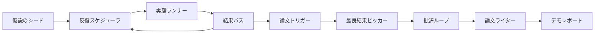
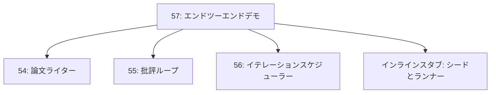
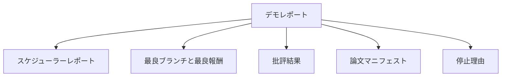

# エンドツーエンド研究デモ

> デモは、これまでに書いたすべてのコントラクトが組み合わさらなければならない場所だ。どれかひとつでも漏れがあれば、デモはそれを教えてくれるレッスンになる。


## 学習目標

- 自動研究ループをエンドツーエンドで繋ぐ：仮説のシード、実験ランナー、スケジューラ、批評ループ、論文ライター。
- Track D の4つの先行レッスンのプリミティブを、フレームワークではなく純粋な Python のインポートで組み合わせる。
- ループを自己終了まで動かし、各ステージの出力を列挙した単一のデモレポートを出力する。
- テストスイートが最終的な形状をアサートできるよう、デモを決定論的に保つ。
- いずれかのステージのコントラクトが壊れたとき、次のステージが壊れた入力で実行されないよう、明確な失敗モードを表示する。

## ここで組み合わさるもの



5つのステージがある。シードは3つの仮説のリストだ。スケジューラは3つの並列スロットで6つの実験を実行する。バスは1つ以上の論文トリガーを報告する。ピッカーは最良の単一結果を選択する。批評ループは、その結果から構築されたドラフトを反復する。論文ライターは最終的な LaTeX、BibTeX、マニフェストを出力する。

## コピーではなくインポートする理由

各先行レッスンには、パブリックなデータクラスと関数を持つ `main.py` が同梱されている。デモは各レッスンの親ディレクトリに `sys.path` を調整することでインポートする。これはフレームワークの配線ではない。先行レッスンのテストファイルがすでに使用している同じインポートだ。



インラインスタブはレッスン50〜53の代わりを務める：仮説シードの小さなジェネレーターと同期報酬関数だ。2つのインポートを調整することで、ユーザーはインラインスタブを各レッスンの本物のプリミティブと入れ替えられる。

## 決定論性の保証

デモは設計上、決定論的だ。実験ランナーはシード済みの numpy だ。批評ループのリバイザーは固定された順序で固定された次元を走査する。論文ライターの散文ジェネレーターはレッスン54のモック版だ。スケジューラの UCB ピッカーは反復順序でタイを解消し、ランダムな選択ではない。

同じシードが与えられれば、デモは同じレポートを出力する。テストはこの性質をデモを2回実行してマニフェストを比較することでアサートする。

## デモレポートの形状



各フィールドは上流ステージからそのまま来る。デモはどの出力も変換しない。組み合わせるだけだ。それがデモの果たすテストだ。

## 失敗モードの処理

各ステージは成功するか、型付きエラーを発生させる。

```text
スケジューラ ........ stop_reason が {queue_empty, max_experiments, deadline}
                   のいずれかである SchedulerReport を返す
最良結果ピック .. 論文トリガーが発火しなかった場合 NoTriggerError を発生させる
批評ループ ...... status が converged または stopped の LoopResult を返す
論文ライター .... コントラクト違反時に PaperValidationError を発生させる
```

いずれかのステージが失敗すると、デモは型付き例外でショートサーキットする。テストはこのコントラクトを固定する：`test_no_triggers_raises_typed_error` と `test_best_picker_raises_when_no_triggers` は、ブランチがトリガーを発火しなかった場合にピッカーが `NoTriggerError` / `BestResultError` を発生させ、ライターが呼び出されないことをアサートする。

## 最良結果ピッカー

スケジューラはブランチごとに論文トリガーを出力する。ピッカーはすべてのトリガーにわたって平均報酬が最も高いブランチを選択する。タイはブランチ ID のアルファベット順で解消され、デモが決定論的になる。ピッカーは小さな純粋関数であり、テストは固定されたスケジューラレポートで固定する。

## 批評ループの配線

レッスン55の批評ループは `MiniPaper` 上で動作する。デモは、ブランチ ID で abstract を埋め、2つのセクション（Introduction と Results）をシードし、ブランチの平均報酬から `originality_tag` を設定する（`>= 0.8` なら high、`>= 0.6` なら medium、それ以外なら low）ことで、選択されたブランチから `MiniPaper` を構築する。

リバイザーはその後、ドラフトを収束まで反復する。出力は論文ライターに渡される。

## 論文ライターの配線

レッスン54の論文ライターは、図と参考文献を持つ完全な `Paper` 形状で動作する。デモは収束済みの `MiniPaper` を `mini_to_full_paper` を通して更新する。この関数は選択されたブランチの図を1つ付加し、批評が提案した cite キーの和集合から構築された小さな合成参考文献を追加する。デモが追加するすべての cite は参考文献リストにも追加されるので、バリデーションは通過する。

## コードの読み方

`code/main.py` は `BestResultError`、`NoTriggerError`、`DemoReport`、`pick_best_branch`、`build_mini_paper`、`mini_to_full_paper`、`run_demo` を定義する。先頭のインポートは `sys.path` を一度だけ調整し、各レッスンから `PaperWriter`、`CriticLoop`、`IterationScheduler` を引き込む。

`code/tests/test_e2e.py` は以下をカバーする：デモがエンドツーエンドで実行されて5つのフィールドすべてが埋まったレポートを出力すること、2回の実行での決定論性、ブランチが閾値を超えなかった場合の NoTriggerError、ライターのコントラクトが壊れた場合の PaperValidationError、論文マニフェストに選択されたブランチの図が含まれること、スケジューラの stop_reason が期待値のいずれかであること。

## さらに先へ

デモが green になったら試す価値のある3つの拡張。第一に永続状態：各ステージの結果を小さな JSON ストアに書き込み、安価なステージを再実行せずに再起動できるようにする。第二にダッシュボード：スケジューラと批評ループのトレースイベントを単一のタイムラインとしてレンダリングする。第三にリアルなモデル呼び出し：モックされた散文ジェネレーターと決定論的な批評をモデル駆動のものに入れ替える。配線は変わらない。

デモの仕事は、合成がアーキテクチャであることを証明することだ。5つのレッスン、4つのインポート、1つのレポート。次にステージを追加するとき、配線は正確に1行増える。
