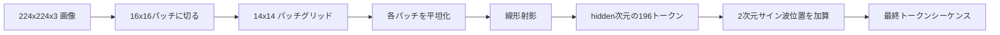

# ビジョンエンコーダーパッチ

> ピクセルを読むビジョンモデルには、ピクセルのトークナイザーが必要だ。パッチ埋め込みがそのトークナイザーだ。画像を正方形のグリッドに切り、各正方形を平坦化し、1つの線形層で射影し、元の画像における各正方形の位置をトランスフォーマーが把握できるよう2次元の位置シグナルを加える。


## 学習目標

- 画像を固定長のパッチ埋め込みシーケンスにトークナイズする。
- `Conv2d` ベースのパッチ射影を実装し、アンフォールド→線形の数学と一致させる。
- トークン順序が空間位置をエンコードするよう、決定論的な2次元サイン波位置埋め込みを構築する。
- 合成フィクスチャでパッチ数、埋め込み形状、`Conv2d`/アンフォールドの等価性を検証する。

## 問題

トランスフォーマーはベクトルのシーケンスを入力とする。画像は3チャンネルのグリッドだ。各ピクセルを1トークンとして読むとシーケンス長が爆発する。224x224 の RGB 画像は 150,528 トークンになり、12層のトランスフォーマーはアテンションで対処できない。画像を1つの巨大な平坦ベクトルとして読むと局所性が失われ、アテンション層はそれを回復できない。エンコーダーフロントエンドの仕事は、ピクセルグリッドを各正方形領域を要約した数百トークンに圧縮することだ。

パッチ埋め込みは1つの線形射影でこれを解決する。224x224 の画像を 16x16 のパッチに切ると、196個のパッチからなる 14x14 グリッドになる。各パッチは `(3, 16, 16) = 768` ピクセル値から1つのベクトルに平坦化され、線形層がそれをモデルの隠れ次元にマッピングする。トランスフォーマーは、次元 `hidden`（通常は768）の 196 トークンに加え CLS トークンを見る。これがネットワーク残りが処理できるシーケンスだ。

## コンセプト



### ピクセルではなくパッチを使う理由

アテンションはシーケンス長について二乗の計算量を要する。196トークンのシーケンスは1ヘッド1層あたり `196 * 196 = 38,416` のアテンションスコアを要する。150,528トークンのシーケンスは `150,528 * 150,528 = 226億` を要する。パッチはアテンション計算を 590,000 倍削減し、16x16 の領域は高レベルなビジョンタスクに十分なシグナルを持つ。コストは、1パッチ内の細粒度な空間的詳細の損失だ。このため、下流のマルチモーダルスタックは細かい局所化が重要な場合に二番目の高解像度ブランチを実行することが多い。

### 線形射影で十分な理由

各パッチは独立したベクトルとして扱われる。射影は基底を学習する：エッジ検出器、カラーフィルタ、単純なテクスチャ。1つの線形層は小さく（ViT-Base で `768 * 768 = 589,824` パラメーター）、高速に訓練できる。より深い畳み込みステム（「ハイブリッド」ViT）も存在するが、フラットな線形射影が標準であり、最新のオープンウェイトエンコーダーのほとんどがこの形状を採用している。

### `Conv2d` トリック

`Conv2d(in_channels=3, out_channels=hidden, kernel_size=patch_size, stride=patch_size)` にパディングなしを指定すると、各出力位置がパッチピクセルと1つのフィルターの内積を計算するため、アンフォールド→線形と数値的に同じ結果が得られる。畳み込みがパッチ射影であり、多くのプロダクションコードベースはGPUでより高速で、リシェイプが1つ少ないためこの方法を採用している。

### 位置埋め込み

トークンは射影から順序を持たない。2次元サイン波埋め込みは、各トークンに `(行, 列)` の位置をエンコードする固定シグナルを与える。埋め込み次元の半分が複数の周波数で行位置をsin/cosでエンコードし、残りの半分が列位置をエンコードする。エンコーディングは決定論的なので解像度を変えても再訓練不要で、訓練時に見たことのないグリッドにもきれいに補間できる。

| コンポーネント | 形状 | パラメーター数 |
|-----------|-------|------------|
| パッチ射影（`Conv2d`） | `(hidden, 3, patch, patch)` | `3 * P * P * hidden + hidden` |
| 位置埋め込み（固定） | `(num_patches, hidden)` | 0（計算済み、学習しない） |
| CLSトークン（学習済み） | `(1, hidden)` | `hidden` |

224解像度の ViT-Base/16 では、射影に 590,592 パラメーター、CLSトークンに 768、サイン波位置にゼロ。次のレッスン（59）ではこのフロントエンドの上に12層のトランスフォーマーを積む。

### 健全性チェックとしての等価性

パッチステップには2つの表現がある：`Conv2d` 射影と明示的なアンフォールド→線形だ。同じ重みで同じ出力を生成しなければならない。そうでなければアンフォールドの数学が間違っており、エンコーダーの残りは砂の上に構築されることになる。このレッスンのテストはその等価性を検証する。

## 実装する

`code/main.py` が実装するもの：

- `PatchEmbed`：パッチ射影のための `Conv2d` をラップする `nn.Module`。
- `sinusoidal_2d(grid_h, grid_w, dim)`：2次元位置テーブルを構築するステートレス関数。
- `VisionFrontEnd`：パッチ埋め込み、CLS の先頭付加、位置加算を1つのフォワードパスに合成する。
- `synthesize_image(seed)`：`numpy.random` から決定論的な 224x224x3 フィクスチャを構築するヘルパー。
- フロントエンドを通じて1つのフィクスチャ画像を実行し、出力形状、CLSトークンノルム、位置埋め込みの1行を表示するデモ。

実行方法：

```bash
python3 code/main.py
```

出力：224x224 のフィクスチャは `(1, 197, 768)` 形状のシーケンスにトークナイズされる。最初のトークンはCLS、次の196がパッチトークンだ。位置埋め込みノルムは各行内で均一で、これがサイン波の特徴だ。

## 使ってみる

同じパッチフロントエンドはすべての最新ビジョン言語モデルに登場する：CLIP ViT-L/14、SigLIP、DINOv2、Qwen-VL ファミリー、InternVL スタックはすべて `Conv2d` パッチ射影と位置シグナルから始まる。ファミリー間の違いは下流にある（CLS対ノーCLSプーリング、レジスタートークン、14対16の異なるパッチサイズ、補間位置による動的解像度）。このレッスンのフロントエンドは、それらのモデルすべての基盤だ。

## テスト

`code/test_main.py` がカバーするもの：

- パッチ数が `(image_size / patch_size) ** 2` に一致する
- 出力形状が `(batch, num_patches + 1, hidden)` に一致する
- `Conv2d` 射影が小さなフィクスチャで手動のアンフォールド→線形と等しい
- サイン波位置テーブルが呼び出し間で決定論的
- CLSトークンがリークなくバッチ次元にブロードキャストする

実行方法：

```bash
python3 -m unittest code/test_main.py
```

## 演習

1. サイン波位置を学習済みの `nn.Parameter` で置き換え、小さな合成分類タスクで最初のエポックの損失を比較する。固定解像度では学習済み位置が勝つ。訓練後に解像度を変えるとサイン波が勝つ。

2. `Conv2d` を明示的な `nn.Unfold` と `nn.Linear` で置き換え、出力が浮動小数点の許容誤差内で一致することをアサートする。同じ数学、2つの表現方法。

3. 非正方形パッチサイズ（例：幅広画像入力用の32x16）のサポートを追加し、位置テーブルが非正方形グリッドを処理することを確認する。

4. バッチサイズ 1、8、64 でパッチステップをプロファイルする。パッチ射影がボトルネックになることはほとんどなく、下流のアテンション層が支配する。

5. フロントエンドを4クラス合成形状データセット（円、正方形、三角形、星）のフリーズされた特徴抽出器として訓練する。CLSトークン出力が線形分離可能になるはずだ。

## キーワード

| 用語 | 意味 |
|------|---------------|
| パッチ | 画像の正方形部分領域、通常は14x14または16x16 |
| パッチ埋め込み | 平坦化された1パッチを隠れ次元に線形射影したもの |
| シーケンス長 | パッチトークナイゼーション後のトークン数、通常はCLSを加える |
| サイン波位置 | 2Dグリッド座標をエンコードする固定のsin/cosシグナル |
| CLSトークン | プーリングヘッドとしてシーケンスの先頭に付加される学習済みベクトル |

## 参考資料

- An Image is Worth 16x16 Words（ViT、2021年）：元のパッチ埋め込みのフレーミングについて。
- Attention Is All You Need（2017年）：ここで2Dに適応されたサイン波位置の公式について。
- DINOv2 論文：演習6として追加できる拡張であるレジスタートークンについて。
