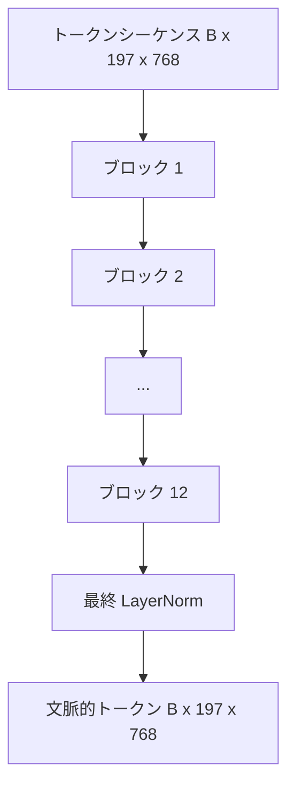

# ビジョントランスフォーマーエンコーダー

> パッチだけでは見えない。12ヘッドの pre-LN トランスフォーマーを12層積むことで、パッチトークンのシーケンスを文脈的なトークンのシーケンスに変換し、CLSトークンが最終隠れ状態に画像全体の特徴をプーリングする。このレッスンは、すべての最新ビジョン言語モデルのエンジンルームだ。


## 学習目標

- マルチヘッド自己アテンションとフィードフォワードサブレイヤーを持つ pre-LN トランスフォーマーブロックを実装する。
- 12ブロックを12ヘッドで積み重ねて ViT-Base エンコーダーを形成する。
- レッスン58のパッチフロントエンドをエンコーダーに繋いでフォワードパスを実行する。
- CLSトークンがすべてのパッチから情報を集約することを検証する。

## 問題

パッチ埋め込みは197トークンのシーケンスを生成するが、各トークンは他のパッチを認識していない。猫の画像では、すべてのパッチがひげを含むパッチ、背景を含むパッチ、目を含むパッチを把握する必要がある。トランスフォーマーはアテンション層を一つずつ重ねることでその認識を構築するメカニズムだ。これがなければ、パッチフロントエンドは理解のない巧みなトークナイザーに過ぎない。

標準的なレシピは、pre-LayerNorm の配置、GELU 活性化、4倍のフィードフォワード展開を持つ、12ブロック深さ・12ヘッド幅だ。そのレシピは CLIP ViT-L、SigLIP、DINOv2、Qwen-VL ファミリー、InternVL、2025〜2026年の他のすべてのオープンウェイトビジョンエンコーダーの背骨だ。このレシピは、明示的に別の形状を述べていない限り、これらの論文のいずれかを読んだ際にこのブロック形状と仮定できるほど安定している。

## コンセプト




### Pre-LN 対 Post-LN

元のトランスフォーマーは残差の後に LayerNorm を配置した。Pre-LN（各サブレイヤーの前に LayerNorm）は、学習率ウォームアップなしに安定して訓練できるため、すべての最新ビジョン言語モデルが使用するバージョンだ。フォワードパスの1行の違いだが、深さ12以上での勾配フローは天地の差だ。

### マルチヘッド自己アテンション

各ヘッドはトークンベクトルを独自の次元 `head_dim = hidden / num_heads` の `(クエリ、キー、バリュー)` トリプルに射影する。`hidden = 768`、`heads = 12` では、各ヘッドは `dim = 64` を持つ。12ヘッドが並列でアテンションし、その出力を連結して次元768に戻し、出力射影を通す。マルチヘッドの意義は、1つのヘッドが「猫の目にアテンション」を学習し、別のヘッドが「背景グラデエントにアテンション」を学習でき、互いに干渉しないことだ。

### 4倍フィードフォワード展開の理由

FFN は `hidden -> 4 * hidden -> hidden` と GELU を中間に挟む。係数4は経験的なもので、2017年以来、言語と視覚のトランスフォーマーを通じて維持されている。小さすぎる（2倍）と適合不足、大きすぎる（8倍）と固定データ予算でオーバーフィットする。MLPはモデルが学習した事実のほとんどを格納する場所であり、広い中間層がその場所だ。

| コンポーネント | ViT-Base スケールのパラメーター数 |
|-----------|------------------------------|
| 各ブロックのqkv射影 | `3 * 768 * 768 = 1.77M` |
| 各ブロックの出力射影 | `768 * 768 = 590K` |
| 各ブロックのFFN（4倍展開） | `2 * 768 * 4 * 768 = 4.72M` |
| 各ブロックの LayerNorm | `4 * 768 = 3K` |
| 各ブロック合計 | 約7.1M |
| 12ブロック | 約85M |
| フロントエンドを加えると | 合計約86M |

ViT-Base は86Mパラメーターのエンコーダーだ。2026年の基準では小さい（SigLIP-So400M は400M、Qwen-VL ViT は675M）が、アーキテクチャは幅と深さを除いて同一だ。

### 因果マスクの有無

ビジョントランスフォーマーはエンコーダーのみで双方向だ。トークン `i` は任意のペアのトークン `j` にアテンションできる。マスクなし。レッスン61のデコーダー側のクロスアテンションは因果マスクを使用するが、ビジョンエンコーダー内では、アテンションは完全に接続されている。

### CLSトークンが学習するもの

CLSトークンは学習済みパラメーターとして始まり、独自のパッチコンテンツを持たず、すべてのブロックのアテンションを通じて情報を蓄積する。最終層までに、CLS 行は画像全体のベクトルサマリーとなる。下流ヘッドはこの単一ベクトルをクラスロジット、コントラスティブ埋め込み、テキストデコーダーのクロスアテンションキーに射影する。

## 実装する

`code/main.py` が実装するもの：

- `MultiHeadSelfAttention`：`qkv` と出力射影、スケール付きドット積アテンションの数学、形状アサートを持つ。
- `FeedForward`：4倍展開の GELU MLP。
- `Block`：残差付きでアテンションとフィードフォワードサブレイヤーを組み合わせた pre-LN ブロック。
- `ViT`：最終 LayerNorm を持つ12ブロックのスタック。
- `VisionEncoder`：レッスン58の `VisionFrontEnd` を `ViT` スタックに繋ぎ、文脈的シーケンスとプーリングされた CLS ベクトルを返す `forward()` を公開する。
- 合成された 224x224 フィクスチャ画像を全エンコーダーに通し、入力形状、出力形状、パラメーター数、1つおきの層でのCLSノルムを表示するデモ。

実行方法：

```bash
python3 code/main.py
```

出力：フィクスチャは `(1, 197, 768)` テンソルにエンコードされる。CLSノルムは層が積み重なるにつれて上昇し、最終 LayerNorm で安定する。パラメーター数は約86Mと報告される。

## 使ってみる

ここで定義されたエンコーダーは、幅と深さを除いて、2025〜2026年のすべてのオープンウェイト VLM に搭載された同じブロックスタックだ。違いは以下にある：

- **幅と深さ。** ViT-Large は `hidden=1024, depth=24, heads=16`。SigLIP So400M は `hidden=1152, depth=27, heads=16`。同じブロック。
- **プーリングヘッド。** CLSプーリング（このレッスン）対平均プーリング（SigLIP）対アテンションプーリング（後の VLM）。
- **位置処理。** 固定サイン波（レッスン58）対学習済み1D対ALiBi対2D RoPE。ブロックの数学は変わらない。
- **レジスタートークン。** DINOv2は4つの余分な学習済みトークンを先頭に付加する。コード1行。

このブロックスタックが基盤だ。次のレッスン（60〜63）はその上に立っている。

## テスト

`code/test_main.py` がカバーするもの：

- 単一ブロックが形状を保持し、入力バッチサイズに不変
- アテンションスコアがキー軸に沿って合計1になる（softmax サニティ）
- 残差パスが配線されている（ゼロ入力でもCLSトークンにより非ゼロ出力が生成される）
- 4層積み重ねたフォワードパスが正しい形状を生成する
- 勾配がCLSアウトプットからパッチ射影に流れる

実行方法：

```bash
python3 -m unittest code/test_main.py
```

## 演習

1. レジスタートークン（CLSの後に付加された4つの学習済みベクトル）を追加して再実行する。最終層のsoftmax分布のエントロピーを通じてアテンションマップのなめらかさを比較する。

2. Pre-LN を Post-LN に交換し、合成形状分類器を1エポック訓練する。LRウォームアップなしにどちらが安定して訓練できるかを観察する。

3. 同じブロックをデコーダーブロックとして再利用できるよう、因果マスキングを `attn_mask` 引数として実装する。マスク形状は `(seq, seq)` の下三角行列。

4. バッチサイズ 1、8、64 で `torch.profiler` を使ってフォワードパスをプロファイルする。MLP 層がウォール時間を支配し、アテンションではない。

5. 1つのアテンションヘッドのq-k-v射影を低ランクのLoRAアダプターで置き換え、残りをフリーズして、勾配が期待通りの場所にのみ流れることを確認する。

## キーワード

| 用語 | 意味 |
|------|---------------|
| Pre-LN | 各サブレイヤーの後ではなく前に適用される LayerNorm |
| 自己アテンション | 各トークンが同じシーケンスの他のすべてのトークンにアテンションする |
| マルチヘッド | 隠れ次元が `H` 個の独立したアテンションヘッドに分割される |
| FFN展開 | フィードフォワード層が縮小する前に `4 * hidden` に広がる |
| CLSプーリング | 最初のトークンの最終隠れ状態を画像サマリーとして使用する |

## 参考資料

- An Image is Worth 16x16 Words（ViT、2021年）：エンコーダーレシピについて。
- DINOv2（2023年）：レジスタートークンと自己教師ありの事前訓練目標について。
- SigLIP（2023年）：平均プーリングの変形とレッスン62で使用されるシグモイドコントラスティブ損失について。
