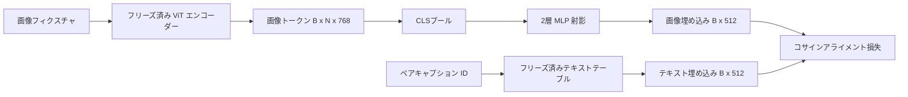

# モダリティアライメントのための射影層

> ビジョンエンコーダーは画像トークンを生成する。テキストデコーダーはテキストトークンを消費する。両者は異なるベクトル空間に存在する。小さな2層 MLP が画像トークンをテキスト埋め込み空間に射影し、ペアとなるキャプションに対するコサインアライメント損失が2つの空間を一致させる。この射影はビジョン言語モデルの最も小さなピースであり、転移に最も重要なものだ。


## 学習目標

- 画像特徴量をテキスト埋め込み空間にマッピングする2層 MLP 射影を構築する。
- モックテキスト埋め込みテーブルを構築する（事前訓練済みトークナイザーも実際のコーパスも不要）。
- 射影された画像トークンとペアとなるキャプション埋め込みの間のコサインアライメント損失を計算する。
- フリーズされたビジョンエンコーダーとフリーズされたテキストテーブルで、射影のみを訓練する。

## 問題

ビジョンエンコーダー（レッスン58〜59）は次元 `vision_hidden = 768` のトークンを生成する。埋め込み次元 `text_hidden = 512` のテキストデコーダーを上に追加したい（他の数値でも同様に可能）。デコーダーはテキスト形状のトークンを期待する。画像トークンはテキスト形状でない。ビジョン専用の事前訓練中に学習した基底に存在し、デコーダーの単語ベクトルとは対応関係がない。

2層 MLP 射影（線形、GELU、線形）がギャップを埋める。十分に小さく（約 `768 * 1024 + 1024 * 512 = 1.3M` パラメーター）、単一 GPU で数分で訓練でき、アライメントフェーズで変わる唯一のピースだ。ビジョンエンコーダーはフリーズされたままだ。テキスト埋め込みテーブルもフリーズされたままだ。射影だけが動く。これは LLaVA が2023年に出荷したレシピで、BLIP-2 が Q-Former として再フレーミングし、以来すべてのオープンウェイト VLM が何らかの形で採用している。

## コンセプト



### 射影前のプーリング

ビジョンエンコーダーは197トークンを出力する。テキスト側はキャプションレベルの1つの埋め込みを持つ。これらをアライメントするには、サンプルごとに1つの画像レベルベクトルが必要だ。CLSプーリングが最もシンプル：エンコーダーの最初のトークンを取って射影する。196パッチトークン全体の平均プーリングも別のオプションで、SigLIP はこれを使用する。どちらも197ベクトルを1つに集約する。

### 2層でなく1層では不十分な理由

単一の線形射影は回転と再スケーリングはできるが、2つの空間に曲率のミスマッチがある場合に基底を修正できない。2つの線形層の間の GELU は1つの非線形曲げを射影に与え、CLIP スタイルの特徴を言語モデルの埋め込みにアライメントするのに経験的に十分だ。より深い射影（LLaVA-NeXT は GLU を使用、Qwen-VL はアテンション層のスタックを使用）は拡張だ。2層 MLP は正規のベースラインで、BLIP-2 の Q-Former 射影ヘッドがフードの下で出荷しているものだ。

| 層 | 形状 | パラメーター数 |
|-------|-------|------------|
| fc1 | `(vision_hidden, projection_hidden)` | `768 * 1024 + 1024` |
| 活性化 | GELU | 0 |
| fc2 | `(projection_hidden, text_hidden)` | `1024 * 512 + 512` |

`768 -> 1024 -> 512` ヘッドで約1.3M パラメーター。

### コサインアライメント損失

アライメントとは `image_emb == text_emb` ではない。アライメントとは `image_emb` が結合空間で `text_emb` と同じ方向を向くことを意味する。コサイン損失は `1 - cos_sim(image, text)` で、0（完全にアライメント済み）から2（反対方向）の範囲だ。訓練はこれをゼロに近づける。レッスン62では、バッチ内のすべての画像が他のどのキャプションよりも自身のキャプションに近くなければならないコントラスティブバッチ（InfoNCE）に一般化する。このレッスンではダイナミクスが見えやすいようペアごとのバージョンを使用する。

### フリーズされたエンコーダーがトリック

ビジョンエンコーダーは86Mパラメーターを持つ。テキストテーブルはさらに数百万。モックコーパスからこれらをすべて訓練することは現実的でない。両方をフリーズすることで、射影の1.3Mパラメーターだけが変化し、数百ステップの合成ペアで損失を下げるのに十分になる。これはすべてのアダプターベース VLM の運用形状そのものだ。重い部分はフリーズされたままで、軽いブリッジが訓練される。

## 実装する

`code/main.py` が実装するもの：

- `MLPProjector(in_dim, hidden_dim, out_dim)`：GELU 活性化を持つ2層線形 MLP。
- `MockTextEmbedding(vocab_size, dim)`：シードから決定論的な初期化を持つフリーズ済み埋め込みテーブル。
- `make_pair(seed, vocab_size)`：1つのペア（画像、キャプション）サンプルを合成する。キャプションは短い ID シーケンスで、キャプション埋め込みはトークン埋め込みの平均プーリングだ。
- `cosine_alignment_loss(image_emb, text_emb)`：ペアごとの `1 - cos_sim` 目標。
- 32の合成ペア（循環）にわたって射影を200ステップ実行する訓練ループ。ビジョンエンコーダーとテキストテーブルはフリーズされ、25ステップごとに損失が表示される。

実行方法：

```bash
python3 code/main.py
```

出力：訓練の報告では、200ステップ以内に初期損失の約1.07から約0.80まで低下し、射影だけで画像トークンをテキスト空間に引き寄せられることを示す。ペアごとの最終コサイン類似度も表示される。

## 使ってみる

同じパターンがすべてのオープンウェイト VLM に登場する：

- **LLaVA 1.5。** CLIP-ViT-L の隠れ層から LLaMA 埋め込み次元への2層 GELU MLP 射影。フリーズ済みビジョンエンコーダー、フリーズ済み LLM、射影のみを訓練（その後第二段階で LLM をアンフリーズ）。
- **BLIP-2。** Q-Formerは32の学習済みクエリトークンを画像トークンに対するクロスアテンションで通し、LLM 埋め込み次元に射影する。Q-Former の最後の射影ヘッドがこのレッスンの MLP のアナログだ。
- **MiniGPT-4。** BLIP-2 Q-Former 出力から Vicuna 埋め込み次元への単一の線形射影。
- **Qwen-VL。** 複数層を持つクロスアテンションアダプターだが、最終ピースは再び LM 埋め込み次元への射影だ。

形状は異なるが役割は同一だ：画像トークンをプールし、テキスト埋め込み次元に射影し、単独で訓練する。

## テスト

`code/test_main.py` がカバーするもの：

- プロジェクター出力形状が設定された `out_dim` に一致する
- フリーズ済みテキスト埋め込みテーブルの `requires_grad` パラメーターがゼロ
- コサイン損失が同一ベクトルでゼロ、反平行ベクトルで2になる
- 1回の backward パス後にプロジェクターの勾配が流れる
- 訓練ループがステップ0からステップ200の間で損失を削減する

実行方法：

```bash
python3 -m unittest code/test_main.py
```

## 演習

1. CLSプーリングを196パッチトークンの平均プーリングで置き換え、200ステップ後の最終損失を比較する。平均プーリングは合成データでは通常より高速に訓練される。CLSは自然画像に対してよりサンプル効率が高い。

2. コサイン損失に学習済みスカラー温度（`cos / tau`）を追加し、`tau` が小さすぎる（勾配ノイズ）または大きすぎる（損失が高いまま停滞）場合に何が起きるか観察する。

3. 2層 MLP を単一の線形層に交換して損失のギャップを定量化する。非線形性は合成特徴量よりも自然画像特徴量に対してより重要だ。

4. プロジェクターの重みに小さなL2ペナルティを追加し、コサインアライメント（コサインはスケール不変なのでペナルティは主に未使用の方向を縮小する）とどのように相互作用するか観察する。

5. プロジェクターの重みを永続化し、ビジョンエンコーダーのバックワードパスなしで推論を実行して、展開時にプロジェクターのみが必要なことを確認する。

## キーワード

| 用語 | 意味 |
|------|---------------|
| モダリティアライメント | 画像とテキストの埋め込みを1つの共有空間で比較可能にする行為 |
| 射影ヘッド | 一方の空間を別の空間にマッピングする小モジュール、通常は2層 MLP |
| コサイン類似度 | L2ノルムの積で除算したドット積 |
| フリーズされたエンコーダー | ビジョン（またはテキスト）モデルのすべてのパラメーターが `requires_grad=False` |
| モックコーパス | データセットのダウンロード依存なしに訓練が可能な合成ペア |

## 参考資料

- LLaVA 論文：2段階訓練（射影、その後 LM をアンフリーズ）について。
- BLIP-2 論文：学習可能な射影の代替としての Q-Former について。
- Qwen-VL テクニカルレポート：より深い射影ヘッドとしてのクロスアテンションアダプターについて。
