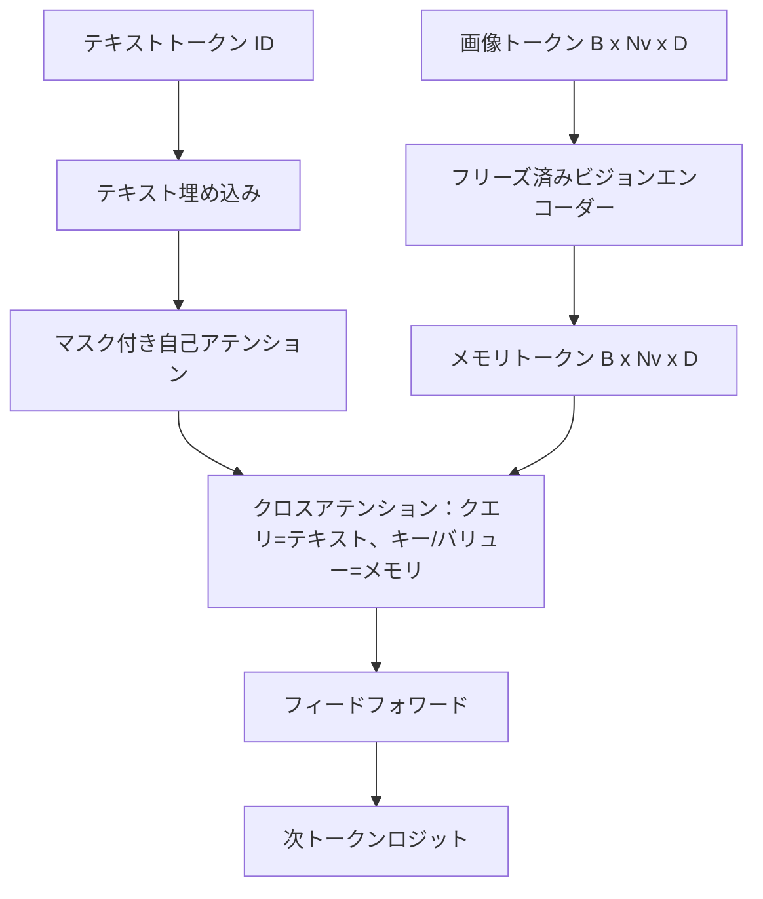
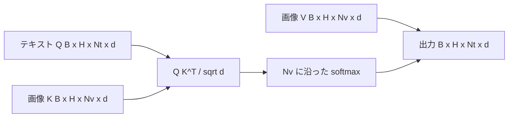

# クロスアテンションフュージョン

> 射影層は1つの画像ベクトルと1つのキャプションベクトルをアライメントする。実際のビジョン言語デコーダーでは、すべてのテキストトークンがすべてのパッチトークンにアテンションし、モデルが各単語を領域にグラウンディングできる必要がある。クロスアテンションはそのグラウンディングが起きる場所だ。テキストがクエリし、ビジョンのキーとバリューが答える。このレッスンはクロスアテンションブロック、因果テキスト自己アテンション、両者を合法に保つマスク形状を構築する。


## 学習目標

- クエリストリームがテキストで、キー/バリューストリームがビジョンであるマルチヘッドクロスアテンションを実装する。
- デコーダーブロックを構成する：因果自己アテンション + クロスアテンション + フィードフォワード。
- マスク形状を正しくする：自己アテンションには因果マスク、クロスアテンションにはマスクなし。
- バッチ化されたテキストトークンと固定された画像トークンプールでフォワードパスを実行する。

## 問題

画像トークンとテキストトークンを1つのシーケンスに連結することは1つのフュージョンオプションだ（アーリーフュージョン、Chameleon と Emu3 が採るパス）。クロスアテンションはもう1つだ（レイトフュージョン、Flamingo が導入し、以来すべての Flamingo 型デコーダーがコピーしているパス）。レイトフュージョンでは、テキストデコーダーはテキストのみのトークンで実行し、各層でクロスアテンションを通じて画像ストリームに到達する。

レイトフュージョンには2つの利点がある。第一に、テキストストリームはクリーンに保たれ、モデルのテキストのみの能力が維持される。第二に、画像ストリームは画像ごとに1回だけ計算され、すべてのデコードステップで再利用されるため、長いキャプションでも生成が安価だ。コストはブロックごとに追加のアテンションサブレイヤーが1つ必要なことだ。

## コンセプト





### マスク形状

デコーダーブロック内の2つのアテンションは異なるマスクを必要とする：

| アテンション | クエリ長 | キー長 | マスク | 理由 |
|-----------|--------------|------------|------|-----|
| 自己アテンション | `Nt`（テキスト） | `Nt`（テキスト） | 因果：下三角 `(Nt, Nt)` | テキストトークンは自己回帰中に先読みできない |
| クロスアテンション | `Nt`（テキスト） | `Nv`（ビジョン） | マスクなし | 画像全体がすべてのテキスト位置から見える |

このレッスンには1つの形状バリデーション関数が含まれており、混同した間違いが暗黙の壊れた損失曲線ではなく `ValueError` として表面化する。

### クロスアテンションにマスクがない理由

画像はテキストが生成される前に完全に観察される。キャプションのトークン `t` は画像の任意のパッチにアテンションできる。画像パッチには時系列の順序はない。複数の画像とテキストセグメントをインターリーブする際にサンプルごとのマスキングパターンを追加する Flamingo の変形もあるが、単一画像プラスキャプションでは、クロスアテンションはすべてを見る。

### キー/バリューキャッシング

画像のキーとバリューはデコード開始時に1回計算されてキャッシュに保持される。各新しいテキストトークンは再計算なしにキャッシュを使用する。これがキャプション生成を推論時に高速にするものだ：重い ViT は1回実行され、クロスアテンションはすべてのステップでそのキーとバリューを再利用する。このレッスンはキャッシュを公開し、キャッシュヒットパスをテストする。

### ブロックの構成

デコーダーブロックの実行順：pre-LN -> 自己アテンション -> 残差 -> pre-LN -> クロスアテンション -> 残差 -> pre-LN -> フィードフォワード -> 残差。3つのサブレイヤー、それぞれに独自の LayerNorm を持つ。Flamingo 論文ではモデルが訓練時の安定性コストで画像パスをオプトアウトできるよう、クロスアテンションに学習済みゲートを追加した。ここで使用する正規のベースラインにはゲートがない。

```python
class DecoderBlock:
  def forward(self, text_tokens, image_tokens, text_mask, cross_mask):
      text_tokens = text_tokens + self.self_attn(self.ln1(text_tokens),
                                                 mask=text_mask)
      text_tokens = text_tokens + self.cross_attn(self.ln2(text_tokens),
                                                  image_tokens,
                                                  mask=cross_mask)
      text_tokens = text_tokens + self.ffn(self.ln3(text_tokens))
      return text_tokens
```

## 実装する

`code/main.py` が実装するもの：

- `CrossAttention(hidden, heads)`：独立した `q` と `kv` 射影を持つマルチヘッドクロスアテンション。
- `CausalSelfAttention(hidden, heads)`：標準デコーダーからのマスク付き自己アテンション。
- `DecoderBlock`：pre-LN 残差を持つ3つのサブレイヤーを構成する。
- `VisionLanguageDecoder`：モックビジョンエンコーダー出力と小さなテキスト埋め込みテーブルで駆動される4層デコーダー。
- `causal_mask(length)`：`(length, length)` の下三角ブールテンソルを返す。
- デモ：長さ10のテキストシーケンス2つと長さ197の画像メモリのバッチを入力し、出力形状、自己アテンションマスク形状、位置ごとのクロスアテンション出力ノルムを表示する。

実行方法：

```bash
python3 code/main.py
```

出力：デコーダーは `(2, 10, text_vocab)` のロジットテンソルを生成する。マスク形状は `(10, 10)`。KVキャッシュ再利用チェックでキャッシュありとキャッシュなしのパスが同一のロジットを確認する。

## 使ってみる

クロスアテンションは2つのプロダクションファミリーに登場する：

- **Flamingo と IDEFICS。** 言語モデルブロックの K 個ごとにクロスアテンションサブレイヤーを挿入し、LMをフリーズする。ビジョン言語アダプターは、クロスアテンションブロックとそのゲートだ。
- **BLIP-2。** Q-Formerは固定された32のクエリトークンのセットからクロスアテンションを使って画像特徴量にアテンションし、クエリを LM 埋め込み空間に射影する。

このレッスンのブロックの形状は両方に直接マッピングされる。マスクの規律（自己アテンションは因果、クロスアテンションはなし）は同じだ。

## テスト

`code/test_main.py` がカバーするもの：

- 因果マスクが下三角で期待されるブール形状に一致する
- クロスアテンション出力形状がキー長に関係なく `(B, Nt, hidden)` である
- KVキャッシュパスが浮動小数点の許容誤差内でキャッシュなしパスと一致する
- テキストと画像ストリームの形状のミスマッチが明確な `ValueError` を発生させる
- 完全なデコーダーフォワードパスが正しいバッチとシーケンス形状を生成する

実行方法：

```bash
python3 -m unittest code/test_main.py
```

## 演習

1. クロスアテンション残差に学習済みtanhゲートを追加し（Flamingo トリック）、初期ゲートがほぼゼロの状態から訓練が収束することを確認する。ゲートは0から始まり、モデルが画像ストリームを混合する前にテキストのみの動作を回復する。

2. 同じデコーダーが複数の画像プラス複数のテキストセグメントを消費するインターリーブドアテンションを実装する。テキストセグメント2が画像1にアテンションするのを防ぐサンプルごとのクロスアテンションマスクを構築する。

3. `Nt=64, Nv=576`（より高解像度で24x24グリッド）でクロスアテンション対自己アテンション層をプロファイルする。クロスアテンションコストは `Nt * Nv` で高解像度では支配的になる。

4. クロスアテンションマップにクエリ側ドロップアウトを追加し、デモでのキャプション多様性を測定する（クロスマップのドロップアウトにより、キャプションサンプルの分散が増加する）。

5. クロスアテンション層を、固定32トークンのクエリプールが各層で画像特徴量にアテンションする Q-Former スタイルのアテンションブロックで置き換える。

## キーワード

| 用語 | 意味 |
|------|---------------|
| レイトフュージョン | テキストとビジョンは別々のストリームに留まり、クロスアテンションが各ブロックでそれらを橋渡しする |
| クロスアテンション | Q が一方のストリームから来て、K と V が別のストリームから来る |
| 因果マスク | 自己回帰中の先読みを防ぐ下三角ブールマスク |
| KVキャッシュ | 画像のキーとバリューを一度保存してすべてのデコードステップで再利用 |
| メモリトークン | デコーダーが到達するフリーズ済み画像トークン |

## 参考資料

- Flamingo（2022年）：ゲート付きクロスアテンションを用いた正規のレイトフュージョン設計について。
- BLIP-2（2023年）：学習済みクエリプールとして装われたクロスアテンションブロックである Q-Former について。
- IDEFICS（2023年）：Flamingo レシピのオープンウェイト再現について。
