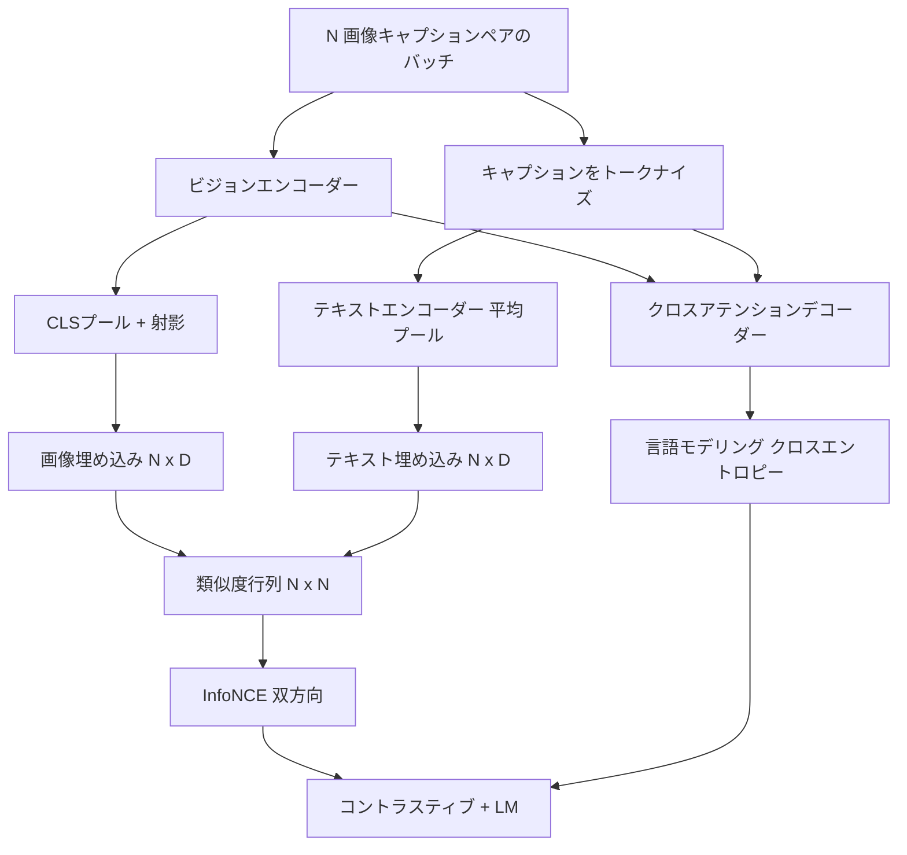

# ビジョン言語事前訓練

> エンコーダー、射影、デコーダーが配線された。次は一緒に訓練する。2つの目標が学習を駆動する：マッチするペアを結合埋め込み空間で引き寄せるコントラスティブな画像テキスト損失（InfoNCE）と、デコーダーに各画像のキャプションを作成させる言語モデリング損失だ。組み合わせることで、キャプションに対して正しい画像を見つける能力と、画像のキャプションを書く能力の両方をネットワークに教える。


## 学習目標

- 画像キャプションペアのバッチにわたる InfoNCE コントラスティブ損失を実装する。
- コントラスティブ損失と自己回帰的な言語モデリング損失を合成する。
- 実際のデータセットのダウンロードなしに200ペアのモック画像キャプションコーパスを合成する。
- 50ステップのデモ訓練ループを実行し、両方の損失が低下するのを観察する。

## 問題

ビジョン言語モデルには2つのスキルが必要だ。ランク付けできなければならない：キャプションが与えられたとき、多くの中から正しい画像を見つける。生成できなければならない：画像が与えられたとき、キャプションを書く。1つのスキルだけで事前訓練すると、半分のシステムしか得られない。CLIP はランク付けを完璧にしたがキャプションを生成できない。GPT-4V はキャプションを生成できるが、ランク付けに別の検索ヘッドを使う。マルチ目標の事前訓練により、1回のパスで両方が得られる。

InfoNCEはランク付けの半分を処理する。N ペアのバッチに対して、モデルは N 個のマッチするペアを正例とし、`N^2 - N` 個のミスマッチペアを負例として扱い、結果の `(N, N)` 類似度行列でクロスエントロピー損失を実行する。LM 損失は生成の半分を処理する：画像を条件とした標準的な次トークン予測。両方の損失は微分可能で、エンコーダー、プロジェクター、デコーダーの重みを共有できる。

## コンセプト



### InfoNCE の1段落説明

N 個の画像埋め込みを行として積み重ね、N 個のテキスト埋め込みを行として積み重ねる。両方を L2 正規化する。`N x N` 行列 `S = I T^T / tau`（`tau` は学習済みの温度）を計算する。対角エントリがマッチするペアで、非対角エントリが負例だ。対角を下って走る `argmax` ターゲットでクロスエントロピーを適用する：行 `i` は列 `i` に最も高いエントリを持つべきだ。列方向でも対称的に同じことを行う。合計は2つの平均だ。これが8行の CLIP 損失だ。

### 温度の重要性

温度 `tau` は softmax のピークの度合いを制御する。小さすぎると（例：`tau = 0.01`）最も難しい負例からのみ勾配が来て、訓練がノイジーになる。大きすぎると softmax が平坦になり、勾配が消える。CLIP は `tau` をパラメーターとして学習する。ここのデモも同じことをする。

### 言語モデリング損失

デコーダーはクロスアテンションを通じて画像メモリトークンを消費し、各位置で次のテキストトークンを予測する。損失は次位置ターゲットを持つ標準クロスエントロピーだ。パディング位置は損失からマスクアウトされる。

### 損失の組み合わせ

`total = contrastive + lm_weight * lm`（`lm_weight` はスカラー、多くの場合1.0）。2つの損失はエンコーダーと射影に勾配を共有する。デコーダーだけが LM 損失の勾配を受け取る。これは CoCa、BLIP、SigLIP スタイルのモデルがすべて使用するマルチタスクレシピで、重み付けは異なる。

| コンポーネント | 損失曲面 | 影響するもの |
|-----------|--------------|---------|
| InfoNCE | 結合空間でのペアランク付け | エンコーダー + 射影 + テキストヘッド |
| LM | 画像を条件とするトークン予測 | エンコーダー + 射影 + デコーダー |
| 組み合わせ | マルチタスク | スタック全体 |

### デモに50ステップで十分な理由

モックコーパスはランダム画像とランダムキャプション ID を持つ合成200ペアセットだ。バッチサイズ16で50 SGD ステップ後、絶対値が実際のデータで訓練されたモデルより高くても、両方の損失は目に見えて低下する。デモの目的は勾配の配線がエンドツーエンドで機能し、LM 損失を追加してもコントラスティブ目標を不安定化しないことを確認することだ。

## 実装する

`code/main.py` が実装するもの：

- `MultimodalModel`：小さな ViT エンコーダー、MLP プロジェクター、小さなテキスト側エンコーダー（埋め込み ID に対する平均プール）、レッスン61からのクロスアテンションデコーダーを組み合わせる。
- `info_nce_loss(image_emb, text_emb, temperature)`：双方向 CLIP スタイルのコントラスティブ損失。
- `lm_loss(logits, target_ids, padding_id)`：マスク付き次トークンのクロスエントロピー。
- `make_mock_corpus(seed, n_pairs)`：決定論的な200の（画像、caption_ids）ペアを返す。
- バッチサイズ16で50ステップを実行する訓練ループ。Adam オプティマイザーと学習済み log-temperature パラメーター付き。両方の損失が5ステップごとに表示される。

実行方法：

```bash
python3 code/main.py
```

出力：コントラスティブ損失が約 `ln(16) = 2.77` から 2.4 に向かって低下し、LM 損失がランダム均一ベースライン `ln(512) ≈ 6.24` から約 4.7 に低下する。両方の低下が勾配が正しく配線されていることを証明する。実際のモデルは数百万ステップ訓練される。ダイナミクスは同じだ。

## 使ってみる

これは以下と同じ損失レシピだ：

- **CLIP（2021年）。** 画像テキストコントラスティブのみで、別のフリーズエンコーダーキャプションプローブ付き。
- **CoCa（2022年）。** 1つのモデルで画像テキストコントラスティブプラス画像キャプション LM 損失。このレッスンが構築するまさにこのパターン。
- **BLIP（2022年）と BLIP-2。** コントラスティブプラス LM プラス画像テキストマッチングヘッド。3つの損失の組み合わせ。
- **SigLIP（2023年）。** InfoNCEをシグモイドペア損失に切り替え。同じコントラスティブの役割、異なる関数形式。
- **LLaVA ファミリー。** 第一段階がアライメント（フリーズ LM に対するコサイン）で第二段階が LM 損失とアンフリーズ LM を追加する2段階訓練。レッスン60が第一段階にマッピングされ、このレッスンが第二段階にマッピングされる。

## テスト

`code/test_main.py` がカバーするもの：

- InfoNCE 損失が画像/テキスト行に対して対称
- InfoNCE 損失が類似度行列が大きな正の数の完全な対角線のとき0を返す
- LM 損失がパディング位置を正しくマスクする
- モデルフォワードパスがエラーなしに両方の損失を生成する
- 5ステップの訓練ループが組み合わせ損失を削減する

実行方法：

```bash
python3 -m unittest code/test_main.py
```

## 演習

1. InfoNCE を SigLIP スタイルのシグモイドペア損失で置き換え、モックコーパスでの収束を比較する。

2. ハードネガティブマイニングステップを追加する：その他のバッチで前のバッチの最もハードな非対角ペアを選択して追加する。訓練してコントラスティブ損失がより速く低下するか検査する。

3. 結合埋め込みの上に画像テキストマッチングバイナリヘッドを追加し（真/偽：これらはマッチするか？）、3番目の損失を加えて BLIP の3ヘッドセットアップを再現する。

4. モックコーパスを画像ハッシュを条件とする遷移行列を持つマルコフ連鎖から描かれるキャプション ID シーケンスで置き換える。キャプション損失はさらに低下するはずだ。実際に学習可能なシグナルがあるから。

5. `lm_weight = 0` と `lm_weight = 1` で同じモデルを訓練する。コントラスティブ損失を比較する。LM 損失はランキング目標を後退させるべきではない。

## キーワード

| 用語 | 意味 |
|------|---------------|
| InfoNCE | ノイズコントラスティブ推定：類似度行列に対するクロスエントロピー |
| 温度 | コントラスティブ softmax のピーク度合いを制御するスカラー |
| ハードネガティブ | モデルが混乱する非対角ペアで、サンプリングに有用 |
| LM 損失 | キャプション側の標準的な次トークンクロスエントロピー |
| 結合埋め込み空間 | 射影後に画像とテキストベクトルが共存する共有空間 |

## 参考資料

- CLIP 論文：元のコントラスティブレシピについて。
- CoCa 論文：1つのモデルでのコントラスティブプラスキャプション生成について。
- SigLIP 論文：シグモイドペア損失の変形とそのスケーラビリティについて。
