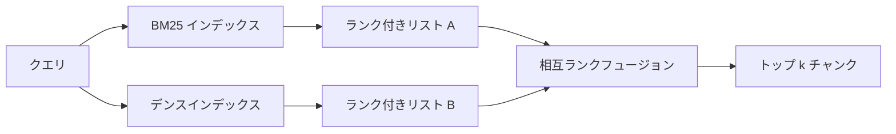

# BM25 とデンス埋め込みによるハイブリッド検索

> 語彙検索とセマンティック検索は逆のクエリ分布で失敗する。相互ランクフュージョンによるハイブリッド検索は補間しない。投票する。そして投票はすべてのクエリクラスで勝つ。


## 学習目標
- Robertson と Sparck Jones の定式化から BM25 をゼロから実装する。フィールド重み付け、ドキュメント長正規化、チューナブルな k1 と b を含む。
- ループがオフラインで実行できるよう決定論的モック埋め込みの上にデンス検索エンジンを構築する。
- Cormack、Clarke、Buettcher が2009年に公開した通りに相互ランクフュージョンを正確に実装し、なぜスコア重み付き補間より優れるかを説明する。
- RRF k 定数とモダリティごとの重みを調整し、小さなフィクスチャコーパスでトレードオフを読む。

## 問題

語彙検索はコーパスが逐語的に含む識別子をクエリが持つときに勝つ。`AbortMultipartOnFail` のクエリは BM25 で数マイクロ秒で正しい Go 関数を返す。同じクエリを埋め込むと、3つの類似クラスターの境界に位置し、デンス検索エンジンは間違いのファイルを最初にランク付けする。

デンス検索はクエリがコーパスのリテラルトークンから言い換えられているときに勝つ。「キャンセルされたアップロードをどう処理するか」と聞くユーザーは abort や multipart という言葉を打ったことがない。BM25 は「大きなファイルのアップロード」に関するドキュメントチャンクを返す。そのページには uploads という言葉が含まれているから。デンス検索は中断関数を見つける。そのサマリーにはキャンセルが言及されているから。

2つの間の選択は静的なものではない。クエリ分布が変数だ。プロダクションの RAG システムは同じエンドポイントから両方のクラスを処理するため、検索は両方を同時に処理する必要がある。それがハイブリッド検索だ。マージステップが正しくなければならない部分だ。

## コンセプト



### BM25 の1段落説明

BM25 はクエリとドキュメントのペアを、クエリの各タームについて、長さ正規化補正を含む飽和タームフリクエンシーファクターを掛けた逆ドキュメントフリクエンシーファクターの合計でスコアリングする。2つのノブ。`k1` はタームフリクエンシーの飽和を制御する。デフォルトの1.5が公開された推奨値で、ベンチマークなしには変更すべきでない。`b` はドキュメント長がどれほど重要かを制御する。デフォルトの0.75は長いドキュメントがペナルティを受けるが線形ではないことを意味する。

IDF 式はスムージングされた Robertson と Sparck Jones の定義 `log((N - df + 0.5) / (df + 0.5) + 1)` を使用する。log 内の +1 によって、タームがコーパスの半分以上に現れる場合に IDF が正に保たれる。これは stopword が技術的にはまれな小さいコーパスで重要だ。

フィールド重み付けにより、シンボル名のマッチが本文のマッチより多くカウントされることを BM25 に伝えられる。実装はインデックス作成時のタームカウントの乗数であり、スコアリング時ではない。これによりフィールドごとの別個のスコアを必要とせず数学を同一に保つ。

### デンス検索の1段落説明

各チャンクを埋め込みモデルで固定次元ベクトルに埋め込む。クエリ時にクエリを埋め込み、類似度でコサインランク付けして各チャンクをトップ k を返す。モデルが品質を決める変数だ。検索アルゴリズム自体はドット積とソートの2行だ。

このレッスンでは決定論的なハッシュベースの埋め込みを使用し、ネットワーク呼び出しなしにフュージョンの数学を読める。ハッシュは 96 次元ベクトルにトークンキー付きオフセットを合計して正規化する。コサインランクは実行間で決定論的で、テストスイートが必要とするものだ。

### 相互ランクフュージョン（公開された公式）

2つのランク付きリスト。いずれかのリストに現れる各候補について、逆ランクの貢献を合計する。2009年の論文はデフォルトとして k = 60 で `1 / (k + rank)` を使用した。総スコアでソートする。それがアルゴリズム全体だ。

公開された定数 k = 60 は任意ではない。k = 60 でランク1の貢献は 1/61、ランク10の貢献は 1/70 だ。貢献はゆっくり減衰するので深い候補でも投票できる。k が小さいとトップ結果が支配する。k が大きいと貢献曲線が平坦になる。

実装の2つのチューナブルノブ。`k` 定数。コーパスで一方が優れているという事前証拠がある場合に BM25 またはデンスをブーストできるモダリティごとの重みのペア。ランク貢献に重みを掛けることが最もシンプルな原則的な実装だ。ランク減衰の形状を保持し、スケール非依存のままだ。

### なぜフュージョンがスコア重み付き補間より優れるか

BM25 スコアは無制限でコーパス依存だ。コサイン類似度は -1〜1 に制限される。線形結合 `alpha * bm25 + (1 - alpha) * cosine` はコーパスごとの alpha 調整が必要で、再インデックスのたびに壊れる。ランクベースのフュージョンはそうでない。2つのランクはモダリティをまたいで比較可能だ。公開された RRF ベースラインは2010年以来すべてのパブリックな TREC トラックでスコア補間を上回っている。

これは Vespa と Weaviate のドキュメントで RankFusion 対 RRF について聞く同じ議論だ。同じ結論に達した：スコアを補間するという非常に強力な証拠がない限り、ランクベースに留まる。

## 実装する

`code/main.py` が実装するもの：

- `tokenize(text)` - 高速な正規表現トークナイザー。
- `BM25Index` - フィールド重み付き、`add`、`search`、チューナブルな k1、b。
- `mock_embed`、`DenseIndex` - レッスン64と同じ決定論的な埋め込み。チャンクが比較可能。
- `rrf(rankings, k, weights)` - マルチモダリティ重み付きの公開フュージョン。
- `HybridRetriever` - BM25 とデンスを組み合わせる。
- デモ `main()` - 小さなフィクスチャコーパスをロードし、各検索エンジンの強みと弱みをターゲットにした3つのクエリを実行し、各モダリティが生成したランク付けとフューズされたリストを表示する。

実行方法：

```bash
python3 code/main.py
```

デモ出力を並べて読む。リテラル識別子クエリは BM25 ランク1、デンスランク4、RRF ランク1に位置する。言い換えクエリは BM25 ランク6、デンスランク1、RRF ランク1。曖昧なクエリは BM25 ランク3、デンスランク3、RRF ランク1。フュージョンはタイブレーカーではない。すべてのクエリクラスで勝つシステムだ。

## ノブの調整

| ノブ | デフォルト | 上げるとき | 下げるとき |
|------|---------|----------------|------------------|
| BM25 k1 | 1.5 | ドキュメントでタームが繰り返され、フリクエンシーをより重視したいとき | ドキュメントが短く、タームの繰り返しがノイズのとき |
| BM25 b | 0.75 | 長いドキュメントが本当に単語あたりの情報量が少ないとき | ドキュメント長がトピックと無相関のとき |
| RRF k | 60 | 深い候補が投票し続けるべきとき | トップ1が支配すべきとき |
| BM25 重み | 1.0 | コーパスにリテラル識別子が含まれ、クエリがそれをマッチするとき | クエリがユーザーによる言い換えのとき |
| デンス重み | 1.0 | クエリが言い換えのとき | クエリがリテラルのとき |

直感ではなく保留クエリセットに対してレッスン68の評価ハーネスを再実行することで調整する。

## デモが隠す失敗モード

**コーパス外語彙トークン。** BM25 の IDF はコーパスから計算されるため、クエリのみにあるタームはゼロに貢献する。デンス埋め込みは同じタームのベクトルを幻覚する。コーパス外識別子では、デンスモダリティはもっともらしく見えるが間違った隣接を返す。フュージョンはBM25が何も返さずランク貢献が落ちるため吸収する。ただしチャンクではなくドキュメントで重複排除する場合のみ。

**ストップトークンの支配。** 「the」という単語に対する BM25 はコーパス全体の均一なランク付けを生成する。インデクサーでストップトークンをフィルタリングするか、高 IDF タームが自然に支配することを受け入れる。

**モダリティをまたいだ同一コンテンツ。** コーパスが BM25 のトップ1もデンスのトップ1も同じである場合、RRF は同じ隣接を持つ同じトップ1を与える。これは正しい動作であって失敗ではないが、フュージョンを見えなくする。実際にフュージョンが機能していることを確認するために評価に敵対的なクエリペアを追加する。

## 使ってみる

プロダクションパターン：

- BM25 をインプロセスでインデックス化する。ボトルネックはタームフリクエンシーディクショナリでベクトルではない。
- デンスベクトルを別のストアにインデックス化する（このレッスンではフラットリストを使用。プロダクションでは HNSW を使用）。
- 両方のクエリを並列で実行する。フュージョンは和集合に対する定数時間マージだ。
- 下流の再ランカーがどのモダリティが投票したかを見えるよう、各検索結果のモダリティを永続化する。

## 成果物を出す

レッスン66はこのレッスンのフューズされたトップ k を取ってクロスエンコーダーで再ランク付けする。レッスン68は精度、リコール、MRR、nDCG でパイプライン全体を評価する。このレッスンのハイブリッド検索エンジンはレッスン69のエンドツーエンドシステムの最初のステージだ。

## 演習

1. `mock_embed` をプロバイダーの実際のモデルで置き換える。デモを再実行し、言い換えクエリでのデンスのみのランク付けがどう変わるかを報告する。
2. 3番目のモダリティを追加する：チャンクサマリーを別にインデックス化して3番目のランク付きリストとしてフュージョン。ゲインを測定する。
3. RRF k を 10、30、60、100、200 でスイープする。レッスン68の recall@k 曲線をプロットする。コーパスで曲線がピークに達する k の値を報告する。
4. BM25F を適切に実装する（乗数トリックではなくフィールドごとの長さ正規化）し、シンボルマッチが最も重要なコーパスで比較する。

## キーワード

| 用語 | よく言われること | 実際の意味 |
|------|-----------------|------------------------|
| BM25 | 「語彙検索」 | idf × 飽和 tf × 長さ正規化を用いた確率的ランク付け |
| RRF | 「ランクフュージョン」 | ランク付きリスト全体の 1/(k + rank) の合計。k = 60 デフォルト |
| k1 | 「TF 飽和」 | 繰り返しタームがスコアに追加するのをどれほど速く止めるかを制御 |
| b | 「長さペナルティ」 | 0 はドキュメント長を無視、1 は完全な正規化 |
| フィールド重み付け | 「シンボルブースト」 | インデックス作成時にトークンを繰り返してそのフィールドでのマッチをブースト |
| ランクベース対スコアベースフュージョン | 「なぜ RRF が線形より優れるか」 | ランクはモダリティをまたいで比較可能。スコアはそうでない |

## 参考資料

- Cormack、Clarke、Buettcher、「Reciprocal Rank Fusion は Condorcet と個別のランク学習手法を上回る」、SIGIR 2009
- Robertson、Walker、Beaulieu、Gatford、Payne、「Okapi at TREC-3」（元の BM25 論文）
- [Vespa：BM25 と埋め込みによるハイブリッド検索](https://docs.vespa.ai/en/tutorials/hybrid-search.html)
- [Weaviate：ハイブリッド検索](https://weaviate.io/developers/weaviate/search/hybrid)
- フェーズ11 レッスン06 - RAG の基礎
- フェーズ19 レッスン64 - ここでインデックス化されるチャンカーの出力
- フェーズ19 レッスン66 - フューズされたトップ k を消費するクロスエンコーダー再ランカー
