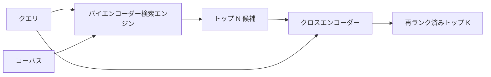

# クロスエンコーダー再ランカー

> バイエンコーダーはクエリとドキュメントを独立して埋め込む。クロスエンコーダーはそれらを連結して一緒に読む。クロスエンコーダーは最も賢い読者であり最も遅い。バイエンコーダーのトップ k に対して第2ステージとして使われると、コストに見合う。


## 学習目標
- バイエンコーダー検索エンジンとクロスエンコーダー再ランカーを、入力形状、パラメーター数、クエリごとのコストで区別する。
- パックされた（クエリ、ドキュメント）シーケンスを消費して単一の関連性スカラーを出力するトランスフォーマーブロックとして、小さなクロスエンコーダーをゼロから実装する。
- 2ステージの検索→再ランクパイプラインを配線する：安価な検索エンジンでトップ N を検索し、クロスエンコーダーで N をトップ K に再ランク付けし、K を返す。
- 小さなフィクスチャコーパスでレイテンシー対品質のトレードオフを測定し、所定のレイテンシー予算に対して正しい N を選ぶ。

## 問題

バイエンコーダーはクエリとドキュメントを同じベクトル空間にマッピングし、コサインでランク付けする。2つのエンコーディングは互いに見ない。モデルはドキュメントについて有用なすべてのものを単一のベクトルに圧縮しなければならず、クエリを考慮しない。これは高速だ。インデックス作成時にドキュメントごとに1つの埋め込みと、クエリ時にクエリごとに1つの埋め込みだ。そしてコーパスの規模でランク付けする唯一の方法だ。

コストは精度だ。同じ全体的なトピックを持つ2つのドキュメントは、1つがクエリに答えもう1つが答えない場合でも、ほぼ同一の埋め込みを持てる。バイエンコーダーはそれらを区別できない。

クロスエンコーダーはクエリとドキュメントを一緒に読むことでこれを解決する。モデルは `[クエリ] [SEP] [ドキュメント]` を単一シーケンスとして受け取り、接合部全体で完全なアテンションを実行し、1つの関連性スカラーを生成する。ドキュメントのすべてのトークンがクエリのすべてのトークンにアテンションできる。モデルは完全なコンテキストでスコアを決定する。

コストはスループットだ。バイエンコーダーが一度埋め込んで永遠にクエリできるのに対し、クロスエンコーダーは（クエリ、ドキュメント）ペアごとに一度実行する。1000万ドキュメントのコーパスではクエリごとに1000万回のフォワードパスだ。リクエスト予算内では実行できない。

解決策はステージング。バイエンコーダーでトップ N を検索する。クロスエンコーダーで N をトップ K に再ランク付けする。N は小さく（50〜200）、クロスエンコーダーの品質の向上は重要な場所に集中する。総レイテンシーはリクエスト予算内に収まる。総品質はクロスエンコーダーの品質であり、N での バイエンコーダーのリコールによって制限される。

## コンセプト



### クロスエンコーダーの入力形状

標準的なパッキングは `[CLS] クエリトークン [SEP] ドキュメントトークン [SEP]` だ。CLS 位置の出力が関連性スカラーを出力する単一の線形ヘッドに渡される。一部の実装は CLS の代わりに平均プーリングを使用する。差は小さい。要点はモデルがペアごとに1つの数値を生成することだ。

22M パラメーターのクロスエンコーダー（公開された `ms-marco-MiniLM-L-6-v2` の重みクラス）が典型的なプロダクションのポイントだ。小さいモデルはレイテンシーを節約するよりも速く品質を失う。大きなモデル（例：568M パラメーターの `bge-reranker-v2-m3`）はオフライン再ランク付けや K が小さい最初のページ再ランク付けのために確保される。

### なぜこのレッスンで小さなものを訓練するか

実際のクロスエンコーダーはファインチューンされたエンコーダートランスフォーマーだ。プロダクションではチェックポイントをロードして実行する。このレッスンの目的はモデルの形状とレイテンシー品質曲線の形状を示すことであり、最先端のランカーを訓練することではない。したがって1つのトランスフォーマーブロック、デフォルトで4ヘッドのマルチヘッドアテンション、1つの回帰ヘッドを持つ小さな `nn.Module` を構築する。シードから決定論的に初期化されるため、ディスク上の重みなしにデモが再現可能だ。

トイモデルはフィクスチャコーパスから正しい形状を学習する：関連するクエリドキュメントペアは無関係なペアより高い予測スコアを持つ。エンドツーエンドのパイプラインはバイエンコーダーの出力を再ランク付けし、再ランクのトップ k はゴールドラベルと相関する。

### レイテンシー対品質

2ステージのパイプラインには1つのチューナブルな変数がある：N。保留クエリセットで N を 5 から 100 にスイープすると曲線が得られる。

| N | ステージ2の Recall@1 | クエリごとのクロスエンコーダーフォワードパス | レイテンシー |
|---|--------------------|---------------------------------------|---------|
| 5 | 0.62 | 5 | 低 |
| 20 | 0.81 | 20 | 中 |
| 50 | 0.86 | 50 | 高 |
| 100 | 0.86 | 100 | 非常に高 |

上記の数値は形状を示すためのものであり、このフィクスチャからの測定値ではない。形状は実際のものだ。再ランクの向上が飽和する 20〜50 候補付近に常にニーがある。ニーを過ぎると何も得ずに支払うことになる。

評価曲線にレイテンシー予算を加えて N を選ぶ。クロスエンコーダーは N での バイエンコーダーのリコールを超えてリコールを上げることはできないため、低い N は品質だけでなくレイテンシーも制限する。

## 実装する

`code/main.py` が実装するもの：

- `CrossEncoder` - 小さな `torch.nn.Module`：トークン埋め込み、マルチヘッドアテンションとフィードフォワードを持つ1つのトランスフォーマーブロック、1つのスカラーを生成する平均プーリングヘッド。
- `tokenize_pair(query, document)` - 2つの文字列を単一の ID シーケンスにパックし、境界をマークする型 ID を付加。決定論的で stdlib。
- `train_tiny(pairs)` - 手動ラベル付きの（クエリ、ドキュメント、関連性）トリプルリストに対する教師あり訓練の1パス。モデルがフィクスチャで合理的なスコアを生成できる。
- `rerank(query, candidates, top_k)` - プロダクションインターフェース。
- `pipeline(query, retriever, top_n, top_k)` - 2ステージフロー。
- デモ `main()` - レッスン65のパターンからコーパスをロード、トップ N を検索、トップ K に再ランク付け、両方のリストを並べて表示、各ステージのレイテンシーを報告する。

実行方法：

```bash
python3 code/main.py
```

出力にはバイエンコーダーのトップ N、クロスエンコーダーのトップ K、タイミングサマリーが表示される。クロスエンコーダーは呼び出しごとに時間がかかるが、コーパス全体では実行されない。2ステージ合計がリクエスト予算内に収まりながら、バイエンコーダーが2番目か3番目にランク付けした回答を選ぶ。

## デモが隠す失敗モード

**クロスエンコーダーは非対称だ。** `rerank(q, d)` と `rerank(d, q)` は異なるスコアだ。常にクエリを最初に入力する。誤って交換すると、リコールが崩壊する。

**N が低すぎてバグが見えない。** N = K に設定するとクロスエンコーダーは並べ替えができず、重み付けのみできる。リフトはゼロに見える。N は少なくとも K の3倍を選ぶ。

**訓練データが評価に漏れる。** 手動ラベル付き訓練ペアが評価クエリを含む場合、再ランクは魔法のように見える。フィクスチャでも訓練と評価を厳密に分離する。

**プロダクションの重みは密だ。** 22M パラメーターのクロスエンコーダーは float32 で 88MB だ。100ms p95 以下を約束する前にモデルサーバーのメモリを計画する。

**バッチングが重要だ。** 実際のクロスエンコーダーは N 候補を1つのバッチで実行する。このレッスンでは `_batch_encode` でそれを行う。バッチ化された ID と型 ID テンソルを `torch.tensor(...)` で構築して1回のフォワードパスを実行する。バッチングをスキップすると、レイテンシーが N 倍になる。

## 使ってみる

プロダクションパターン：

- バイエンコーダー、クロスエンコーダー、N を一緒にピン留めする。いずれかを変えると評価が無効になる。
- 再ランカーの出力を（クエリ、ドキュメント ID）ハッシュでキャッシュする。安定したコーパスに対する同じクエリは同じ順序に再ランク付けされる。キャッシュヒットで無料のレイテンシー削減が得られる。
- ランク1のクロスエンコーダースコアをログに記録する。トップ1スコアがコーパス固有の閾値を下回るクエリはコーパス外のヒットだ。「自信がない」として LLM に表示する。

## 成果物を出す

レッスン68でこの2ステージパイプラインをエンドツーエンドで評価する。レッスン69でこの再ランカーをレッスン65のハイブリッド検索エンジンの後ろと回答ジェネレーターの前に配線する。再ランカーはエンドツーエンドシステムの第2ステージだ。

## 演習

1. N を 5〜50 でスイープして再ランク済み出力の recall@1 をプロットする。このフィクスチャのニーを見つける。
2. クロスエンコーダーを1エポックでなく10エポック訓練する。各エポックで正例と負例ペアのスコアマージンを測定する。
3. 平均プーリングを CLS トークンヘッドで置き換える。このフィクスチャでの収束を比較する。
4. 「この回答はドキュメントにあるか」バイナリラベルを予測する2番目のクロスエンコーダーヘッドを追加する。推論時に両方のヘッドを使用する。1つはランク付け用、1つは閾値判定用。
5. 決定論的モックバイエンコーダーをレッスン65のものに置き換えて2つのステージを繋ぐ。バイエンコーダー単独と比較したトップ K の変化を測定する。

## キーワード

| 用語 | よく言われること | 実際の意味 |
|------|-----------------|------------------------|
| バイエンコーダー | 「ベクトル検索エンジン」 | クエリとドキュメントを独立してエンコード。コサインでランク付け |
| クロスエンコーダー | 「再ランカー」 | （クエリ、ドキュメント）を共同エンコード。1つの関連性スカラーを出力 |
| 2ステージパイプライン | 「検索と再ランク」 | 安価な検索エンジンが N を返し、高価な再ランカーが K を保持 |
| N（候補予算） | 「再ランクプール」 | クロスエンコーダーがクエリごとにスコアリングする候補数 |
| 平均プーリングヘッド | 「最終隠れ層の平均」 | エンコーダーの最終層出力を1つのベクトルに平均する |

## 参考資料

- Nogueira、Cho、「BERT によるパッセージ再ランク付け」、2019年 - 正規のクロスエンコーダーランカー論文
- Reimers、Gurevych、「Sentence-BERT：Siamese BERT ネットワークを使った文埋め込み」、2019年 - バイエンコーダー対クロスエンコーダーについて
- [SentenceTransformers クロスエンコーダーのドキュメント](https://www.sbert.net/examples/applications/cross-encoder/README.html)
- [BGE Reranker v2 モデルカード](https://huggingface.co/BAAI/bge-reranker-v2-m3)
- フェーズ19 レッスン65 - この再ランクステージに供給するハイブリッド検索エンジン
- フェーズ19 レッスン68 - この再ランクが提供するリフトを測定する評価
