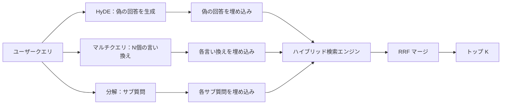

# クエリ書き換え：HyDE、マルチクエリ、分解

> ユーザーが入力するクエリは、検索エンジンが求めるクエリではない。書き換えは検索の前にそのギャップを埋め、インデックスが答えのように見えるものに近いものを見せる。


## 学習目標
- Hypothetical Document Embeddings（HyDE）を実装する：偽の回答を生成し、それを埋め込み、クエリベクトルの代わりにそのベクトルで検索する。
- マルチクエリ展開を実装する：1つのクエリを N 個の言い換えに書き換え、それぞれで検索し、相互ランクフュージョンで和集合をマージする。
- クエリ分解を実装する：複雑な質問をサブ質問に分割し、サブ質問ごとに検索し、マージする。
- 3つの書き換え器をフィクスチャで直接比較し、各戦略がいつ勝つかを説明する。
- 書き換えループがオフラインで実行できるよう、決定論的なフィクスチャ出力を生成するモック LLM を配線する。

## 問題

ユーザーが「アップロードが失敗して予算がなくなったとき、チームはどうするか？」と入力する。コーパスには「AbortMultipartOnFail は進行中の S3 マルチパートアップロードを中断し、アップロードが失敗するとバケットごとのリトライ予算をデクリメントする」と書かれたドキュメントがある。クエリとドキュメントは名詞句を共有しない。BM25 はミスする。バイエンコーダーはドキュメントを3番目か4番目にランク付けする。クエリベクトルがキャンセルされたジョブではなく中断されたアップロードに関するドキュメントを好む埋め込み空間の領域に位置するから。レッスン66の2ステージ再ランクはドキュメントがトップ N にあれば回答を救えるが、トップ N にさえ届かなければ再ランカーは見ることがない。

修正はクエリが検索エンジンに触れる前に書き換えることだ。2023年の論文「Precise Zero-Shot Dense Retrieval without Relevance Labels」（Gao et al.）は HyDE を導入した：LLM にクエリに答えるドキュメントを書かせ、その仮想ドキュメントを埋め込み、そのベクトルを検索ベクトルとして使用する。仮想ドキュメントはコーパスの語調で書かれているため、埋め込み空間の正しい領域に位置する。クエリベクトルはそうでなかった。

2つの関連技術が HyDE と組み合わさる。マルチクエリ展開（Microsoft の GraphRAG が使用した用語）は N 個のクエリの言い換えを生成してそれぞれで検索し、マージする。分解（2024年 Stanford DSPy の研究で「サブクエリ分解」として普及）は「アップロードが失敗したとき、予算がなくなったとき、チームはどうするか」を2つの質問に分割する：「アップロードが失敗したとき何が起きるか」と「リトライ予算がなくなったとき何が起きるか」。2つの検索、1つのマージ済み結果、両方の回答の部分が到達可能だ。

このレッスンでは3つすべてを実装して同じフィクスチャコーパスに対して実行する。

## コンセプト



### HyDE の詳細

HyDE はユーザーのクエリベクトルを LLM が書いた仮想ドキュメントベクトルに置き換える。プロンプトは短い：

```
You are a domain expert. Write a one-paragraph passage that answers the question
below. Use the same vocabulary and phrasing the documentation in this domain would
use. Do not refuse. Do not say you do not know.

Question: {user_query}

Passage:
```

LLM の回答はコーパスを知らないため事実的な回答としては間違いだ。それで構わない。検索エンジンは事実の正確さではなく、トークン分布のみを気にする。仮想パッセージには「abort」「multipart」「bucket」「budget」という言葉が含まれる。そのトピックのドキュメントパッセージがそう言うものだから。そのパッセージを埋め込む。ベクトルは本物のパッセージの近くに位置する。

プロダクションでは仮想ドキュメントを2〜3文に制限する。長い仮想文書はよりノイズを集める。短いものは HyDE が必要とする語彙シグナルを失う。

### マルチクエリ展開の詳細

ユーザーのクエリの N 個の言い換えを生成する。最もシンプルなプロンプト：

```
Rewrite the following question in {N} different ways. Each rewrite must preserve
the original intent. Number them 1 to {N}. Do not add explanations.
```

各言い換えのトップ k を検索する。N 個のランク付きリストを RRF（レッスン65と同じアルゴリズム）でマージする。安価、並列、決定論的。

マルチクエリは、ユーザーの表現が質問する同様に有効な多くの方法の1つで、言い換えのいずれかがより良く質問していたであろう場合に勝つ。すべての言い換えが同様に悪い場合には負ける。元のものが同じ意味で悪かったから。

### 分解の詳細

単一の検索は多面的な質問を満たせない。分解は LLM に質問をサブ質問に分割させ、システムがサブ質問ごとに検索する。プロンプト：

```
The following question may require information from multiple distinct topics.
Decompose it into a list of sub-questions. Each sub-question must be answerable
independently. If the question is already atomic, return it unchanged.

Question: {user_query}
```

サブ質問ごとに検索する。マージする。分解は接続詞、複数の節の比較、または2つの無関係なトピックを含む質問に対する正しいツールだ。不可分な質問には間違ったツールだ。分解器の仕事はそこで単一の質問を返すことで、偽のサブ質問を作り出さないことだ。

### 3つが存在する理由

3つは補完的だ。HyDE はクエリとコーパスのトークンギャップを橋渡しする。マルチクエリは言い換えの分散をカバーする。分解はマルチトピッククエリをカバーする。プロダクションシステムはクエリごとに戦略を選択して3つすべてを実行する（レッスン69のエンドツーエンドシステムでセレクターを示す）。

## モック LLM

レッスンはオフラインで実行する。モック LLM はユーザーのクエリをキーにした小さなルックアップテーブルと、見たことのないクエリのフォールバックだ。ルックアップテーブルには以下が含まれる：

- 各フィクスチャクエリについて：書かれた仮想パッセージ、3つの言い換え、分解。
- 未知のクエリについて：決定論的な変換。クエリのコンテンツワードを取って同義語マップで展開し、結果を返す。

モックの形状が重要で、データではない。プロダクションでは実際のモデル呼び出しとスワップする。検索エンジンは変わらない。

## 実装する

`code/main.py` が実装するもの：

- `MockLLM` - 上記の決定論的代替品。
- `HyDERewriter` - LLM を呼び出して仮想ドキュメントを書き、`RewriteResult` として仮想テキストと検索エンジンが使用すべきクエリを返す。
- `MultiQueryRewriter` - N 個の言い換えを LLM に呼び出して、クエリのリストを返す。
- `DecomposeRewriter` - 分解のために LLM を呼び出し、サブ質問を返す。
- `retrieve_with_rewriter` - 書き換え器と検索エンジンを取り、書き換えを実行し、結果をフューズする。
- デモ：フィクスチャで3つの書き換え器を実行し、どの戦略がゴールド回答ドキュメントを最初に返したかを表示する。

検索エンジンの形状はレッスン65（ハイブリッド BM25 + デンス）から再利用される。フュージョンは同じ RRF だ。唯一の新しい形状は書き換え器インターフェースで小さい。

実行方法：

```bash
python3 code/main.py
```

出力は戦略ごとのランク付けと最終サマリーだ。HyDE は表現がミスマッチしたクエリで勝つ。マルチクエリは言い換え分散クエリで勝つ。分解はマルチトピッククエリで勝つ。書き換えなしのフォールバックは3つのうち少なくとも1つで負ける。

## デモが隠す失敗モード

**HyDE がコーパス固有の識別子を間違えて幻覚する。** モデルが関数名を作り出す。仮想の BM25 スコアが崩壊する。作り出した名前が今では高重みトークンでインデックスに現れないから。仮想の長さを制限してフュージョンで BM25 の重みを下げる。

**マルチクエリの書き換えがすべて収束する。** 弱いモデルがほぼ同じ言い換えを3つ生成する。N 個の検索が同じトップ k を返す。RRF マージは単一の検索と変わらない。書き換えプロンプトに明示的な多様性指示を追加して、Jaccard で重複を検出する。

**分解が過分割する。** 分解器が不可分な質問をリストに変換する。検索はすべて同じドキュメントを返すが、ランクが下がる。マージは元よりも悪い。ファンアウト前に「これらのサブ質問は十分に異なるか」パスで検出する。

**レイテンシーが倍増する。** HyDE は1つの LLM 呼び出しにかかる。マルチクエリは N 個の書き換えを生成する1つの LLM 呼び出し、次に N 個の検索にかかる。分解は分解する1つの LLM 呼び出し、次に M 個の検索にかかる。検索は並列で実行される。LLM 呼び出しがフロアだ。

## 使ってみる

プロダクションパターン：

- クエリ長によるクエリごとの戦略選択：不可分な短いクエリはマルチクエリ、複雑な複数節クエリは分解、専門用語の多いクエリは HyDE。
- クエリハッシュで書き換え器の出力をキャッシュする。多くのクエリが繰り返される。
- 3つすべてを並列で実行して、3つの結果セットを RRF で1つにフューズする。コストは3つの LLM 呼び出しと1つのフュージョン。品質は3つの戦略のカバレッジの和集合だ。

## 成果物を出す

レッスン69でこの書き換えステージをレッスン65の検索エンジンの前とレッスン66の再ランカーの後に配線する。レッスン68で書き換えが検索リコールに追加するリフトを評価する。

## 演習

1. RAG-Fusion（マルチクエリの2024年のバリアント）を実装する。書き換え器の言い換えが意図的に多様で、再ランクステップ（レッスン66）が最終リストを選ぶ。
2. 4番目の戦略を追加する：ステップバックプロンプティング（LLM により一般的な質問をさせ、それで検索し、次に絞り込む）。フィクスチャで比較する。
3. 「質問は不可分か」ヘッドを追加して不可分なクエリを認識するよう分解器を訓練する。前後の過分割率を測定する。
4. モック LLM を実際のモデル呼び出しで置き換える。スタックでの戦略ごとのレイテンシーを測定する。
5. 書き換えごとの信頼スコアを追加する。閾値以下の書き換えを削除する。リコールへの影響を測定する。

## キーワード

| 用語 | よく言われること | 実際の意味 |
|------|-----------------|------------------------|
| HyDE | 「偽ドキュメント検索」 | LLM が回答を書く。その代わりに埋め込んで検索する |
| マルチクエリ | 「言い換え展開」 | クエリの N 個の書き換え。N 回検索、RRF でマージ |
| 分解 | 「サブクエリ分割」 | マルチトピッククエリをサブ質問に分割、別個に検索 |
| 不可分なクエリ | 「単一トピック」 | 偽のサブ質問を作り出さずに分解できない |
| ステップバック | 「クエリを抽象化する」 | より一般的な質問をして検索し、次に絞り込む |

## 参考資料

- Gao、Ma、Lin、Callan、「Precise Zero-Shot Dense Retrieval without Relevance Labels」（HyDE）、2023年
- Microsoft Research、「Multi-Query Expansion for Retrieval」
- Stanford DSPy、「Subquery Decomposition for Multi-Hop QA」
- [LlamaIndex クエリ変換のドキュメント](https://docs.llamaindex.ai/en/stable/optimizing/advanced_retrieval/query_transformations/)
- フェーズ11 レッスン07 - 高度な RAG パターン
- フェーズ19 レッスン65 - この書き換え器が供給する検索エンジン
- フェーズ19 レッスン68 - 書き換えリフトを測定する評価
