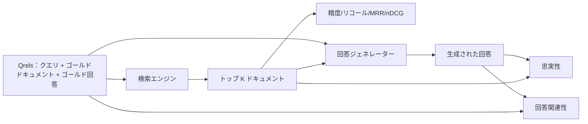

# RAG 評価：精度、リコール、MRR、nDCG、忠実性、回答関連性

> 検索と回答を同時にグレードできなければ、システムを出荷できない。2つは同じメトリクスではなく、同じプロンプトが異なる軸で失敗する。


## 学習目標
- ゴールドの qrels から4つの検索メトリクスを計算する：precision@k、recall@k、MRR（平均逆数ランク）、nDCG@k。
- 2つの回答グレードメトリクスを計算する：忠実性（検索されたコンテキストに基づくすべての主張）と回答関連性（回答が質問に対応している）。
- 評価がエンドツーエンドで読む fixture qrels ファイル（クエリ、ゴールドドキュメント ID、ゴールド回答テキスト）を構築する。
- メトリクス値を読んでパイプラインがどこで失敗しているかを診断する：検索、ランク付け、生成、またはグラウンディング。

## 問題

RAG システムには少なくとも4つの動く部分がある：チャンカー、検索エンジン、再ランカー、ジェネレーター。そのいずれもが間違った回答の原因になり得る。ステージごとのメトリクスなしには暗闇を飛んでいるようなものだ。

ユーザーが間違った回答を報告する。チャンカーが回答スパンを切ったから？検索エンジンがトップ k にチャンクを含めなかったから？再ランカーが正しいチャンクを位置1を超えてプッシュしたから？ジェネレーターがチャンクを無視して何かを作り上げたから？回答だけからでは判断できない。必要なもの：

- 検索エンジンから出てきたものをグレードする検索メトリクス。
- 正しいチャンクが順序のどこに座っているかをグレードするランク付けメトリクス。
- ジェネレーターが検索されたコンテキスト内に留まったかをグレードする忠実性。
- 回答が質問に対応しているかをグレードする回答関連性。

このレッスンでは fixture qrels ファイルの上に6つすべてを構築する。評価はオフラインで決定論的。プロダクションでは、モック LLM-as-judge を実際のものと交換する。

## コンセプト



### Precision@k

検索エンジンが返したトップ k ドキュメントのうち、何割がゴールドセットにあるか？ゴールドが3ドキュメントでトップ3が2つを返して1つが間違いなら、precision@3 は 2/3 だ。無関係な検索チャンクのコストが高い場合（ジェネレーターがそれにトークンを無駄にする、またはチャンクが回答を汚染する）に precision を使う。

### Recall@k

ゴールドドキュメントのうち何割がトップ k にあるか？ゴールドが3ドキュメントでトップ5がすべて3つを含む場合、recall@5 は1.0だ。見逃した回答のコストが高い場合（余分な間違いのチャンクを見るよりも回答チャンクを見逃す方が嫌な場合）に recall を使う。

プロダクション RAG では人々が通常引用するメトリクスは recall@k だ。生成は無関係なチャンクを簡単に落とせる。見たことのないチャンクから回答を作り出すことはできない。

### MRR（平均逆数ランク）

各クエリについて、ランク付きリストの最初の関連ドキュメントの位置を見つける。逆数ランクは 1/位置。クエリセット全体で平均する。MRR は検索エンジンがベストな回答をどれだけうまくトップに置くかの単一数値サマリーだ。

MRR は位置1を重視する。ゴールドドキュメントがランク1にあるクエリは1.0に貢献する。ランク2は0.5に貢献する。ランク10は0.1に貢献する。メトリクスはリストのトップに支配される。

### nDCG@k

正規化割引累積ゲイン。完全な式は各検索ドキュメントにゲインを割り当て（関連なら1、なければ0が多い）、位置のlogで割引し、合計して、理想のDCG（完璧にランク付けした場合のDCG）で割る。範囲は0〜1。

nDCG はグレード付き関連性に対応する：ゴールドが「ドキュメントAは3、ドキュメントBは2、ドキュメントCは1」と言える。MRR と recall@k はすべてをバイナリに平坦化する。クエリごとに部分的に関連するドキュメントが複数あるときに nDCG を使う。

### 忠実性

生成された回答の各主張について、主張が検索されたコンテキストによってサポートされているかを確認する。標準的な実装は（主張、コンテキスト）を取って yes か no を返す LLM-as-judge プロンプトを使う。メトリクスはパスする主張の割合だ。

忠実性はジェネレーターが内容を作り出す失敗モードを捉える。検索エンジンが正しいチャンクを返しても、幻覚するジェネレーターは壊れている。忠実性はグラウンドネス、サポート、帰属とも呼ばれる。

このレッスンでは、評価がオフラインで実行できるよう、各主張のトークンが検索されたコンテキストと閾値で重複するかを確認する決定論的なモックジャッジで忠実性を実装する。プロダクションでは実際のモデル呼び出しに交換する。メトリクスの形状は同じだ。

### 回答関連性

回答は実際に質問に対応しているか？忠実性は「回答はコンテキストに基づいているか？」を問う。回答関連性は「回答は質問に基づいているか？」を問う。忠実だがトピックを外れた回答は忠実性で高いスコアを得て、関連性で低いスコアを得る。コンテキストを無視した短く的確な回答は関連性で高いスコアを得て忠実性で低いスコアを得る。

標準的な実装も LLM-as-judge を使う：（質問、回答）を取って回答が質問に対応しているかを問う。このレッスンではトークン重複プラスジャッジの代替を実装する。

## fixture qrels

```python
{
  "qid": "q1",
  "query": "マルチパートアップロードの中断閾値はどのようなものか",
  "gold_doc_ids": ["d1", "d3"],
  "gold_answer_substring": "3つの失敗パート",
  "graded_relevance": {"d1": 3, "d3": 2},
}
```

各クエリが持つもの：
- クエリ文字列、
- ゴールドドキュメント ID のセット（精度/リコール/MRR のため）、
- グレード付き関連性の辞書（nDCG のため）、
- ゴールド回答のサブストリング（各 qrel の参照メタデータとして保持。このレッスンの忠実性は検索されたコンテキストに対して抽出された主張を判定することで計算され、このサブストリングに対してではない）。

プロダクションではこれらにラベルを付ける。このレッスンでは評価がすぐに実行できるよう手作りの fixture を出荷する。

## 実装する

`code/main.py` が実装するもの：

- `precision_at_k(retrieved, gold, k)` - 文字通りの定義。
- `recall_at_k(retrieved, gold, k)` - 文字通りの定義。
- `mean_reciprocal_rank(retrieved_list_of_lists, gold_list)` - クエリ全体の平均。
- `ndcg_at_k(retrieved, graded_relevance, k)` - バイナリまたはグレード付きゲインを持つ DCG / IDCG。
- `extract_claims(answer)` - 回答を文形状の主張に分割。
- `faithfulness(claims, context_texts, judge)` - サポートされていると判定された主張の割合。
- `answer_relevance(question, answer, judge)` - 回答が質問に対応しているかのジャッジ。
- `MockJudge` - 評価がオフラインで実行できる決定論的なトークン重複ジャッジ。
- `evaluate_pipeline(pipeline_fn, qrels, ks)` - すべてのメトリクスを実行するオーケストレーター。
- デモ：qrels に対して3つのパイプラインバリアント（チャンカーベースライン、ハイブリッド検索、ハイブリッド+再ランク）を実行し、メトリクステーブルを表示する。

実行方法：

```bash
python3 code/main.py
```

出力は1行のメトリクステーブルに各バリアントのprecision@k、recall@k、MRR、nDCG@k、忠実性、回答関連性を表示する。ハイブリッド検索行がチャンカーベースラインをリコールで上回り、再ランク行がハイブリッドを MRR で上回る。

## メトリクスを読んで失敗を診断する

| 症状 | 原因と思われること | 修正すること |
|---------|-------------|-------------|
| recall@k と precision@k が低い | チャンカーが回答を切ったか、検索エンジンが見つけられない | チャンカーの境界（レッスン64）または検索エンジンのモダリティ（レッスン65） |
| まあまあの recall@k、低い MRR | 正しいチャンクはトップ k にあるが位置1にはない | 再ランカー（レッスン66） |
| 高い MRR、低い忠実性 | 正しいコンテキストにもかかわらずジェネレーターが内容を作り出す | 生成プロンプト。引用か拒否を強制 |
| 高い忠実性、低い関連性 | 回答はグラウンドしているがトピックを外れている | クエリ書き換え器（レッスン67）または生成プロンプト |
| 4つすべて高いが、ユーザーがまだ不満 | 評価セットが代表的でない | 実際のユーザークエリで qrels を拡張 |

## デモが隠す失敗モード

**LLM-as-judge のバイアス。** モデルは自分自身の出力を実際より忠実と判定する。ジェネレーターとは異なるモデルファミリーをジャッジに使用するか、サンプルを手動でグレードする。

**qrels のロット。** コーパスが変化するにつれてゴールド回答がドリフトする。2024年1月に q1 のゴールドだったドキュメントは、チームが関数の名前を変えた2024年10月にはもはや正しい回答ではない。四半期ごとの qrels レビューをスケジュールする。

**忠実性のマイクロチェックがマクロクレームを見逃す。** 文ごとの忠実性はパスしても全体的な回答の構造が誤解を招く場合がある。自動メトリクスの上にサンプルレベルの定性的レビューを追加する。

**recall@k がクエリごとの失敗をマスクする。** 平均90%のリコールは特定のクエリクラスが常に見逃すことを隠せる。クエリクラス（リテラル、言い換え、マルチトピック）で qrels をスライスし、スライスごとに報告する。

## 使ってみる

プロダクションパターン：

- 検索エンジンまたはジェネレーターの変更ごとに評価を実行する。recall@k のリグレッションをテスト失敗として扱う。
- クエリごとのメトリクストレースを永続化する。ユーザーが不満を言ったとき、マッチする qrels エントリを検索して捕捉できたかを確認する。
- qrels を階層化する：CI で実行する20クエリのスモークセット、毎晩実行する200クエリのリグレッションセット、毎週実行する2000クエリのディープセット。

## 成果物を出す

レッスン69でパイプライン全体（チャンカー、検索エンジン、再ランカー、ジェネレーター）を配線し、エンドツーエンドシステムに対してこの評価を実行する。

## 演習

1. 5番目の検索メトリクスを追加する：hit-rate@k。recall@k と比較する。それらが異なるときを説明する。
2. グレード付き忠実性を実装する：0（サポートなし）、1（部分的サポート）、2（完全サポート）。メトリクスを更新する。
3. モックジャッジを実際のモデル呼び出しで置き換える。fixture でモックと実際のジャッジの不一致を測定する。
4. クエリクラススライス（「リテラル」「言い換え」「マルチトピック」）を追加する。スライスごとのメトリクスを報告する。
5. 「回答長」メトリクスを追加して忠実性と相関させる。曲線をプロットする。

## キーワード

| 用語 | よく言われること | 実際の意味 |
|------|-----------------|------------------------|
| Precision@k | 「検索した上位のヒット率」 | トップ k のうちゴールドにある割合 |
| Recall@k | 「ゴールドに対するヒット率」 | トップ k にあるゴールドの割合 |
| MRR | 「最初のヒット位置」 | 最初の関連ドキュメントのランクの逆数の平均 |
| nDCG@k | 「グレード付きランク品質」 | トップ k の DCG を理想の DCG で割ったもの |
| 忠実性 | 「グラウンドネス」 | 検索されたコンテキストによってサポートされる回答の主張の割合 |
| 回答関連性 | 「質問に対応したか？」 | 回答が質問の意図とマッチするかどうか |
| Qrels | 「ゴールドラベル」 | クエリとゴールドドキュメントおよび回答のラベル付きセット |

## 参考資料

- Buckley、Voorhees、「Evaluating Evaluation Measure Stability」、SIGIR 2000 - ランキングメトリクスの正規的な論文
- Jarvelin、Kekalainen、「Cumulated Gain-based Evaluation of IR Techniques」 - nDCG 論文
- [Ragas：RAG パイプラインの自動評価](https://docs.ragas.io)
- [Anthropic、RAG の評価](https://www.anthropic.com/news/evaluating-rag)
- フェーズ11 レッスン10 - 評価フレームワークの基礎
- フェーズ19 レッスン64〜67 - ここで評価されるコンポーネント
- フェーズ19 レッスン69 - この評価がグレードするエンドツーエンドパイプライン
