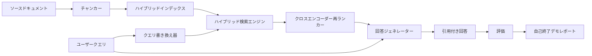

# エンドツーエンド RAG システム

> 6レッスンのコンポーネント。1つのパイプライン。1つの評価ループ。1つの自己終了デモ。これが出荷するシステムだ。


## 学習目標
- チャンカー、ハイブリッド検索エンジン、クエリ書き換え器、クロスエンコーダー再ランカー、回答ジェネレーターを1つのエンドツーエンドパイプラインに組み合わせる。
- チャンクアンカーで主張を引用し、低信頼度時に拒否するフォールバックを持つ回答ジェネレーターを実装する。
- 組み立てたパイプラインに対してレッスン68の評価を実行し、ステージごとのビルドが個々のコンポーネントに対してすべてのメトリクスで勝つことを証明する。
- fixture コーパスを取り込み、固定されたクエリセットを実行し、サマリーレポートと共にゼロで終了する自己終了 CLI デモを構築する。

## 問題

6つのコンポーネントを単独で使用しても何も証明できない。チャンカーはコーパスに対して recall@5 で勝てるが、システムの recall@5 では負ける。なぜなら検索エンジンがチャンカーの出力をランク付けできないからだ。再ランカーは合成候補プールで MRR を向上させられるが、実際のバイエンコーダー候補では失敗する。なぜなら再ランク予算でのバイエンコーダーのリコールが低すぎるからだ。クエリ書き換え器は1つのクエリでゴールドドキュメントを昇格させても、LLM モックが縮退した仮想文書を返すために次のクエリで壊れる。

統合テストはパイプライン全体を同じ fixture qrels に対して同じメトリクスでエンドツーエンドで実行し、すべてをつなぐ1つのオーケストレーターファイルを持つ。それがこのレッスンで構築するものだ。統合パイプラインのメトリクスが各ステージの単独デモのメトリクスを上回れば、システムを証明したことになる。

## コンセプト



### 配線の選択

パイプラインは小さなグラフだ。各ステージは明確な関数シグネチャを持つ。

| ステージ | 入力 | 出力 |
|---------|------|------|
| チャンカー | ドキュメントテキスト | Chunk レコードのリスト |
| 検索エンジン | クエリ文字列 | トップ N Chunk レコード |
| 書き換え器（任意） | クエリ文字列 | 書き換えのリスト + 仮想文書 |
| 再ランカー | クエリ、候補 | クロスエンコーダースコア付きのトップ K Chunk レコード |
| ジェネレーター | クエリ、トップ K Chunk レコード | 引用付き回答文字列 |

各シグネチャが安定していれば組み合わせは簡単だ。レッスンの `Pipeline` クラスは5つのステージと、それらを順に実行する `query` メソッドを持つ。すべてのステージは交換可能：異なるチャンカー、検索エンジン、書き換え器、再ランカー、またはジェネレーターを渡してもパイプラインは動き続ける。

### 引用付き回答ジェネレーター

ジェネレーターは最後のステージで、最も壊れやすい。レッスンは決定論的なモックジェネレーターを出荷する：

1. 再ランクされたトップ K チャンクを取る。
2. テキストにクエリとの最高のコンテントトークン重複があるチャンクを最大2つ選ぶ。
3. 選ばれたチャンクから1文ずつ連結した回答を発する。各文の後に `[doc_id:chunk_index]` アンカーを付ける。
4. 拒否閾値を超えるオーバーラップを持つチャンクがない場合、引用なしで「わかりません」を発する。

プロダクションでは、プロンプトテンプレートで実際の LLM 呼び出しとスワップする：

```
You are answering a question using only the snippets below.
Cite every claim with the anchor in parentheses.
If the snippets do not answer the question, say "I do not know".

Question: {query}

Snippets:
{enumerated chunks with anchors}

Answer:
```

低信頼度時に拒否するパスが、クロスエンコーダーのランク1スコアをログに記録する理由全体だ。コーパス閾値を下回った場合、ジェネレーターは拒否する。これが幻覚した回答に対する安全バルブだ。

### 自己終了デモ

デモはすべてをエンドツーエンドで実行する。1つのクエリのステージごとの内訳を表示し、4つの fixture qrels に対して評価を実行し、メトリクステーブルを表示し、デモ内で設定された閾値をすべてのレッスン68メトリクスが満たす場合はステータスゼロで終了する。いずれかのメトリクスが閾値を下回った場合、デモは失敗したメトリクスを名指しするメッセージとともに非ゼロのステータスで終了する。

これが CI スモークテストの形だ。パイプラインはオフライン、高速、決定論的に実行する。閾値は fixture で意図的にタイトに設定されているため、6つのレッスンのどれかで退行するとデモが失敗する。

## 実装する

`code/main.py` が実装するもの：

- `Chunk` - すべてのステージを通して運ばれるレコード（レッスン64の形状を chunk_index と source doc_id で拡張）。
- `Chunker` - レッスン64からの戦略を選択（デフォルトは再帰的分割）。
- `HybridIndex` - レッスン65の BM25 + デンス + RRF をバンドル。
- `Rewriter`（任意） - クエリの長さと接続詞の存在によって、レッスン67の HyDE、マルチクエリ、分解のいずれかを選択。
- `Reranker` - レッスン66の訓練済みクロスエンコーダー。fixture 訓練セットが小さく秒単位で収束する。
- `Generator` - 引用と低信頼度拒否を持つ決定論的なモックジェネレーター。
- `Pipeline` - `query(question)` メソッドで5つのステージを組み合わせ、`Result(answer, top_k, latency_ms_per_stage)` を返す。
- `run_demo()` - コーパスを取り込み、3つの fixture クエリを実行し、評価を実行し、結果を表示し、閾値でステータスコードを設定する。

実行方法：

```bash
python3 code/main.py
```

出力は1つのクエリトレース、フル評価テーブル、最終合格/不合格ステータスだ。fixture でステータスコード0を返す。

## デモが隠す失敗モード

**チャンカー境界のドリフト。** 評価 qrels のラベリングパスとデモの間でチャンカー戦略を交換すると、ゴールドドキュメント id が一致しなくなる。qrels ファイルでチャンカー戦略をロックする。デモのヘッダーにはチャンカーの名前が含まれる。

**再ランカー訓練セットが評価にリークする。** レッスン66の14の訓練トリプルには評価クエリに似たクエリが含まれる。プロダクションでは評価クエリを厳密に保留する。デモの評価クエリは再ランク訓練セットと意図的に切り離されている。

**モックジェネレーターが幻覚リスクを隠す。** モックは検索されたチャンクからのテキストのみを発するため幻覚できない。レッスンはこれに注意し、実際のモデルへのプロダクションスワップインパスを指し示す。

**ストリーミングなし。** パイプラインはすべてのステージの最後に完全な回答を返す。プロダクションシステムはジェネレーターの出力をストリームする。ストリーミングはスコープ外。回答グレードメトリクスはどちらでも最終文字列で動く。

**レイテンシーはオフライン。** モック LLM 呼び出しは一定時間だ。実際の LLM 呼び出しが支配する。リクエストスコープでレイテンシー予算を計画する。レッスンのステージごとのタイミングは CPU 作業のみを測定する。

## 使ってみる

プロダクションパターン：

- パイプラインファイルを明示的なステージインターフェースを持つ1つのオーケストレーターの下に出荷する。リポジトリ全体に配線を広げない。
- ステージに触れるすべてのマージの前に評価を実行する。評価が下がればマージしない。
- CI 実行ごとにメトリクストレースを永続化してステージスワップへの退行を帰属できるようにする。
- 30秒以内に実行する20クエリのスモークセット（退行セットのサブセット）を追加する。フル退行セットは毎晩実行する。

## 成果物を出す

このレッスンのパイプラインファイルは、フェーズ19の Track F レッスンが仮定する形だ。後続のレッスンでは取り込み自動化、増分再インデックス、テレメトリ、サービング層が追加される。検索、再ランク、書き換え、評価の各部分はここで完結している。

## 演習

1. 書き換え器内でクエリごとの戦略セレクターを追加する：レッスン67のヒューリスティック（長さ、接続詞、専門用語率）が HyDE、マルチクエリ、分解を選ぶ。
2. 環境フラグの後ろにジェネレーター用の実際の LLM 呼び出しを追加する。デフォルトはモック。レイテンシーデルタを測定する。
3. デモに実際のコーパスをロードする `--corpus path` フラグを追加する。評価と閾値チェックを再実行する。
4. チャンカーに `--strategy` フラグを追加する。エンドツーエンドのリコールへの各戦略の貢献を測定する。
5. ストリーミングジェネレーターインターフェースを追加して評価に接続する。忠実性がストリームされたプレフィックスではなく最終文字列で計算されることを確認する。

## キーワード

| 用語 | よく言われること | 実際の意味 |
|------|-----------------|------------------------|
| パイプライン | 「RAG パイプライン」 | 取り込みから引用付き回答までの組み合わせたステージ |
| 引用アンカー | 「ソースリンク」 | 各主張に付与される (doc_id, chunk_index) 参照 |
| 低信頼度拒否 | 「わかりません」 | 再ランカーのトップ1スコアが閾値を下回るとジェネレーターが回答を返さない |
| スモークセット | 「CI 評価」 | すべての PR チェックで実行される最小 qrels サブセット |
| ステージインターフェース | 「関数シグネチャ」 | 各パイプラインステージの安定した入出力型 |

## 参考資料

- [Anthropic、検索と検索の構築](https://www.anthropic.com/news/contextual-retrieval)
- [Pinterest、MCP 内部検索](https://medium.com/pinterest-engineering) - リファレンスプロダクションアーキテクチャ
- [Ragas：RAG パイプラインの自動評価](https://docs.ragas.io)
- フェーズ11 レッスン06 - RAG の基礎
- フェーズ19 レッスン64〜68 - ここで組み合わせるコンポーネント
