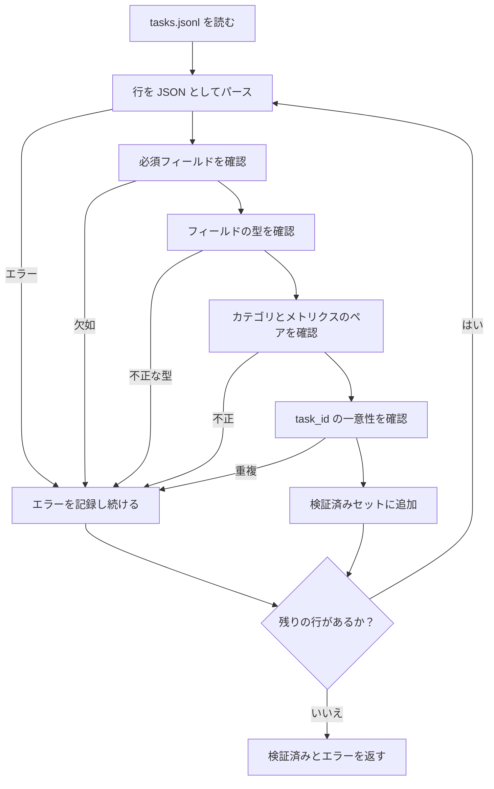

# タスクスペック形式

> 評価ハーネスは、タスクが守るコントラクトと同じ品質しか持てない。スコアリング関数を1つ書く前に JSONL の形状とメトリクスの語彙を固定する。


## 学習目標

- 算術、多肢選択、コード実行、分類、自由記述要約を1つの形状でカバーする JSONL タスクレコードスキーマを定義する。
- 下流のレッスン（71〜73）が単一フィールドでディスパッチできるよう、メトリクス名の閉じた語彙を固定する。
- フューショットの例とポストプロセスルールをランナーではなくタスクの一部として指定することで、同じプロンプトがモデル間で同じターゲットを生成する。
- 不正なレコードがランナーに届く前に拒否する厳密なバリデーターを実装する。
- バリデーターが実際に噛める10タスクの fixture セットを出荷する。スペックのすべてのブランチを実行する。

## なぜ固定スペックが必要か

研究コードベースはテストが増えるよりも早く評価スクリプトが蓄積する。6か月後には各ノートブックが独自の JSON 形状を持ち、各メトリクスが2回再実装され、実行間で何も比較できなくなる。修正は地味だ。スキーマを選ぶ。バリデーターを書く。それ以外をすべて拒否する。このレッスンが行うことはそれだ。

この形状は BIG-bench、HELM、lm-eval スタイルのハーネスからアイデアを借りているが、フィールド名は独自のものだ。すべてのフィールドには単一のオーナーがいる。ランナーはタスクを読む。メトリクスはターゲットを読む。ポストプロセスステップは生成を正規化する。パイプラインの途中でフィールドが変更可能なものはない。

## レコードの形状

タスクは1行の JSON オブジェクトだ。ハーネスは `tasks.jsonl` を読み込み、各行を独立して検証する。不正な行はその記録を中止するが、実行は中止しない。

```json
{
  "task_id": "arith_001",
  "category": "arithmetic",
  "prompt": "Compute the result. Question: 17 + 24\nAnswer:",
  "targets": ["41"],
  "metric_name": "exact_match",
  "few_shot_examples": [
    {"prompt": "Question: 2 + 2\nAnswer:", "completion": "4"}
  ],
  "post_process": "strip_whitespace",
  "metadata": {"difficulty": "easy"}
}
```

必須フィールドは `task_id`、`category`、`prompt`、`targets`、`metric_name`、`post_process`。`few_shot_examples` と `metadata` はオプションだ。不明なトップレベルフィールドはバリデーションを失敗させる。

## フィールドルール

`task_id` は空白のない文字列だ。バリデーターはファイル全体での一意性を強制する。

`category` は `arithmetic`、`mcq`、`code_exec`、`classification`、`summary` のいずれかだ。カテゴリは合法的なメトリクスとポストプロセスのペアを制約する。`code_exec` タスクは `metric_name = code_exec` を使用しなければならず、`mcq` タスクは単一文字のターゲットに対して `metric_name = exact_match` を使用しなければならない。

`prompt` は空でない文字列だ。バリデーターは末尾の空白を禁止し、プロンプト本体にすでにフューショットブロックが含まれているレコードを拒否する。フューショットのレンダリングはランナーで行われ、作成者ではない。

`targets` は空でない文字列のリストだ。`exact_match` の場合、一致する要素があれば合格だ。`f1` と `rouge_l` の場合、最高スコアのターゲットが勝つ。`mcq` の場合、リストはちょうど1つの要素を持つ。

`metric_name` は `exact_match`、`f1`、`bleu_4`、`rouge_l`、`accuracy`、`code_exec` のいずれかだ。語彙は閉じている。新しいメトリクスには新しいレッスンとここへの新しいエントリが必要だ。

`few_shot_examples` は `{prompt, completion}` ペアのリストだ。バリデーターはプロンプトを有界に保つためリストを最大8エントリに制限する。

`post_process` は `none`、`strip_whitespace`、`lower`、`extract_letter`、`extract_code_block`、`extract_first_line` のいずれかだ。各ルールには単一の決定論的な動作がある。バリデーターはルールの組み合わせを禁止する。

## バリデーターの動作



バリデーターは2つのリストを返す：検証済みレコードと、問題のある行、違反したルール、問題のあるフィールドを含むエラーレコード。`--allow-bad-tasks` フラグが明示的に設定されていない限り、エラーリストが空でない場合ランナーは起動を拒否する。

## フューショットのレンダリング

ランナーはフューショットの例をプロンプトの前に空行区切りで連結する。同じコードパスがすべてのモデルで実行されるため、唯一の分散源はモデル自体だ。作成者は例をプロバイダーごとではなく1回書く。

```python
def render(task):
    parts = []
    for ex in task.get("few_shot_examples", []):
        parts.append(ex["prompt"] + " " + ex["completion"])
    parts.append(task["prompt"])
    return "\n\n".join(parts)
```

## ポストプロセスルール

ポストプロセスステップは生成後、メトリクスの前に実行される。決定論的でステートレスだ。

- `none` は文字列を変更せず返す。
- `strip_whitespace` は先頭と末尾の空白を削除する。
- `lower` は文字列を小文字にする。
- `extract_letter` は `[A-E]` にマッチする最初の文字を返す。MCQ に使用される。
- `extract_code_block` は最初のトリプルバッククォートのフェンスブロックの本体を返す。コード実行に使用される。
- `extract_first_line` は最初の空でない行を返す。要約分類に使用される。

このリスト外のルールが必要なタスクは新しいレッスンに属する。

## このレッスンがしないこと

スコアを付けない。モデルを呼び出さない。コードを実行しない。それらはレッスン71、72、75で来る。このレッスンはそれらすべてが守るコントラクトを固定する。

10タスクの fixture は算術2つ、MCQ2つ、コード実行2つ、分類2つ、要約2つをカバーする。バリデーターはすべて10でパスする。別の fixture（`tasks_bad.jsonl`）はすべてのルールをトリップし、バリデーターはそれだけのエラーを返す。

## コードの読み方

`main.py` は `TaskSpec`、`validate_task`、`validate_file`、CLI エントリポイントを定義する。fixture ローダーは `load_fixtures` だ。レンダリングとポストプロセスヘルパーはバリデーションの隣にあるため、レッスン75のランナーは単一モジュールをインポートする。

`main.py` を上から下まで読む。次に `code/tests/test_spec.py` を読む。テストはすべてのバリデーションルールとすべてのポストプロセスの動作を固定する。`main.py` の下部のデモはバンドルされた fixture を検証してサマリーを表示する。

## さらに進むには

実際の評価スイートはスキーマが列を増やすようにカテゴリを増やす。まじめなやり方は、メトリクス、ポストプロセスルール、少なくとも1つの fixture タスクも追加せずにカテゴリを追加することを拒否することだ。スペックをデータベースのマイグレーションのように扱う。すべての変更はレビューされ、バージョン管理され、テストを伴う。このレッスンのバリデーターがゲートだ。
