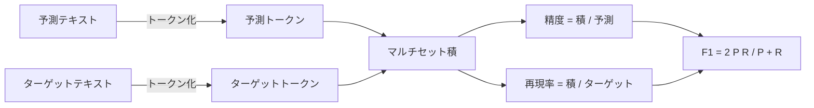
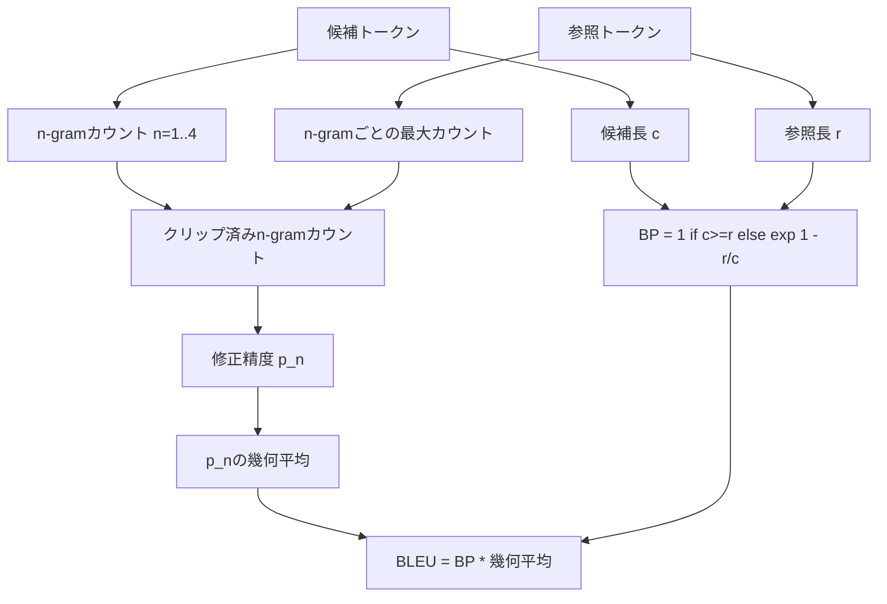

# 古典的評価指標

> BLEU、ROUGE-L、F1、exact-match、accuracy。公表されたLLM評価の数値の大半を占める5つの指標。各数値が何を意味するのかを理解するために、それぞれをゼロから実装する。


## 学習目標

- 明示的なトークン化ルールを用いて、トークンレベルのexact-match、F1、accuracyを実装する。
- BLEU-4をゼロから構築する：修正n-gram精度、n=1〜4の幾何平均、簡潔さペナルティ。
- 最長共通部分列を使ってROUGE-Lを実装し、precisionとrecallをF-betaで組み合わせる。
- レッスン70のmetric_nameフィールドに対してディスパッチし、ランナーが指標に依存しないようにする。
- サードパーティのライブラリではなく、計算例から引き出した参照ベクトルで動作を固定する。

## なぜ再実装するのか

BLEUが28.3と報告している論文と、0.283と報告している別の論文を目にすることがある。ROUGE-Lスコアが2つのライブラリ間で10ポイント異なるケースもある。一方は小文字に変換し、もう一方はしないからだ。混乱を解消する最速の方法は、指標を自分で書いてみること、そしてトークナイザーが決まる行とスムージングが適用される行を指差せるようにすることだ。そうすれば、論文間の数値比較はライブラリについての議論ではなく、指標の設定を読むだけの問題になる。

標準ライブラリとnumpyで十分だ。BLEUはカウントとクランプ処理である。ROUGE-Lは動的計画法だ。F1はトークンの集合積だ。最難関はトークナイザーの選択とその一貫した使用だ。

## トークン化

トークナイザーは `re.findall(r"\w+", text.lower())` だ。小文字化、英数字のまとまり、句読点は除去する。このレッスンのすべての指標は全く同じトークナイザーを使用する。ランナーはこれを変えることができない。トークナイザーを変えた場合、それは別のベンチマークを実行していることになる。

```python
TOKEN_RE = re.compile(r"\w+", re.UNICODE)
def tokenize(text):
    return TOKEN_RE.findall(text.lower())
```

これは意図的な簡略化だ。本番環境のセットアップでは、CJK文字、短縮形、コード識別子に注意する必要がある。このレッスンの要点は、トークナイザーが調整可能なノブではなく、契約であるということだ。

## Exact match

```python
def exact_match(pred, targets):
    return float(any(pred.strip() == t.strip() for t in targets))
```

タスクごとに1.0または0.0を返す。データセット全体での集計は平均値だ。これは、算術計算、MCQ（選択式問題）、短い分類タスクの主力指標だ。

## トークンレベルF1

予測とターゲットのトークンマルチセットを設定する。Precisionはマルチセット積を予測のマルチセットで割ったものだ。Recallは同じ積をターゲットのマルチセットで割ったものだ。F1は調和平均だ。実装では、空の予測と空のターゲットのエッジケースを処理する。



複数ターゲットのタスクでは、ターゲットリスト全体で最良のF1を取る。これは文献で広く報告されているSQuADスタイルの動作に一致する。

## BLEU-4

BLEUは機械翻訳の標準指標であり、要約の研究にも依然として登場する。使用する定式化は、標準の簡潔さペナルティと、単一の4-gramの欠如がスコアをゼロにしないよう修正n-gramカウントに加算1スムージングを施したコーパスレベルBLEU-4だ。

候補と参照の各ペアについて、n=1,2,3,4の修正n-gram精度をカウントする。修正精度では、候補のn-gramカウントをいずれかの参照中のそのn-gramの最大カウントでクリップする。これにより、候補が1つのフレーズを繰り返してスコアを水増しすることを防ぐ。4つの精度の幾何平均を簡潔さペナルティでラップする。



スムージングルールはLin and Ochがmethod 1と呼んだものだ：対数を取る前に各n-gram精度の分子と分母の両方に1を加算する。これにより、参照に一致する4-gramがない場合の`log 0`を回避し、長い候補では非スムージング値に近い値を保持する。

## ROUGE-L

ROUGE-Lは候補と参照のトークン列の最長共通部分列（LCS）を比較する。LCSは連続性を強制せずに語順を捉えるため、デフォルトの要約指標となっている。標準的な動的計画テーブルでLCS長を計算し、recallを`lcs / 参照長`、precisionを`lcs / 候補長`として導き、beta=1の対称F1形式のF-betaで結合する。

```python
def lcs_length(a, b):
    n, m = len(a), len(b)
    dp = numpy.zeros((n + 1, m + 1), dtype=int)
    for i in range(n):
        for j in range(m):
            if a[i] == b[j]:
                dp[i+1, j+1] = dp[i, j] + 1
            else:
                dp[i+1, j+1] = max(dp[i+1, j], dp[i, j+1])
    return int(dp[n, m])
```

numpyテーブルで実装を見やすくしている。純粋なPythonリストでも動作する。ROUGE-Lを選択したタスクは、タスクごとにO(n m)のコストを負担する。典型的な要約長では1ミリ秒未満に収まる。

## Accuracy

複数ターゲットの分類タスクでは、accuracyは単一の正規化されたターゲットに対するexact-matchに帰着する。ランナー内の文字列比較を経由せずにディスパッチャーが`metric_name`でディスパッチできるよう、別関数として公開する。

## ディスパッチ契約

唯一のエントリポイントは`score(metric_name, prediction, targets)`だ。`[0, 1]`の浮動小数点数を返す。ランナーは指標名で分岐しない。呼び出しを委譲して結果を書き込む。これが、レッスン75がレッスン70のタスク仕様と接続する際のインターフェースだ。

```python
def score(metric_name, pred, targets):
    if metric_name == "exact_match":
        return exact_match(pred, targets)
    if metric_name == "f1":
        return max(f1_score(pred, t) for t in targets)
    if metric_name == "bleu_4":
        return max(bleu4(pred, t) for t in targets)
    if metric_name == "rouge_l":
        return max(rouge_l(pred, t) for t in targets)
    if metric_name == "accuracy":
        return accuracy(pred, targets)
    raise ValueError(f"unknown metric_name: {metric_name}")
```

`code_exec`はレッスン72で処理され、そこでディスパッチャーに組み込まれる。

## このレッスンで扱わないこと

モデルを呼び出さない。レッスン70の後処理ルールで実施済みの内容を超えた生成のノーマライズは行わない。信頼区間は計算しない。BLEURTやBERTScoreは実装しない（これらはモデルを必要とし、別のレッスンで扱う）。このレッスンの要点は基盤だ：5つの指標、1つのトークナイザー、1つのディスパッチテーブル。

## コードの読み方

`main.py`は各指標を自由関数とディスパッチャーとして定義している。参照ベクトルはファイル末尾の`_reference_examples`ブロックに収められている。デモはディスパッチャーを8つの例に対して実行し、指標ごとのスコアを出力する。`code/tests/test_metrics.py`のテストは参照ベクトルを固定し、すべてのエッジケース（空の予測、空の参照、共通トークンなし、完全一致、繰り返しフレーズのクリッピング）を検証する。

`main.py`を先頭から読む。関数は複雑さの順に並んでいる。exact_matchとaccuracyはそれぞれ1行だ。F1は6行だ。BLEUとROUGE-Lが重要な部分で、スムージングルールとLCSの漸化式について詳細なコメントが含まれている。

## さらに学ぶために

古典的指標は必要条件であって、十分条件ではない。表面的な重なりを報酬として与え、意味を見逃す。解決策は、古典的な基盤を信頼した後、モデルベースの指標（BLEURT、BERTScore、GEval）を重ねることだ。それは後のレッスンで扱う。今は：この5つを機能させ、テストで固定し、監査可能で高速かつ再現可能な指標スタックを手に入れよう。
