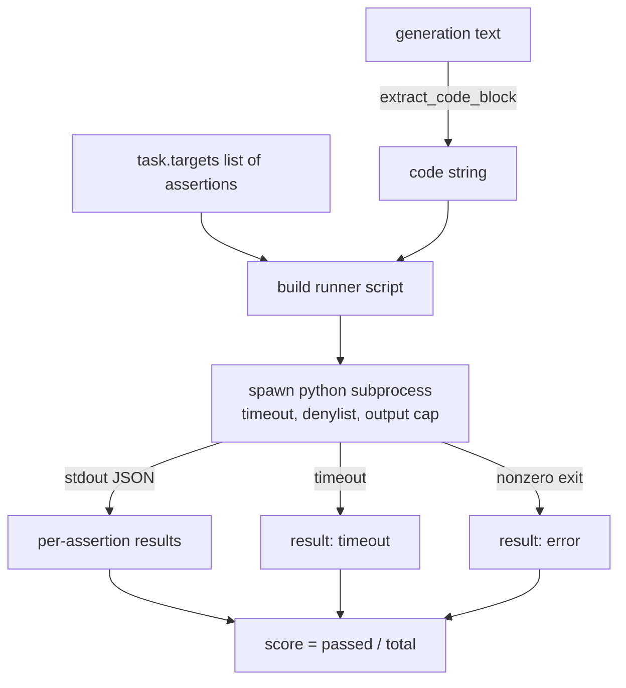
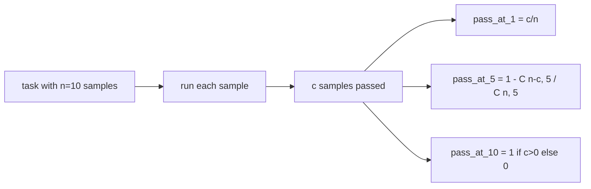

# コード実行指標

> 生成されたコードはテストを通過したときに正しい。評価ハーネスは、ホストをクラッシュさせずにコードを抽出・実行し、合格率を正直に集計する必要がある。このレッスンではそのインターフェースを構築する。


## 学習目標

- レッスン70の後処理ルールに合致する方法で、自由形式の生成からコードブロックを抽出する。
- ウォールクロックタイムアウト、出力上限、インポート拒否リストを持つ分離されたサブプロセスで候補コードを実行する。
- 提供されたアサーション文字列のうち候補に対して合格したものの割合でタスクをスコア付けする。
- 1つのモデルから複数の生成をサンプリングするタスクのpass@kを計算する。
- サンドボックスのクラッシュ、構文エラー、タイムアウトを、ランナーがログに記録できる明確な終了コードを持つ一流の失敗モードとして扱う。

## 分離されたサブプロセスを使う理由

インラインの`exec`はセキュリティと安定性の脅威だ。生成された`while True: pass`は評価を永久にブロックする。生成された`import shutil; shutil.rmtree('/')`はその通り破滅的だ。解決策は、候補ごとに新しいPythonインタープリターを起動し、コードをstdinで渡し、アサーション結果をstdoutに書き込み、時間超過なら処理を終了させることだ。ホストの評価プロセスは動き続ける。

HumanEval、MBPP、BigCodeBench、LiveCodeBenchなどの実際の評価はすべてサブプロセスサンドボックスを使用している。その上にDockerを重ねるものもある。サブプロセスで止めるのには理由がある。移植性があり、標準ライブラリで実装でき、教育的な評価に重要な失敗モードをキャッチできる。本番環境のデプロイメントではseccomp、ネットワーク分離、読み取り専用ファイルシステムを追加する。次の強化についてのレッスンはこのトラック外にある。

## コード実行タスクの形

`code_exec`タスクは`targets`にアサーション文字列を持つ。ランナーは生成からフェンスされたコードブロックを抽出し、その周りにテストハーネスを構築して実行する。



スコアは`[0, 1]`の分数だ。3つのアサーションのうち2つが合格したタスクは0.667のスコアになる。何が失敗しても同じ形を返す：サブプロセスのクラッシュはPythonのトレースバックをハーネスまで伝播させずに正規化されたエラーコードにマッピングされる。

## 拒否リスト

拒否リストはインポートベースだ。候補コードを実行する前に、ランナースクリプトが危険なモジュールのインポートを`ImportError("denied")`を発生させるスタブに書き換える。このリストは意図的に保守的だ：`os.system`、`subprocess`、`socket`、`requests`、`urllib`、`urllib.request`、`urllib.error`、`urllib.parse`、`ctypes`、`shutil`、`http.client`、`asyncio.subprocess`。

これが完璧な防御だとは主張しない。悪意あるコードはPythonのインプロセスサンドボックスから脱出できる。拒否リストは最後の砦だ。ウォールクロックタイムアウトと出力上限が主要な制御だ。

```python
DENIED = {
    "os.system": True,
    "subprocess": True,
    "socket": True,
    "shutil": True,
    "requests": True,
    "urllib": True,
    "ctypes": True,
}
```

候補の前に`import sys`と`os.system`をraise するガードのモンキーパッチを追加する。完全なテンプレートは`main.py`にある。

## ウォールクロックタイムアウト

各サブプロセスはデフォルトで3秒のウォールクロック予算を持つ。ランナーは`subprocess.run(..., timeout=t)`を使う。タイムアウトが発動すると、ランナーは`TimeoutExpired`をキャッチし、プロセスを終了させ、タスクに`timeout`終了理由を記録する。そのタスクのスコアはゼロだ。ランナーは処理を続ける。

タイムアウトは`task.metadata.timeout_s`を通じてタスクごとに設定可能だ。長時間実行するユニットテストはより多くの時間を要求できる。レッスン70のバリデータは、スイートを有界に保つためにこの値を30秒に上限を設けている。

## 出力上限

サブプロセスはstdoutを大量に出力してホストメモリを枯渇させる可能性がある。ランナーはstdoutをバッファにストリームし、累計が256KBを超えた瞬間に子プロセスを終了させる。結果は`exit_code = error`として記録され、詳細文字列は`"output overflow"`となる。これは生成が誤って無限に出力するループを書いた場合に実際に発生する。

## Pass@k

Pass@kはHumanEvalなどで使用される不偏推定量だ。タスクごとに`n`個の独立したサンプルがあり、そのうち`c`個が合格している場合、サイズ`k`の`n`からのサンプルに少なくとも1つの合格解が含まれる確率は：

```
pass_at_k(n, c, k) = 1 - C(n - c, k) / C(n, k)
```

`n - c < k`の場合、分子は未定義となり、値は`1`だ。実装はこのエッジケースを直接処理する。レッスン74のリーダーボード層が使用するために`pass_at_k(n, c, k)`を公開する。



## 終了コード

ランナーはタスクごとに5つの結果のいずれかを返す：

- `pass`：すべてのアサーションが合格したとき。
- `assertion_fail`：コードは実行されたが少なくとも1つのアサーションが失敗したとき。
- `syntax_error`：コードがインポートできなかったかSyntaxErrorがあったとき。
- `timeout`：ウォールクロックが超過したとき。
- `error`：その他のクラッシュ（拒否リストのヒットや出力オーバーフロー含む。オーバーフローは詳細`"output overflow"`で表示）。

スコアは依然として分数だ。終了コードはメタデータだ。下流のレッスンは、タイムアウトをゼロとして数えるか欠損データとして扱うかを決定できる。

## このレッスンで扱わないこと

実際のサンドボックスは提供しない。オープンウェブからの信頼できないコードを実行しない。ファイルI/Oやネットワーク呼び出しなどのステートフルなタスクを扱わない。それらにはコンテナかマイクロVMが必要だ。このレッスンの要点は契約だ：分離されたサブプロセス、拒否リスト、タイムアウト、出力上限、クリーンな終了コード語彙、pass@k数学。

## コードの読み方

`main.py`は`extract_code`、`run_candidate`、`score_code_exec`、`pass_at_k`を定義している。サブプロセスランナースクリプトは文字列として構築され、新しいPythonインタープリターへの`-c`として渡される。`code/tests/test_exec.py`のテストは4つの終了コードとpass@kをHumanEvalスタイルから引き出した計算例で検証する。

`main.py`を先頭から読む。ランナーテンプレートが主要部分だ。アサーションループを、それが親プロセスに書き返すJSONエンベロープを予測できるまでじっくり見る。

## さらに学ぶために

サブプロセスの形が機能したら、次の関心事は移植性だ。PythonのバージョンによってWindowsでのSIGKILLの処理が異なる。最も綺麗な解決策はランナーをDockerイメージに入れることだ。その次はアサーション文字列を実際のユニットテストファイルに置き換えることだ。そうすれば評価が本番CIと一致する。その時点でアサーション文字列をテストと呼ぶのをやめよう。それはおもちゃのテストであり、おもちゃの失敗モードを持つ。
