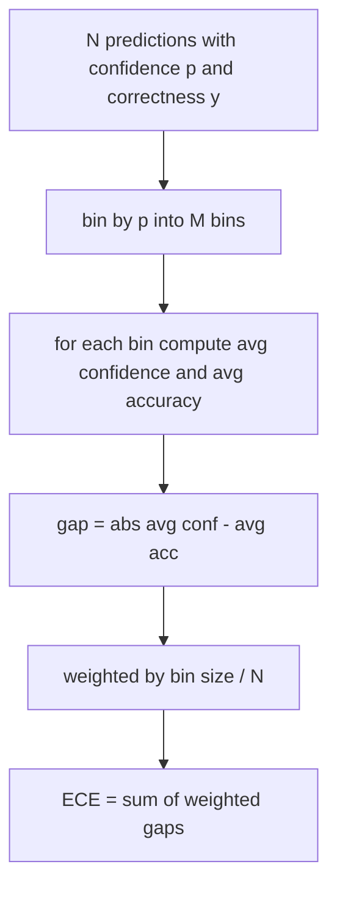
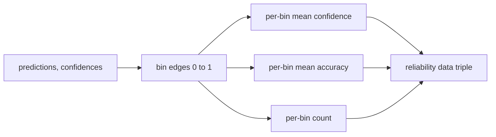

# パープレキシティとキャリブレーション

> あなたのモデルが1000個の回答に対して90%の自信を持ち、600個正解したとすれば、それは十分にキャリブレーションされていない。キャリブレーションは信頼性の高い評価の半分を占める。もう半分はパープレキシティだ。これはモデルが保留テキストをそもそも妥当と考えるかどうかを示す。


## 学習目標

- モデルアダプタから提供されるトークンの負の対数確率から、保留コーパスのトークンレベルパープレキシティを計算する。
- ビン分割された予測確率から、分類器または選択式評価の期待キャリブレーション誤差（ECE）を計算する。
- Brierスコア（正確性の指標に対する平均二乗誤差）を計算し、ECEができないことをいつカバーするかを説明する。
- 信頼性図のデータを構築して、信頼度対精度曲線をプロットする。
- 3つすべてを評価ハーネスに組み込み、ランナーがモデルレポートに`perplexity`、`ece`、`brier`の数値を添付できるようにする。

## パープレキシティが教えてくれること

パープレキシティはトークンごとの平均負の対数尤度を指数化したものだ。低いほど良い。パープレキシティ1は、モデルが実際のすべてのトークンに確率1を割り当てることを意味する。パープレキシティが語彙サイズに等しい場合、モデルは一様で何も学んでいない。実際の数値はその間にある：WikiText-103での2026年の優れたベースモデルは8〜12程度。同じテキストで悪いモデルは50以上になる。

ハーネス自体は対数確率を計算しない。それはモデルアダプタから来る。ハーネスは集計する：トークンごとの対数確率のリスト、シーケンスごとのトークン数のリストを受け取り、コーパスのパープレキシティを返す。

```python
def perplexity(neg_log_probs, token_counts):
    total_nll = sum(neg_log_probs)
    total_tokens = sum(token_counts)
    return math.exp(total_nll / total_tokens)
```

実装はゼロトークンのエッジケースを処理し、負の対数確率が非負であることをアサートする。よくある間違いは符号を忘れること：`-log p`の代わりに`log p`を返すアダプタは不可能な1未満のパープレキシティを生成する。関数はそれをコントラクト違反としてキャッチする。

## ECEが測定するもの

期待キャリブレーション誤差は、固定数のビンに信頼度で予測をグループ化し、ビンサイズで重み付けした信頼度と精度の平均ギャップをビン間で測定する。



標準的な定式化では`[0, 1]`で10等幅ビンを使用する。実装は任意の正の整数カウントをサポートする。ランナーが出版慣例（10）と比較慣例（15）を選べるよう`bins`パラメータを公開している。

ECEはビン数とサンプルサイズによって偏る。10ビンで100予測では、0.02 ECEとランダムノイズを区別できない。実装はECEとともに入力されたビン数を返す。ランナーがサンプル不足の時に単一の数値を報告することを拒否できるようにするためだ。

## BrierスコアがECEにできないことをすること

ECEは平均ギャップしか見ない。半分のビンで過信し、残り半分で過小信頼するモデルは、局所的にキャリブレーションが悪くても低いECEを持てる。Brierスコアは予測ごとの真の結果に対する二乗誤差を測定するため、広がりを直接ペナルティとする。

二値結果でのBrierは`mean((p_i - y_i)^2)`だ。信頼性、分解能、不確実性に分解される。スコアと分解の両方を計算する。ランナーはスカラーを報告するが、ダッシュボード用に分解をログに記録する。

```python
def brier(p, y):
    return float(np.mean((p - y) ** 2))
```

## 信頼性図データ

信頼性図は各ビンで予測信頼度を対経験的精度にプロットする。対角線が完全なキャリブレーションだ。この関数は3つの配列を返す：ビンごとの平均信頼度、ビンごとの平均精度、ビンごとのカウント。プロットコードは下流にある。このレッスンはデータ形状で止まる。



返却されるタプルは、呼び出し側がプロットを描くか、カスタムECEバリアント（適応ECE、スイープECEなど）を計算するのに必要なものだ。下流のコードが変換不要なようnumpy配列を返す。

## 信頼度のソース

ハーネスは信頼度がsoftmaxから来ることを仮定しない。予測ごとに`[0, 1]`の任意の数値を受け取る。選択式タスクでの自然な信頼度は`オプション対数尤度のsoftmax`だ。自由テキストでの自然な信頼度はモデルの自己報告確率や平均対数尤度の指数だ。評価はただその数値を消費する。それがどこから来るかはアダプタの仕事だ。

## エッジケース

- すべての予測が間違い：ECEは平均信頼度、Brierは高い、パープレキシティはモデルがテキストをどう思うかによる。
- すべての予測が高信頼度で正しい：ECEはゼロに近い、Brierはゼロに近い。
- p=0.5の完全に不確実な予測者：ECEは0.5マイナス精度、Brierは0.25マイナス補正項。
- 空の入力：ECE、Brier、信頼性は`0.0`（またはゼロ埋め配列）を返す。パープレキシティはゼロトークンのケースで`NaN`を返す。これらのパスはいずれも警告を発しない。ランナーが値を検査して報告するかスキップするかを決定する。

これらのケースはテストに組み込まれている。実際のベンチマークでの本物のモデルはこれらに当たらないが、バグのあるアダプタや小さなサンプルは当たり、ランナーはクラッシュすべきでない。

## ディスパッチ

キャリブレーションはF1のようなタスクごとの指標ではない。モデルごとのレポートだ。ランナーは評価全体で`(confidence, correct)`ペアを蓄積し、ECE、Brier、信頼性データを一度計算する。パープレキシティはタスクごとのスコアリングとは別に、保留テキストコーパスで計算される。

インターフェースは：

```python
report = CalibrationReport.from_predictions(confidences, correct)
report.ece          # float
report.brier        # float
report.reliability  # tuple of three numpy arrays
report.populated_bins  # int
```

`PerplexityResult.from_token_nll(neg_log_probs, token_counts)`はパープレキシティとトークンごとの平均負の対数尤度を返す。

## このレッスンで扱わないこと

モデルを呼び出さない。softmaxを実装しない。出力トークンから信頼度を推定しない（それはアダプタの仕事だ）。温度スケーリングやPlattスケーリングは実装しない（これらは後のレッスンで扱うポストホック修正だ）。このレッスンの要点は3つの数値（パープレキシティ、ECE、Brier）を信頼できて再現可能にすることだ。

## コードの読み方

`main.py`は`perplexity`、`expected_calibration_error`、`brier_score`、`reliability_diagram`、`CalibrationReport`/`PerplexityResult`データクラスを定義している。デモは真の結果がわかっている合成予測で実行される：十分にキャリブレーションされたモデル、過信モデル、過小信頼モデル。`code/tests/test_calibration.py`のテストはすべてのエッジケースと合成予測子の参照値を固定している。

`main.py`を先頭から読む。関数の順序はスカラーからベクターへ、そしてレポートへと進む。各関数には数学と契約を記した簡単なdocstringがある。

## さらに学ぶために

キャリブレーションは公表された評価で最も無視される軸だ。ほとんどのリーダーボードは単一の精度の数値を報告して終わりにしている。精度で勝ちながらBrierで負けるモデルは、精度が数ポイント低くても不確実性を確実に報告するモデルより本番デプロイメントとして劣っている。キャリブレーションの配管が整ったら、保留バリデーションスライスで温度スケーリングを追加し、ECEを再計算してギャップが縮まるのを観察しよう。それは別のレッスンだが、基盤はここにある。
