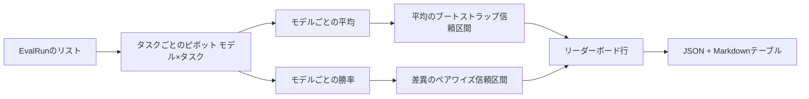
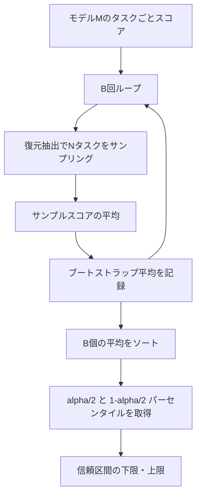

# リーダーボード集計

> タスクごとのスコアは簡単だ。異質なタスク間でのモデルごとのランキングはより難しい。1000個の予測リーダーボードでの統計的有意性は、誰もが省く部分だ。このレッスンでは省かない。


## 学習目標

- 複数のモデルと複数のタスクにわたるタスクごとのスコアを、モデルごとの整然としたデータ行に集計する。
- 合格率とBLEU値が集計に過度な影響を与えないよう、異質なスコアを正規化する。
- 平均と勝率でモデルをランク付けし、それぞれがいつ適切な要約かを説明する。
- モデルごとの平均スコアとペアワイズ差異に対してブートストラップ信頼区間を計算する。
- リーダーボードをJSONレポートと、レッスン75のランナーがCIコメントに貼り付けられるMarkdownテーブルとして出力する。

## 入力の形

集計器は`EvalRun`レコードのリストを消費する：

```python
@dataclass
class EvalRun:
    model_id: str
    task_id: str
    metric_name: str
    score: float          # in [0, 1]
    category: str
```

レッスン75のランナーは`(model, task)`ペアごとに1つのレコードを出力する。集計器はスコアがどのように生成されたかを気にしない。正規化がすでに行われていることを期待する：すべてのスコアが`[0, 1]`にある。

## 出力

3つのテーブルが出力される：



リーダーボード行には`model_id`、`mean_score`、`mean_ci_lo`、`mean_ci_hi`、`win_rate`、`tasks_completed`、オプションのカテゴリごとの平均の`categories`マップが含まれる。

## 正規化

一方のタスクが`[0, 1]`でスコア付けされ、もう一方が`[0, 100]`でスコア付けされる場合、2番目が平均を無音で支配する。集計器はすべての入力スコアが`[0, 1]`にあることを検証し、そうでない場合は実行を拒否する。修正は上流にある：指標はすでに分数を返すべきだ。レッスン71〜73がその契約を強制している。

## 平均と勝率

2つのランキング方式は異なる目標を果たす。

平均スコアは1つのモデルのタスクごとのスコアの平均だ。リーダーボードが報告するヘッドライン数値だ。外れ値とタスクの不均衡に敏感だ。

勝率は同じタスクでモデルが他のすべてのモデルに勝つ頻度をカウントする。各タスクについて、最高スコアのモデルが勝つ（同点は分割）。勝率は勝ち数をモデルがスコアを持つタスク数で割ったものだ。外れ値とスケールの違いに対してより鈍感だが、情報を失う。

```python
def win_rate(model_id, runs_by_task, all_models):
    wins, total = 0, 0
    for task_id, runs in runs_by_task.items():
        scores = {r.model_id: r.score for r in runs if r.model_id in all_models}
        if model_id not in scores:
            continue
        total += 1
        best = max(scores.values())
        if scores[model_id] >= best:
            wins += 1
    return wins / total if total else 0.0
```

ハーネスは両方を報告する。レッスン75のランナーはデフォルトで平均でランク付けする。勝率のMarkdown列はユーザーが好む場合のためにそこにある。

## ブートストラップ信頼区間

モデルごとの平均には、タスクに対するブートストラップリサンプリングで推定された信頼区間が伴う。タスクIDを復元抽出でリサンプリングし、リサンプリングセットの平均を計算し、`B`回繰り返し、レベル`alpha`のパーセンタイル区間を取る。



ペアワイズ比較では、タスクごとの差`score_A - score_B`をブートストラップし、パーセンタイル区間を取り、それを報告する。ユーザーは区間がゼロを除外しているかを読み取る。除外している場合、差はレベルalphaで有意だ。除外していない場合、リーダーボードはモデルを同点として扱う。

低レベルヘルパー（`bootstrap_mean_ci`、`bootstrap_pairwise_diff`）はデフォルトで`B=1000`。公開集計器（`aggregate`、`pairwise_diffs`）はデフォルトで`b=500`でデモとテストを高速に保つ。デフォルトのalphaは0.05。レッスンはブートストラップをscipy抜きの純粋なnumpyで保つ。

## カテゴリ

`EvalRun.category`が設定されている場合、集計器はカテゴリごとの平均も報告する。これはすべてのリーダーボードにある`math`、`reasoning`、`code`、`safety`の列だ。ランナーがモデルが全体的には優れているがコードが弱いかどうかを見つけることができる。ヘッドライン平均が隠している情報だ。

## Markdownレンダリング

リーダーボードはMarkdownテーブルとしてレンダリングされる：

```text
| Rank | Model | Mean | 95% CI | Win rate | Tasks |
|------|-------|------|--------|----------|-------|
| 1    | gpt   | 0.78 | 0.74-0.82 | 0.62 | 50 |
| 2    | claude| 0.75 | 0.71-0.79 | 0.34 | 50 |
| 3    | random| 0.10 | 0.07-0.13 | 0.04 | 50 |
```

テーブルは平均スコア順にソートされる。CIは小数点以下2桁でレンダリングされる。長いモデルIDは20文字に切り詰められる。

## このレッスンで扱わないこと

モデルを実行しない。指標層を呼び出さない。適応ECEや他のキャリブレーションバリアントは実装しない（それはレッスン73だ）。タスクの重み付けは実装しない。ここではすべてのタスクが同じカウントだ。本番のリーダーボードはタスクを重み付けする。`weight`フィールドを通じてそのフックは開いたままにしておくが、集計器では無視する。必要であれば後続のレッスンで重み付けを追加しよう。

## コードの読み方

`main.py`は`EvalRun`、`LeaderboardRow`、`aggregate`、`bootstrap_mean_ci`、`bootstrap_pairwise_diff`、`render_markdown`を定義している。デモは3つのモデルと12のタスクの合成スイートを構築し、集計して、リーダーボードとペアワイズ差テーブルを出力する。`code/tests/test_leaderboard.py`のテストはブートストラップ、Markdownレンダリング、勝率のエッジケース、空入力動作を固定している。

`main.py`を先頭から読む。データ形状（EvalRun、LeaderboardRow）が最初、集計器が次、ブートストラップが3番目、レンダリングが最後だ。各関数には焦点を絞った契約がある。

## さらに学ぶために

次のステップはペアリングされていないブートストラップの代わりにペアードタスク有意性だ。モデルAとBが同じ100のタスクを両方実行した場合、適切なテストはタスクごとの差に対するペアードブートストラップであり、これは実装している。それ以外には、タスクファミリーを尊重する階層的ブートストラップが必要だ（数学の問題は互いに独立していない；算術エラーのパターンがそのうちの10個に影響する）。それはフォローアップだ。このレッスンの要点は基盤を正しく機能させ、評価が守れる数値を報告するようにすることだ。
