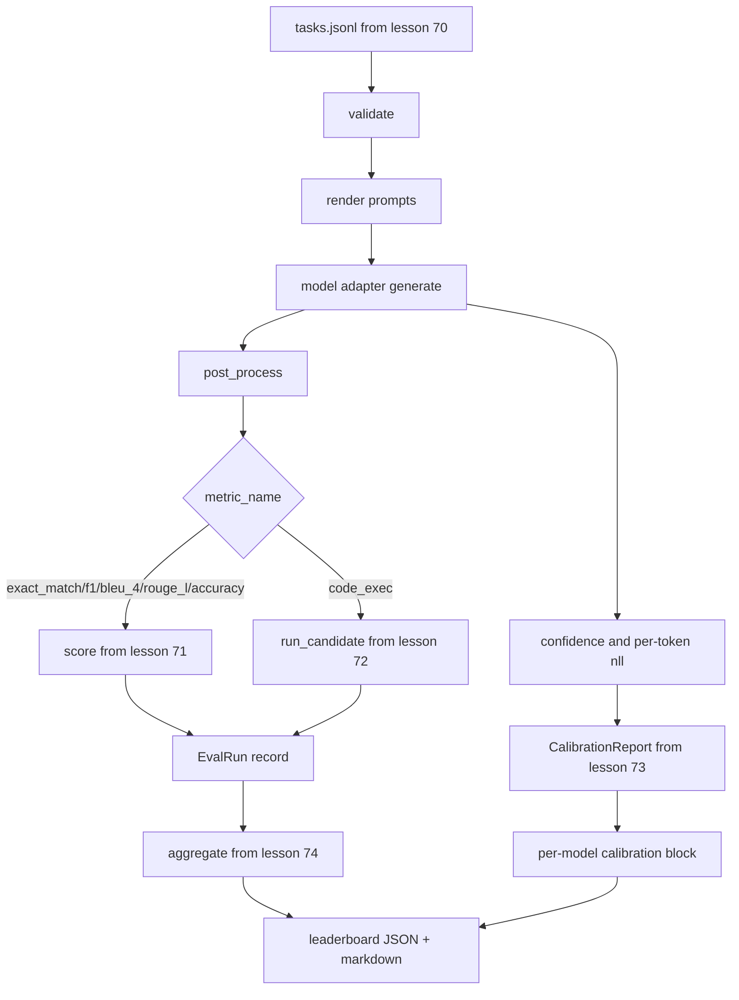

# エンドツーエンド評価ランナー

> 5レッスン分の配管、1レッスンで接着する。ランナーはレッスン70のタスク仕様を読み込み、アダプタ経由でモデルを呼び出し、レッスン71・72でスコア付けし、レッスン73のキャリブレーションレポートを添付し、レッスン74のリーダーボードを出力する。デモは自己終了する。


## 学習目標

- モデル（モック、ローカル、API）が小さなメソッドサーフェスで満たせる`ModelAdapter`インターフェースを定義する。
- ワーカープールを使った並列タスク実行でフィクスチャJSONLファイル上の評価を実行する。
- 指標層（exact_match、F1、BLEU-4、ROUGE-L、code_exec）とキャリブレーション層を1回のパスで組み合わせる。
- モデルごとの`EvalRun`レコードを出力してリーダーボード集計器に直接入力する。
- JSONレポートとMarkdownテーブルの両方を出力。クリーンな実行では終了コードゼロ、バリデーションまたはランタイム失敗では非ゼロで自己終了する。

## パイプライン



ランナーは統合ポイントだ。レッスン70〜74はそれぞれ1つのモジュールを所有し、ランナーがそれらを組み合わせる。ランナーはそれらのモジュールからいかなるロジックも複製しない：インポートするだけだ。

## アダプタインターフェース

アダプタはランナーとモデル間のシームだ。インターフェースは意図的に小さい。

```python
class ModelAdapter:
    model_id: str

    def generate(self, prompt: str, task: TaskSpec) -> Generation: ...
```

`Generation`は次のフィールドを持つデータクラスだ：

- `text`：モデルの自由形式の出力
- `confidence`：回答のモデルの自己報告確率を表す`[0, 1]`のfloat
- `token_nll`：生成されたトークンの負の対数尤度の合計（オプション）
- `token_count`：生成されたトークン数（オプション）

ランナーのモックアダプタは3種類を提供する：`RuleBasedAdapter`（決定論的、ほぼ完璧）、`NoisyAdapter`（過信、しばしば間違い）、`BiasedAdapter`（1つのカテゴリが得意、別のカテゴリが苦手）。デモはレッスン70のフィクスチャ上でこれら3つすべてを実行する。

## 並列実行

ランナーは`concurrent.futures.ThreadPoolExecutor`を使ってモデルごとに並列でタスクを実行する。ワーカー数はデフォルトで8とタスク数の小さい方だ。実際のモデル呼び出しのボトルネックはネットワークI/Oなので、スレッドで十分だ。コード実行パスはタスク内で自身のサブプロセスを起動し、エグゼキューターは待機のスケジューリングのみ行う。

決定論的なテストのために、ランナーは`run_eval(adapters, tasks, parallel=False)`を公開しており、テストが実行順序を固定できる。

## 単一パススコアリングループ

各タスクについて：

1. プロンプトをレンダリングする（少数ショットのプレフィックスとプロンプト本文）。
2. アダプタを呼び出して時間を計測する。
3. タスクのルールに従って生成を後処理する。
4. 指標層にディスパッチする。
5. スコアと指標メタデータを持つ`EvalRun`レコードを構築する。
6. `(confidence, correct)`ペアをキャリブレーションバッファに追加する。

`correct`シグナルは、exact_matchスタイルの指標（`exact_match`、`accuracy`、`code_exec`）では`score >= 1.0`、グレード付き指標では`score >= 0.5`だ。しきい値は`_correct_from_score`にあり、ランナーはパブリックオーバーライドを公開しない。

## 集計

すべてのタスクに結果が出たら、ランナーはレッスン74の`aggregate`と`pairwise_diffs`、レッスン73の`CalibrationReport.from_predictions`を呼び出す。出力は単一のJSONエンベロープだ：

```json
{
  "leaderboard": [...],
  "pairwise": [...],
  "calibration": {
    "model_id_a": {"ece": 0.04, "brier": 0.10, "populated_bins": 8, ...},
    ...
  },
  "summary": {
    "tasks": 10,
    "models": 3,
    "wall_seconds": 1.2
  }
}
```

ランナーはMarkdownテーブルをstdoutにも書き込むので、ユーザーがPRレビューに結果を貼り付けられる。

## 自己終了デモ

デモはレッスン70の10個のフィクスチャタスク上で3つのモックアダプタを実行する。ウォールタイムは10秒以下に収まる。クリーンな実行では終了コードはゼロだ。

クリーン実行の基準は：

- すべてのタスクがレッスン70でバリデーションされた。
- すべてのタスクがレッスン71・72でスコア付けされた。
- キャリブレーションレポートがエラーなくレッスン73の下で集計された。
- リーダーボードがルールベースアダプタをランダムアダプタより厳密に上位にランク付けした。

これらのいずれかが壊れた場合、ランナーはJSONエンベロープに構造化エラーを入れて非ゼロで終了する。

## このレッスンで扱わないこと

実際のモデルを呼び出さない。APIキーフローやレート制限処理は実装しない。ストリーミングや部分的な生成は実装しない。アダプタは呼び出しごとに1つの生成を返す。リトライやキャッシングは行わない。これらの関心事はアダプタ層にある。ランナーは指標に依存せず、プロバイダーに依存しない。

## コードの読み方

`main.py`は統合だ。他の5つのレッスンモジュールを相対パスで解決する小さな`_load_sibling`ヘルパーを通じてインポートする。`Generation`、`EvalReport`、`ModelAdapter`データクラスはローカルに定義されている。モックアダプタはファイルの末尾にある。

`main.py`を先頭から読む。インポートをざっと見て、次に`run_eval`、次に`_score_one`、そしてアダプタを見る。末尾のデモがエントリポイントだ。

`code/tests/test_runner.py`のテストはアダプタインターフェース、単一パスループ、並列対シーケンシャルの等価性、キャリブレーションバッファ、JSONエンベロープの形を固定している。

## さらに学ぶために

このランナーは基盤だ。本番の評価システムには：`(task_id, model_id, model_version)`でキー付けされた結果キャッシュ、実行ごとのドルとトークンを追跡するコスト台帳、レート制限でバックオフするリトライ層、pass@kタスクのサンプリングポリシー、長いスイートのストリーミング出力形式が追加される。それぞれが指標や集計層を変更せずにランナーをラップする単一の関心事だ。その分離が契約のポイントだ。

モックが動作したらリアルなプロバイダーのアダプタを追加しよう。無料枠を持つものを選び、30行のグルーコードを書いて、リーダーボードが点灯するのを見よう。それから2番目のプロバイダーを追加してハーネスに仕事をさせよう。
