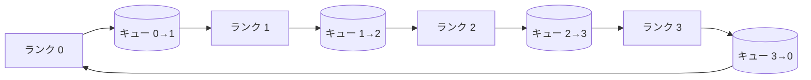

# 集合演算のゼロからの実装

> 分散学習を支える4つの集合演算はallreduce、broadcast、allgather、reduce_scatterだ。トレーニングフレームワークが提供する他のすべてのプリミティブはこれらのラッパーだ。`multiprocessing.Queue`メッシュ上で一度構築し、参照実装に対して検証すれば、残りのトラックは配管作業になる。


## 学習目標

- リングallreduceを2パス（reduce-scatterとallgather）で実装し、ランクごとの通信量が要素あたり2(N-1)/Nバイトであることを証明する。
- `multiprocessing.Queue`上のポイントツーポイント送信を基にbroadcast、allgather、reduce_scatterを構築する。
- すべてのプリミティブを同じ入力の`torch.distributed` glooリファレンスに対して検証する。
- クラスタ形状、レイテンシの下限、帯域幅の上限を基に、リングとツリーの選択を擁護する。

## 問題

N個のランクにわたるナイーブなallreduceは、テンソルをN回ルートに送り、N回ブロードキャストで返す。帯域幅はランクあたりO(N)でスケールし、ルートがボトルネックになり、ウォールクロックの下限は最も遅いリンク×Nになる。リングallreduceはこれをサイズT/NのN-1チャンクに平坦化し、ランクあたりのバイトはクラスタサイズに依存しない2T(N-1)/Nに下がる。ツリーallreduceは小さなNと高レイテンシリンクで勝つ。深さが2(N-1)ホップではなくlog2(N)ホップだからだ。クラスタ形状に合わない位相を選ぶと、最も遅いGPUがステップ時間を決定する。

このトラックで読むすべての分散学習フレームワークはこれら4つのプリミティブに依存している。PyTorch DDPはパラメータバケットごとに1回のallreduceで勾配を同期する。ZeROはreduce_scatterでオプティマイザー状態をシャーディングし、allgatherで更新されたパラメータシャードをブロードキャストする。FSPDはフォワード全体をallgatherとreduce_scatterに変える。パイプライン並列はステージグループにわたる活性化のためにbroadcastを必要とする。4つの集合演算を実装できなければ、なぜ学習が停止するのか、rank 3でグラジエントの不一致が現れる理由は何か、位相を変えたときなぜパイプラインバブルが倍増するかを推論できない。

## コンセプト



### 2パスのリングallreduce

テンソルをインデックス0..N-1のN等分チャンクに分割する。各ランクは自分のランクと等しいインデックスのチャンクを所有する。パス1、reduce-scatter、はN-1ステップ実行される。ステップsで、ランクrはチャンク(r-s) mod NをランクR(r+1) mod Nに送り、ランク(r-1) mod Nからチャンク(r-s-1) mod Nを受け取り、ローカルコピーに受け取ったチャンクを累積する。N-1ステップ後、ランクrはチャンクrの完全な合計を所有する。パス2、allgather、はもうN-1ステップ実行し、完成したチャンクをリングの周りを回転させ、すべてのランクがすべてのチャンクの完全な合計を保持するまで続く。

| プリミティブ | ランクあたりのバイト数 | ステップ | 使用場面 |
|-----------|---------------|-------|-------------|
| リングallreduce | 2T(N-1)/N | 2(N-1) | 大きなT、ファットパイプの均一クラスタ |
| ツリーallreduce | T log2(N) | 2 log2(N) | 小さなTまたは高レイテンシリンク |
| Broadcast | T | log2(N)ツリー | パラメータ初期化、スカラー設定 |
| Allgather | T(N-1)/N | N-1 | シャードフォワード、ZeROアンシャード |
| Reduce_scatter | T(N-1)/N | N-1 | ZeROグラジエントシャーディング |

### NCCLの代替としてのキューメッシュ

NCCLはPCIeとNVLink上でハードウェアオフロードの削減を伴って実行される。CPUではそれはない。リングエッジごとの`multiprocessing.Queue`は単一のプロデューサーと単一のコンシューマーで順序付きのポイントツーポイント配信を提供する。削減はユーザー空間で発生するため、Pythonのオーバーヘッドを払うが、ワイヤパターンはNCCLリングallreduceと同じだ。キューバージョンで正確性を推論すれば、クラスタの動作が続く。

### glooに対する検証

すべてのプリミティブは、同じテンソルを同じワールドサイズで`torch.distributed` glooバックエンドと比較するユニットテストとともに動作する。リングallreduceがglooとfloat32のイプシロンを超えて乖離した場合、テストは失敗する。参照実装に対する検証は交渉の余地がない。それがなければ、プリミティブは実際のトレーニング実行の10000ステップまで正しく見える。

## 実装する

`code/main.py`は以下を実装する：

- N個の`multiprocessing.Queue`インスタンスをリングに配線し、ランクごとに`send(dst, tensor)`と`recv(src)`を公開する`Mesh`クラス。
- 2パスアルゴリズムを実行する`ring_allreduce(mesh, rank, world_size, tensor)`。
- 対数ツリー上の`broadcast(mesh, rank, world_size, tensor, src)`。
- N-1回の回転を使う`allgather(mesh, rank, world_size, tensor)`。
- allreduceの前半部分としての`reduce_scatter(mesh, rank, world_size, tensor)`。
- バイト等価比較のために同じ入力を`torch.distributed` glooで実行する`_gloo_reference(op, world_size, tensor)`。

実行：

```bash
python3 code/main.py
```

出力：キューメッシュとgloo出力を比較するプリミティブごとの検証テーブル、続いて2T(N-1)/Nのスケーリングを証明するランクごとのバイトカウンター。

## 実際の本番パターン

3つのパターンがプリミティブを十分に堅牢にして出荷できるようにする。

**allreduceの前に勾配をバケット化する。** 10億パラメータのモデルには何万もの勾配テンソルがある。テンソルごとに1回のallreduceではレイテンシの下限をN回払う。DDPは勾配を約25MBのチャンクにバケット化して、バケットごとに1回のallreduceを発行する。小さなテンソルは大きなテンソルの後ろに乗る。バケット化がなければレイテンシのオーバーヘッドがステップを支配する。

**計算と通信を重ねる。** バックワードは逆順にレイヤーごとに勾配を計算する。最後のレイヤーの勾配が準備できた瞬間に、次のレイヤーが計算を続けている間にallreduceを開始する。PyTorch DDPはバケット準備フックでこれを配線している。ネットワークにスラックがある場合、重なりが可視の通信時間を半分にする。

**宗教ではなくメッセージサイズでリングかツリーかを選ぶ。** NCCLは1MB以上のメッセージにはリング、以下にはツリーを選ぶトポロジー検出器を搭載している。クロスオーバーは帯域幅対レイテンシだ：1MB以上では帯域幅項2T(N-1)/Nが支配してリングが勝つ。1MB以下ではlog2(N)ホップカウントが勝つ。1つのトポロジーをハードコードすると、間違ったメッセージサイズでスループットが損なわれる。

## 使ってみる

本番パターン：

- **PyTorch DDP。** バックワード後にバケット化された勾配に対して`dist.all_reduce`を呼ぶ。バケットサイズは調整可能だ。デフォルトの25MBは100Gbitイーサネットに合理的だ。
- **DeepSpeed ZeRO。** reduce_scatterを発行して勾配をシャーディングし、allgatherでフォワード前にフルパラメータを再構築する。レッスンのプリミティブはZeROが行う呼び出しそのものだ。
- **FSDP。** フォワードはallgatherでレイヤーをアンシャードすることから始まり、計算し、その後reduce_scatterで削減してアンシャードを破棄する。同じプリミティブ、異なるスケジュール。

## 成果物を出す

キューメッシュのプリミティブをレッスン77〜81で使う。レッスン77がallreduceをDDPに配線する。レッスン78がreduce_scatterをZeROに配線する。レッスン79がbroadcastをパイプライン活性化に配線する。レッスン81がすべて4つをエンドツーエンドデモに合成する。

## 演習

1. ツリーallreduceバリアントを追加してメッセージサイズでリングとツリーを切り替える。クロスオーバーを測定する。
2. 停止したランクが永遠にハングする代わりにデッドラインエラーを出す`recv_timeout_ms`を追加する。
3. `multiprocessing.Queue`をTCPソケットに置き換えて4つのプリミティブを実装する。同じテスト、実際のワイヤ。
4. ランクごとのバイトカウンターがJSONLにログを記録するように帯域幅計測フックを追加する。
5. サイズ1KB、1MB、16MBのテンソルで4ランクのリングとツリーのウォールクロック時間を比較する。クロスオーバーを実証的に擁護する。

## キーワード

| 用語 | 人々が言うこと | 実際の意味 |
|------|----------------|------------------------|
| Allreduce | 「ランク間で合計する」 | 呼び出し後、すべてのランクが同じ削減テンソルを保持する |
| リング | 「速いトポロジー」 | T/Nサイズの N-1チャンクがサイクルを2回流れる |
| ツリー | 「対数トポロジー」 | 削減は二分木に従う。深さはlog2(N)ホップ |
| Allgather | 「シャードを連結する」 | すべてのランクが他のすべてのランクのシャードを持つ |
| Reduce_scatter | 「合計を分割する」 | 各ランクは1チャンクの合計のみを持つ |
| バケット | 「小さなテンソルを融合する」 | N個の小さなallreduceを1つの大きなallreduceに統合する |

## 参考資料

- [PyTorch Distributed: NCCL collectives](https://pytorch.org/docs/stable/distributed.html#collective-functions)
- [Horovod ring allreduce paper](https://arxiv.org/abs/1802.05799)
- [NCCL topology and algorithm selection](https://docs.nvidia.com/deeplearning/nccl/user-guide/docs/index.html)
- [Patarasuk and Yuan, Bandwidth optimal allreduce algorithms](https://www.cs.fsu.edu/~xyuan/paper/09jpdc.pdf)
- Phase 10 Lesson 05 - 分散学習の概要
- Phase 19 Lesson 77 - これらのプリミティブ上に構築されたDDP
