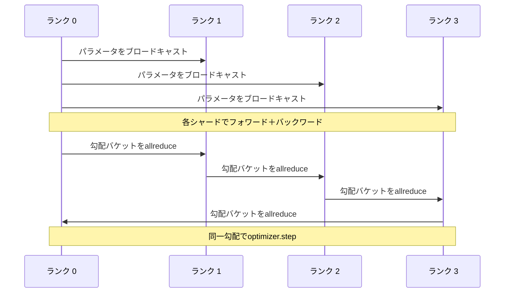

# データ並列DDPのゼロからの実装

> DistributedDataParallelはallreduceの上のフックだ。モデルをラップし、すべてのランクが同一で始まるようにランク0から初期パラメータをブロードキャストし、各パラメータに勾配のallreduceを発行するバックワードフックをインストールする。残りは勾配降下だ。パターン全体は200行だ。


## 学習目標

- 初期パラメータをブロードキャストしてバックワード後に勾配をallreduceする`DistributedDataParallel`形のラッパーを配線する。
- ファイルベースのランデブーを持つglooバックエンドで`torch.multiprocessing.spawn`を使ってN個のCPUランクをスポーンする。
- 同じデータで同じモデルを逐次学習し、ステップごとのパラメータ等価性を示すことで勾配同期の正確性を証明する。
- バケット（勾配融合）とオーバーラップ（バックワード中の通信）の使用が、動作するDDPを本番DDPに変える2つの変更点であることを擁護する。

## 問題

12GBの活性化を持つ10億パラメータのモデルは1つの消費者向けGPUに収まらない。収まる場合でも、学習には数週間かかる。データ並列はバッチをN個のランクに分割し、各ランクはそのシャードでフォワードとバックワードを計算し、各ステップですべてのランクの勾配を合計してN個のコピーが同一に保たれる。合計された勾配がオプティマイザーがステップする対象だ。

勾配の同期なしでは、N個のレプリカは2ステップ目で乖離する。モデルはもはや「より多くのデータで学習された1つのモデル」ではなく、初期の重みを共有するN個の別々のモデルになる。勾配の同期が悪く行われると（パラメータごとに1回のallreduce、オーバーラップなし、バケット化なし）、ネットワークがボトルネックになりGPUはワイヤを待って待機する。DDPの技術は、NCCL on NVLinkを使ってGPUを計算に対してほぼ無料にすることだ。CPUのgloo上でも同じ3つのことができ、同じ教訓を学べる。

## コンセプト



### DDPが必要とする3つの演算

| ステージ | 集合演算 | 理由 |
|-------|-----------|-----|
| 初期化 | ランク0からのブロードキャスト | すべてのランクが同じパラメータで始まる |
| バックワード後 | 各勾配のallreduce | 平均勾配がオプティマイザーがステップする対象 |
| 場合によって | バッファのブロードキャスト | バッチノルムの実行統計を同期させる |

### なぜ合計ではなく平均か

allreduce-SUMをworld_sizeで割ると平均勾配になる。平均はworld_sizeに対して不変だ：1ランクで調整された学習率は4ランクでも機能する。なぜなら1ステップあたりの勾配の大きさが変わらないからだ。world_sizeで割らずにallreduce-SUMを使うと、クラスタサイズを変えるたびに学習率を再調整する必要がある。DDPはSUMをラップして割り算する。レッスンでも同じことをする。

### なぜ勾配をバケット化するのか

トランスフォーマーには何千ものパラメータテンソルがある。テンソルごとに1回のallreduceでは、glooのレイテンシの下限を何千回も払う。DDPは勾配を約25MBのバケットにグループ化してバケットごとに1回のallreduceを発行する。合計バイト数は同じだがレイテンシはバケット全体で償却される。レッスンの小さなモデルではすべてを1つのバケットにグループ化する。構造が重要だ。

### なぜシードを固定するのか

各ランクはシャッフルに`torch.manual_seed(seed + rank)`を呼ぶ必要があるが、パラメータ初期化には`torch.manual_seed(seed)`を呼ぶ必要がある。単一の共有シードはすべてのランクが同じバッチ順序を見る（データ並列を無効にする）。パラメータ用のランク固有のシードは初期パラメータがfloatイプシロンで一致しないことを意味し、勾配の同期はもはやレプリカを同一にしない。シードパターンを正しく取得しないと、パラメータ等価性のテストがステップ1で失敗する。

## 実装する

`code/main.py`は以下を実装する：

- `MiniMLP`：数秒で収束するのに十分小さく、配線を公開するのに十分大きい3層MLP。
- `DistributedDataParallel(model, world_size)`：コンストラクト時にparamをブロードキャストし、`sync_grads`が累積されたallreduce合計勾配をworld_sizeで割るラッパーを返す。
- `worker(rank, world_size, ...)`：glooでの`torch.distributed`初期化を含む完全な学習ループ。フォワード、バックワード、同期、ステップ。
- `_reference_single_process_loop(...)`：同じデータで同じモデルを1つのランクで逐次学習する。各ステップ後のバイト等価パラメータ等価性のテストで使用。

実行：

```bash
python3 code/main.py
```

出力：単一プロセスの損失とパラメータチェックサムと4ランクのDDP実行を比較するステップごとのトレーニングテーブル。2つのパスはfloatイプシロンまで同一の損失曲線を生成し、勾配の同期が正しいことを証明する。

## 実際の本番パターン

3つのパターンがDDPを出荷できるほど堅牢にする。

**未使用パラメータを見つける。** 一部のフォワードパスは条件付きでパラメータをスキップする（早期終了、混合エキスパートルーター）。スキップされたパラメータには勾配がないが、DDPのバケット準備フックはまだそれらを待ち、allreduceがデッドロックする。`find_unused_parameters=True`はDDPに削減前にどのパラメータが勾配を持ったかを確認させる。コストはステップごとのグラフウォークなので、フォワードが分岐しない限りオフにしておく。

**静的グラフの最適化。** フォワードがステップ間で安定している場合、`static_graph=True`でDDPはバケットスケジュールを事前計算できる。この最適化はスケールで重要だ：事前計算はステップあたり数ミリ秒節約し、10000ステップで積み重なる。

**勾配累積には注意が必要だ。** 各マイクロバッチを同期せずにK個のマイクロバッチで勾配を累積すると10倍のスループット向上になる。DDPはポストバックワードのallreduceを一時停止するコンテキストマネージャーとして`no_sync()`を公開している。マネージャーを忘れると無駄にK回allreduceし、スループットが下限まで落ちる。

## 使ってみる

本番パターン：

- **PyTorch DDP。** 標準実装。`torch.nn.parallel.DistributedDataParallel(model)`はバケット化、オーバーラップ、no_syncコンテキストを配線する。
- **HuggingFace Accelerate。** `torchrun`の環境変数とモデルラップを扱うランチャーを追加する。内部は同じDDPだ。
- **Megatron-LMデータ並列。** 大型モデル用にテンソル並列とDDPを組み合わせる。データ並列部分は同じバックワード後のallreduceパターンだ。

## 成果物を出す

レッスン78（ZeROシャーディング）はパラメータごとのallreduceをreduce_scatterに置き換え、各ランクがオプティマイザー状態のシャードのみを保存するようにする。レッスン81がDDPとZeROをエンドツーエンドデモに合成する。

## 演習

1. 設定可能なサイズの勾配バケットを追加し、より深いモデルでパラメータごとに1回のallreduceとのスピードアップを測定する。
2. `no_sync()`をコンテキストマネージャーとして実装し、K個のマイクロバッチにわたる勾配累積が単一プロセスのベースラインと一致することを検証する。
3. フォワードがMLPの1層をスキップすることがある`find_unused_parameters`モードを追加する。フラグなしでは実行がデッドロックすべきだ。
4. allreduceベースとバリアのみの同期の違いを感じるためにglooを`torch.distributed.barrier()`のみの同期に置き換える。
5. バッチサイズ1、16、256の勾配同期オーバーヘッドをステップ時間の割合として測定し、スケーリングを説明する。

## キーワード

| 用語 | 人々が言うこと | 実際の意味 |
|------|----------------|------------------------|
| DDP | 「データ並列」 | パラメータをブロードキャストして各ステップで勾配をallreduceするラッパー |
| バケット | 「勾配を融合する」 | N個の小さなallreduceを1つの大きなallreduceにグループ化する |
| オーバーラップ | 「通信を隠す」 | 後のレイヤーがまだバックワードを計算している間にallreduceを発行する |
| no_sync | 「累積する」 | 勾配累積のためにポストバックワードのallreduceをスキップする |
| find_unused | 「分岐したフォワード」 | 削減前に勾配がないパラメータを検出する |

## 参考資料

- [PyTorch DistributedDataParallel docs](https://pytorch.org/docs/stable/generated/torch.nn.parallel.DistributedDataParallel.html)
- [PyTorch DDP internals tutorial](https://pytorch.org/tutorials/intermediate/ddp_tutorial.html)
- [Li et al, PyTorch Distributed: Experiences on Accelerating Data Parallel Training](https://arxiv.org/abs/2006.15704)
- Phase 19 Lesson 76 - DDPが構築されている集合演算
- Phase 19 Lesson 78 - ZeROシャーディングがパラメータごとのallreduceをreduce_scatterに置き換える
