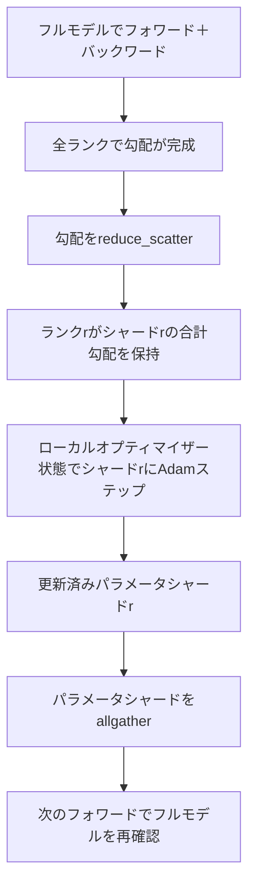

# ZeROオプティマイザー状態シャーディング

> Adamはパラメータごとに2つのモーメント推定をfloat32で保存する。70億パラメータのモデルは56GBのオプティマイザー状態を持つ。ZeROステージ1はそれをN個のランクにシャーディングする。各ランクはオプティマイザーの1/Nを所有する。ローカルステップの後、更新されたパラメータシャードがブロードキャストされ、すべてのランクがフルモデルを再構築し、次のステップが始まる。メリットはトレーニングスタックで最大の単一割り当てに対するメモリの線形な削減だ。


## 学習目標

- オプティマイザー状態（第1モーメント、第2モーメント、fp32マスターコピー）をN個のランクにシャーディングし、各ランクが1/Nを所有するようにする。
- reduce_scatterを使って各ランクにそのシャードの勾配合計のみを届け、allgatherを使って更新されたパラメータシャードをブロードキャストして戻す。
- ステージ1、2、3のメモリ節約テーブルをバニラDDPに対して計算する。
- モデルサイズと帯域幅バジェットに基づいてステージ1対2対3の選択を擁護する。

## 問題

バニラDDPはすべてを複製する：パラメータ、勾配、オプティマイザー状態はすべてのランクに完全に存在する。fp16の70億パラメータモデルでは、ランクあたり14GBのパラメータ、14GBの勾配、28GBのオプティマイザー状態になる。オプティマイザー状態は最大の項であり、フォワードやバックワード中ではなくステップ中のみ触れられるため、最も簡単にシャーディングできる。

ZeROステージ1はオプティマイザー状態をシャーディングする。各ランクはAdamモーメントの1/Nを保持する。バックワード後、フル勾配をallreduceしてローカルでステップするのではなく、ZeROはreduce_scatterして各ランクがそのシャードの合計勾配のみを受け取るようにする。ランクはマスターパラメータのシャードにオプティマイザーステップを適用する。更新されたパラメータシャードはallgatherされてすべてのランクが次のフォワードのためにフルモデルを持つ。オプティマイザーメモリはNで割れる。帯域幅あたりのステップごとのワイヤトラフィックはDDPと同じだ：reduce_scatter1回とallgather1回は帯域幅でallreduce1回に等しい。メモリは勝ち、スループットは保たれる。

## コンセプト



### ZeROのステージ

| ステージ | シャーディングされるもの | ランクあたりのメモリ | ステップごとの通信 |
|-------|----------------|------------------|---------------|
| DDP | なし | params + grads + optim | 1xallreduce |
| ZeRO-1 | オプティマイザー状態 | params + grads + optim/N | 1xreduce_scatter + 1xallgather |
| ZeRO-2 | optim + grads | params + grads/N + optim/N | 1xreduce_scatter + 1xallgather |
| ZeRO-3 | optim + grads + params | params/N + grads/N + optim/N | レイヤーごとに1xallgather + 1xreduce_scatter |

ステージ1は最も安価なメリットだ。オプティマイザー状態がバジェットを支配しているからだ。ステージ2は勾配シャード累積ロジックが必要だが帯域幅は同じだ。ステージ3（FSDP）はすべてのフォワードとバックワードでレイヤーごとの通信を払い、パラメータシャードのメモリ削減を得る。レッスンはステージ1を完全に実装する。

### メモリ計算、実際の数値

混合精度でAdamを使って学習するPパラメータのモデルについて：

| 項目 | バニラ | ZeRO-1 | 理由 |
|------|---------|--------|-----|
| fp16 params | 2Pバイト | 2Pバイト | フォワードに必要 |
| fp16 grads | 2Pバイト | 2Pバイト | バックワードに必要 |
| fp32マスターコピー | 4Pバイト | 4P/Nバイト | optimのみが使用 |
| fp32第1モーメント | 4Pバイト | 4P/Nバイト | optimのみが使用 |
| fp32第2モーメント | 4Pバイト | 4P/Nバイト | optimのみが使用 |
| 合計 | 16Pバイト | 4P + 12P/Nバイト |   |

N=8では：バニラ16P、ZeRO-1 5.5P、65%の削減。N=64では：バニラ16P、ZeRO-1 4.19P、74%の削減。

### なぜallreduce-then-shardよりreduce_scatterが良いか

allreduceはすべてのランクに完全な合計勾配を渡す。シャードrのみが必要な場合、ランクrで削減された(N-1)/Nの勾配は無駄になる。reduce_scatterは各ランクが所有するシャードを正確に届ける。ランクあたりのバイトはallreduceと同じだ（allreduceはreduce_scatter + allgatherなので）が、2番目の半分は後のパラメータシャードのallgatherに置き換えられる。正味のワイヤはDDPと同一で、メモリは割り算される。

## 実装する

`code/main.py`は以下を実装する：

- モデルのパラメータを1つの連続したテンソルにパックしてアンパックする`flatten_params(module)`と`unflatten_into(module, flat)`。フラットなレイアウトはランクによるシャーディングを単純なスライスにする。
- ランクのマスターコピーとAdamモーメントのシャードを所有する`ZeroOptimizer(model, world_size, rank, lr)`。
- フラット勾配でreduce_scatterを実行し、ランクのシャードにAdamを適用し、更新されたパラメータをallgatherして戻す`step()`。
- 3層MLPを20ステップ学習してバニラDDPベースラインとともにステップごとのメモリバジェットを出力するデモ。

実行：

```bash
python3 code/main.py
```

出力：ステップごとの損失と、各ランクでDDPのフルコピーに対してZeRO-1がオプティマイザー状態の1/Nを保持することを示すメモリテーブル。

## 実際の本番パターン

3つのパターンがZeROを出荷できるほど堅牢にする。

**シャーディングされたチェックポイントが重要だ。** ZeRO-1のオプティマイザー状態はランク間で分割されている。チェックポイントはどのランクが何を所有するかを記録する必要がある。レッスン80がZeROの実行を同じワールドサイズで再開するシャーディングされたチェックポイントマニフェストを構築する。それなしでは保存された状態は再起動時に読めない。

**混合精度が要点だ。** ZeROは混合精度技術だ。シャーディングされるのはfp32マスターコピーだ。混合精度なしでZeROを実行すると、対応するfp16フォワードの利得なしにfp32マスターのメモリ税を払う。本番実行は常にZeROとautcastまたはbf16ウェイトを組み合わせる。

**ステージ1はほぼ無料の利得だ。** 帯域幅あたりの通信はDDPと同じだ。メモリ節約はNに対して線形だ。唯一のコストはオプティマイザーシャードのブックキーピングだ。本番スタックはパラメータシャードのメモリも問題でない限りデフォルトでステージ1を使う。問題がある場合はステージ2か3が通信とメモリをトレードする。

## 使ってみる

本番パターン：

- **DeepSpeed ZeRO。** 参照実装。`deepspeed_config.json`でステージ1/2/3とパーティションサイズを選択する。
- **PyTorch FSDP。** PyTorchネイティブの同等品。`ShardingStrategy.SHARD_GRAD_OP`はZeRO-2で、`FULL_SHARD`はZeRO-3だ。
- **HuggingFace Accelerate。** DeepSpeedとFSDPの両方を統一設定でラップする。

## 成果物を出す

レッスン79（パイプライン並列）は直交するシャーディング軸だ：同じモデル上でオプティマイザー状態をシャーディングする代わりに、パイプラインはランク間でレイヤーをシャーディングする。レッスン81がDDP + ZeROをエンドツーエンドデモに合成する。

## 演習

1. ZeRO-2に拡張して勾配をシャーディングする：各ランクはそのシャードの勾配のみを保存し、バックワード後に非シャード部分をゼロにすることで実現する。
2. ランク0での実際のfp32バイト使用量と計算式の予測を出力するメモリプロファイラーを追加する。
3. バニラDDPとZeRO-1のステップごとのウォールクロック時間を測定し、フォワード、バックワード、通信に分解する。
4. ZeRO-1での勾配クリッピングを実装する：L2ノルムは局所ノルムの二乗のallreduceを介してすべてのシャードにわたって計算される必要がある。
5. reduce_scatterの代わりにallreduceを持つ「ナイーブZeRO」を実装し、ワイヤ時間の差を測定する。数値でreduce_scatterの選択を擁護する。

## キーワード

| 用語 | 人々が言うこと | 実際の意味 |
|------|----------------|------------------------|
| ZeRO-1 | 「オプティマイザーをシャーディングする」 | 各ランクはfp32マスター + Adamモーメントの1/Nを保持する |
| ZeRO-2 | 「勾配もシャーディングする」 | 各ランクはreduce_scatter後に非シャード勾配も破棄する |
| ZeRO-3 | 「パラメータをシャーディングする」 | 各ランクはfp16 paramsの1/Nを保持する。フォワードでレイヤーごとにallgather |
| マスターコピー | 「fp32ウェイト」 | オプティマイザーが更新する高精度パラメータコピー |
| Reduce_scatter | 「合計を分割する」 | 各ランクにそのシャードの合計勾配のみを届ける |

## 参考資料

- [Rajbhandari et al, ZeRO: Memory Optimizations Toward Training Trillion Parameter Models](https://arxiv.org/abs/1910.02054)
- [DeepSpeed ZeRO documentation](https://www.deepspeed.ai/tutorials/zero/)
- [PyTorch FSDP documentation](https://pytorch.org/docs/stable/fsdp.html)
- Phase 19 Lesson 76 - このレッスンが基づくreduce_scatterとallgather
- Phase 19 Lesson 80 - ZeRO状態が使う必要があるシャーディングされたチェックポイント
