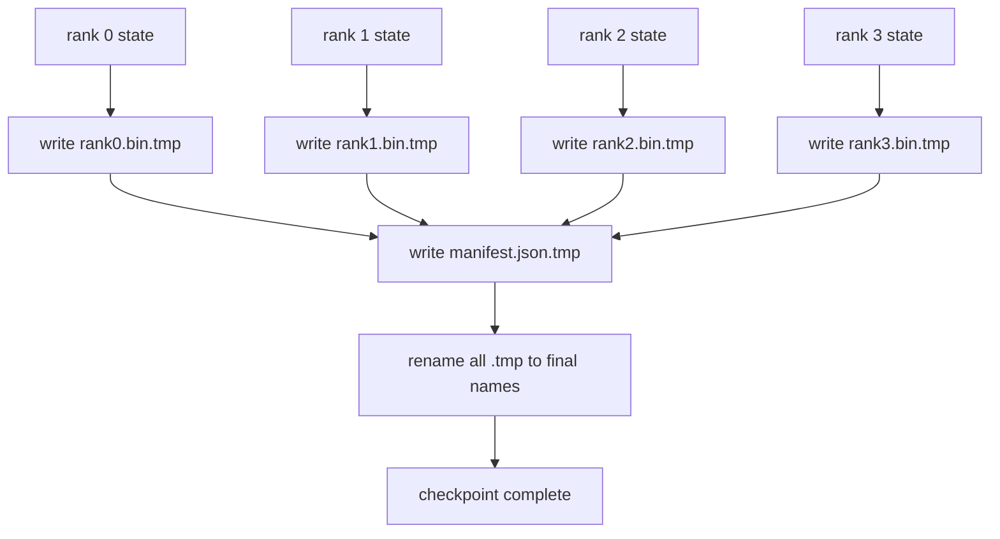

# シャーディングされたチェックポイントとアトミックな再開

> 700億パラメータのトレーニングジョブは数時間ごとにノード障害で一時停止される。チェックポイントの形式が30分を失うか30時間を失うかを決定する。シャーディングされたチェックポイントは各ランクのシャードを並列に書き込み、どのランクが何を所有するかをマニフェストに記録する。再開は同じワールドサイズで各ランクのシャードを独自ファイルから読み込み、状態を再構築し、何も起きなかったかのようにオプティマイザーがステップする。アトミックな書き込みで未完成のチェックポイントが次の再開を汚染しないようにする。


## 学習目標

- マルチランクチェックポイントをランクごとのシャードファイルとどのランクが何を所有するかを記録するマニフェストとして保存する。
- アトミックな書き込みパターン（一時パスに書き込んでからリネーム）を使い、書き込み中のクラッシュが未完成のチェックポイントを生成しないようにする。
- マニフェストから再開し、すべてのランクでfp16パラメータとZeROオプティマイザー状態の両方についてバイト等価な状態を検証する。
- マニフェストスキーマを3つの失敗モードに対して擁護する：ワールドサイズの変更、シャード数の不一致、部分的な書き込み。

## 問題

バニラチェックポイントはすべてのパラメータとオプティマイザー状態をランク0に読み込み、収集して1つのファイルに書き込む。70Bモデルでは1つのランクのネットワークポートを通じて1.1TBの状態になる。他のすべてのランクは収集を待ってアイドルになるため書き込みがブロックされる。IOの帯域幅は集合ではなく最も遅い単一GPUのネットワークリンクだ。実際のクラスタでは、収集してから書き込むステップが前のトレーニング時間より長くかかることがある。つまり1トレーニング日に1つ未満のチェックポイントしか出荷されない。

シャーディングされたチェックポイントはパターンを反転させる：すべてのランクが自分のシャードを独自ファイルに並列で書き込む。マニフェストはどのランクがどのシャードを所有するかを記録するので、再開は各シャードを元の場所に戻せる。集合的な書き込み帯域幅はクラスタとともにスケールする。1つのランクを通じて4時間かかった1TBのチェックポイントが64ランクを通じて4分かかる。さらにマニフェストは互換性のない再開のコントラクトを提供する：ワールドサイズの変更は検出可能で、部分的な書き込みは検出可能で、ロードパスは陳腐なデータを無音で使用するのではなく大きな声で失敗できる。

## コンセプト



### マニフェストスキーマ

```json
{
  "world_size": 4,
  "step": 1234,
  "wall_clock_seconds": 4521,
  "shards": [
    {"rank": 0, "path": "rank0.bin", "sha256": "...", "param_shard_offset": 0, "param_shard_numel": 65536},
    {"rank": 1, "path": "rank1.bin", "sha256": "...", "param_shard_offset": 65536, "param_shard_numel": 65536}
  ],
  "schema_version": 1
}
```

3つのフィールドが重要だ。`world_size`は異なるサイズでの再開が無音で破損するのではなく大きな声で失敗するようにする。シャードごとの`sha256`は部分的または破損した書き込みをキャッチする。シャードごとの`param_shard_offset`と`param_shard_numel`でローダーが正しい位置でフラットなパラメータテンソルを再構築できる。

### アトミックな書き込み

標準パターン：各シャードを`<name>.tmp`に書き込み、マニフェストを`manifest.json.tmp`に書き込み、各ファイルをfsyncし、リネームする。同じファイルシステム内でのPOSIXリネームはアトミックだ。新しいファイルが完全に存在するか古いファイルがそのままかのどちらかだ。最後のリネーム前のクラッシュは前のチェックポイントをライブのままにする。アトミックな書き込みがなければ、クラッシュで部分的なシャードが存在するマニフェストに指し示される可能性があり、再開時にオプティマイザー状態が破損する。

### スキーマが防御する必要がある3つの失敗モード

| 失敗 | 症状 | 防御 |
|---------|---------|---------|
| ワールドサイズの変更 | N=4のマニフェストでN=8で再開 | マニフェストのworld_sizeの不一致、大きな声で失敗 |
| シャード数の不一致 | 再開でマニフェストのシャードより少ないrank*.binファイルを確認 | シャードを列挙してすべてが存在することを検証 |
| 部分的な書き込み | シャードファイルがフラッシュ途中で切り詰められた | ロード時のsha256検証 |

各防御は不良なロードを早期に拒否する。代替は100ステップ後に損失がNaNになったときに現れる無音の破損だ。

### なぜランクごとのファイルで1つの大きなファイルではないか

1つのファイルへの`O_APPEND`による並列書き込みはPOSIXではバイト整列の書き込みに対して機能するが、実際には1つのシャード内のオフセットがMBサイズの領域にわたり、ロックが支配する。ランクごとのファイルは競合がなく、基盤のファイルシステムが並列（Lustre、GPFS）の場合はストライピングのメリットがある。本番スタック（DeepSpeed、FSDP、NeMo）はすべてその理由でランクごとのファイルを使う。

## 実装する

`code/main.py`は以下を実装する：

- 上記のスキーマとともに`to_json`/`from_json`を持つ`ShardManifest`データクラス。
- アトミックな一時ファイルからリネームパターンを使って各ランクのバイナリ状態を独自ファイルに書き込み、マニフェストを書き込む`save_sharded(state_dict_per_rank, dir, step)`。
- マニフェストを読み込み、各シャードのsha256を検証して、ランクごとのstate dictを返す`load_sharded(dir, expected_world_size)`。
- ラウンドトリップテスト：ランクごとの状態を構築し、保存し、ロードし、バイト等価をアサートする。

実行：

```bash
python3 code/main.py
```

出力：4つのシャードファイルとマニフェストが書き込まれ、バイト等価の検証でリロードされる。

## 実際の本番パターン

3つのパターンがチェックポイントを出荷できるほど堅牢にする。

**非同期書き込み。** 本番スタックは別のスレッドまたはプロセスでチェックポイント書き込みを発行してトレーニングが続くようにする。バリアは次のチェックポイントで：前の書き込みが完了するまで次の保存を開始しない。DeepSpeedの`async_io`フラグがまさにこれを行う。レッスンはステップが見えるよう書き込みを同期のままにする。

**ローカル高速ディスクを最初に、その後非同期アップロード。** ローカルNVMe（速い）に書き込んでからS3またはGCSに非同期アップロードする。2層パターンはクラスタ内のチェックポイントを再開用に高速に保ちながら、アーカイブ用のオフクラスターへの耐久性のあるコピーを出荷する。マニフェストはローカルパスを持ち、アップロードマニフェストはリモートパスを持つ。

**ローテーションが重要だ。** 本番実行は最後のKチェックポイント（通常3〜5）を保持して最も古いものをローテートする。ローテーションなしでは実行の途中でディスクが満杯になり次のチェックポイントが失敗する。ローテーションで次の保存は最初に最も古いものを削除してバジェットを確保する。

## 使ってみる

本番パターン：

- **DeepSpeedチェックポイント。** `deepspeed.save_checkpoint(tag=step)`はランクごとのファイルとアクティブなタグを指す`latest`ファイルを書き込む。
- **PyTorch FSPDチェックポイント。** `torch.distributed.checkpoint`はランクごとのレイアウトを決定する`Planner`を持つシャーディングされた状態を保存する。
- **NeMo。** DeepSpeedとFSDPをメタデータを追加する統一された`save_to_checkpoint` APIでラップする。

## 成果物を出す

レッスン81はエンドツーエンドのDDP+ZeROの実行のシャーディングされたチェックポイントを保存し、同じワールドサイズでリロードして再開コントラクトが成立することを証明する。

## 演習

1. 非同期書き込みを追加する：スレッドで保存を開始してトレーニングを続ける。前の保存が完了するまで次の保存をブロックする。
2. `last_5_steps`ローテーションを追加する：最新の5つのチェックポイントを保持し、新しいものを保存する前に最も古いものを削除する。
3. 内部ループのリロードのためのCRCのみの高速検証パスを追加する（ローテーションはチェックポイントを新しいアクティブなものとしてロールインするが、完全なsha256なし）。
4. クロスワールドサイズのロードを追加する：マニフェストを読み込み、連結して、N=4からN=8への再シャーディング。
5. フェイクS3（2番目のディレクトリ）へのアップロードを追加してアップロードマニフェストを書き込む。2層ストレージポリシーを擁護する。

## キーワード

| 用語 | 人々が言うこと | 実際の意味 |
|------|----------------|------------------------|
| シャーディングされたチェックポイント | 「ランクごとの保存」 | 各ランクが独自のシャードファイルを並列に書き込む |
| マニフェスト | 「インデックス」 | シャードパス、オフセット、sha256を記録するJSONファイル |
| アトミックな書き込み | 「tmpからリネーム」 | .tmpに書き込んでからPOSIXリネームでクラッシュが前のファイルをライブのままにする |
| 部分的な書き込み | 「切り詰められたシャード」 | 書き込み中のクラッシュが破損したシャードを生成する。sha256がキャッチする |
| ローテーション | 「最後のKを保持する」 | 新しいものを書き込む前に最も古いチェックポイントを削除してディスク使用量を制限する |

## 参考資料

- [DeepSpeed checkpointing](https://www.deepspeed.ai/tutorials/checkpointing/)
- [PyTorch torch.distributed.checkpoint](https://pytorch.org/docs/stable/distributed.checkpoint.html)
- [POSIX rename atomicity](https://pubs.opengroup.org/onlinepubs/9699919799/functions/rename.html)
- Phase 19 Lesson 78 - このチェックポイントが保存するように形成されたZeRO状態
- Phase 19 Lesson 81 - 保存された状態をラウンドトリップするエンドツーエンドデモ
