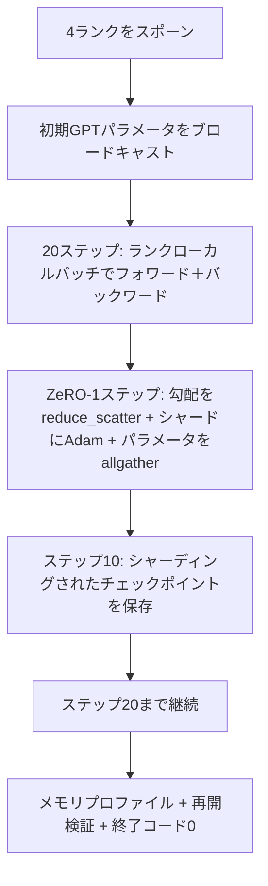

# エンドツーエンド分散学習

> レッスン76〜80はそれぞれ1つのピースを構築した。これは組み立てだ：4つのシミュレートされたランクにわたって、勾配同期にDDP、オプティマイザー状態シャーディングにZeRO-1、中間点でシャーディングされたチェックポイントを持つ小さなGPTをトレーニングする。デモは20ステップ実行し、自己終了し、損失曲線とメモリプロファイルを出力し、再開可能なチェックポイントを書き込む。


## 学習目標

- DDP（レッスン77）+ ZeRO-1（レッスン78）+ シャーディングされたチェックポイント（レッスン80）を1つのトレーニングループに合成する。
- 4つのシミュレートされたランクにわたって小さな合成コーパスで2層トランスフォーマー言語モデルを20ステップ学習する。
- ステップごとの損失テーブル、ランクごとのメモリプロファイル、同じワールドサイズでバイト等価に再開するチェックポイントマニフェストを出力する。
- 組み合わせを擁護する：各ピースは前のレッスンで独立してテスト可能であり、このレッスンはそれらが合成されることを証明する。

## 問題

キャップストーンはピースが合わさる証明だ。レッスン76が集合演算を実装した。レッスン77がそれらをDDPにラップした。レッスン78がreduce_scatterでオプティマイザー状態をシャーディングした。レッスン79がパイプラインを分析した。レッスン80がシャーディングされたチェックポイントを保存した。各レッスンは独自のテストを持って単独で成り立った。実際のトレーニング実行はすべてのプリミティブを同時に使用する。組み合わせが間違っている場合、損失が乖離するか、チェックポイントが再開を拒否するか、ランクごとのメモリが縮むべき時に増加する。

このレッスンはエンドツーエンドデモを実行して4つの不変条件を検証する：(a) 損失は20ステップにわたってfloatノイズ内で単調に減少する、(b) すべてのランクが各ステップで同じパラメータノルムを保持する、(c) ランクごとのオプティマイザーメモリはZeRO-1の計算式12P/Nバイトと等しい、(d) ステップ10のチェックポイントが再起動時にバイト等価にリロードされる。デモは自己終了する：20ステップ、単一コマンド、終了コード0。

## コンセプト



### ミニGPT

モデルは意図的に小さい：2つのトランスフォーマーブロック、埋め込み次元32、4つのアテンションヘッド、語彙64、シーケンス長16、バッチ4。数千のパラメータ。すべての配線決定を実行するのに十分大きい（マルチヘッドアテンションは標準的なマスクされたパスを実行する。LayerNormは同期するウェイトを持つ。LMヘッドは語彙への別の線形投影だ）。20ステップが4つのCPUランクで数秒で終わるのに十分小さい。

### 組み合わせのルール

| レッスンのピース | 何を所有するか | ループに何を残すか |
|--------------|--------------|----------------------------|
| DDPブロードキャスト | 初期パラメータ同期 | コンストラクト時に1回の呼び出し |
| ZeRO-1ステップ | 勾配同期、マスターコピー更新、パラメータブロードキャスト | optimizer.stepを置き換えるステップごとに1回の呼び出し |
| シャーディングされたチェックポイント | ランクごとの状態の永続化、sha256を持つマニフェスト | allgatherで収集された状態を持つランク0で呼ばれる |
| トレーニングループ | フォワード、バックワード、損失ロギング | 上記3つを順に呼ぶ |

ループはreduce_scatterやランデブーファイルについて知らない。ZeROとチェックポイントモジュールはループが合成するナロウなインターフェースを公開する。

### なぜMLPではなく小さなGPTなのか

レッスン77のMLPは勾配の同期を検証するのに十分だった。小さなGPTは3つのことを追加する：語彙に対する別のLMヘッド（このレッスンでは明確にするために非タイド。完全なGPTは通常ヘッドをトークン埋め込みにタイする）、損失としてsoftmax+クロスエントロピー（MSEよりも多くの数値エッジケース）、非対称なフォワード（埋め込みその後アテンションその後レイヤーごとのMLP）。キャップストーンにMLPを使い続けると、組み合わせがLayerNormや埋め込みレイヤーの勾配形状を正しく処理するかどうかが隠れる。

### 自己終了は終了コード0を意味する

ループは固定の20ステップを実行して終了する。`while True`なし、人間の介入なし、外部状態からの再開なし。無人で実行して完了時に完全なログを見つけられるキャップストーンは、システムが正しく配線されていることを証明するキャップストーンだ。いずれかのピースがデッドロックするとデモは決して戻らず、テストリグがそれをキャッチする。

## 実装する

`code/main.py`は以下を実装する：

- `MiniGPT`：マスクされたセルフアテンションと別のLMヘッドを持つ2層トランスフォーマー。
- `make_corpus(seed, total_tokens)`：決定論的な次トークン予測データ。
- `_train_worker`：ランクごとにスポーンされる。初期paramsをブロードキャストし、ループを実行し、ZeROステップを呼び、ステップ10でシャーディングされたチェックポイントを書き込む。
- `verify_resume`：メインの実行後、ステップ10のチェックポイントをインプロセスでリロードして、保存されたマスターシャードがインメモリのスナップショットとバイト単位で一致することをアサートする。
- `main`：デモ全体を調整し、損失テーブル、メモリプロファイル、検証結果を出力する。

実行：

```bash
python3 code/main.py
```

出力：20行の損失テーブル、4行のランクごとのメモリプロファイル、チェックポイントマニフェスト、成功時の「RESUME VERIFIED」行。

## 実際の本番パターン

3つのパターンが実際の実行のために組み合わせを完成させる。

**Kステップではなく毎Kミニッツのチェックポイント。** ステップ時間はシーケンス長とマイクロバッチ数によって変化する。10分のチェックポイントのケイデンスはモデルサイズに関わらず同じ計算をキャッチする。レッスンは単純さのためにステップベースを使う。本番はウォールクロックベースを使う。

**乖離を早期に検出する。** 本番実行はバックワード後にNaNガードと損失スパイク検出器を追加する。1ステップで損失が2倍以上ジャンプすると、オプティマイザーが退化した状態に進む前に前のチェックポイントにロールバックする。レッスンの損失曲線はスムーズなのでガードは未使用だが、フックは残る。

**ランク間でメモリプロファイルを集計する。** ランクごとのメモリは実際の実行では異なる（最大のパイプラインステージを持つランクはより多くの活性化を保持する）。本番はランク間の最大と平均をログに記録する。レッスンはランクごとに出力して計算式が一致することを示す。

## 使ってみる

本番パターン：

- **DeepSpeed。** DDP + ZeRO + パイプライン + 活性化チェックポイントを1つの設定でまとめる。レッスンの組み合わせはミニチュアのDeepSpeed形状だ。
- **PyTorch FSDP。** ネイティブの同等品。`ShardingStrategy.SHARD_GRAD_OP`を持つ`FullyShardedDataParallel`はZeRO-2だ。
- **NeMoとMegatron-LM。** 最も大きなモデル用にテンソル並列を追加する。それ以外では組み合わせは同じ形状だ。

## 成果物を出す

フルトラックはここで終わる。6つのレッスン合わせてDeepSpeedを採用する前に実際のチームが構築する分散トレーニングサブシステムだ。抽象化はglooに対して証明されて、失敗モードが実践されている。Phase 17（インフラと本番）が実際のクラスタにこれを持っていく場所だ。

## 演習

1. アテンションヘッドのテンソル並列分割を追加して、損失が単一ランクのベースラインと一致することを検証する。2ランク：ランクごとに半分のヘッド、アテンション出力のallreduce。
2. 4つのマイクロバッチにわたる勾配累積を追加して、勾配が1つの大きなバッチのフォワードの勾配と等しいことを証明する。
3. ステップ10から再開して実際にステップ20まで続くパスを追加し、元の実行と同じ最終損失を生成する。
4. メトリクスエクスポート（損失、勾配ノルム、ステップ時間）をJSONLに追加して、実行後に可視化できるようにする。
5. 損失スパイクで前のチェックポイントにロールバックするNaNガードを追加し、ロールバックを実行するために1ステップのLR乗数でスパイクを強制する。

## キーワード

| 用語 | 人々が言うこと | 実際の意味 |
|------|----------------|------------------------|
| エンドツーエンド | 「全部配線する」 | 1回の実行がすべてのピースを合成する。ピースごとのユニットテストではない |
| メモリプロファイル | 「ランクあたりのGB」 | 各ランクがparams、grads、オプティマイザー状態に保持するバイト数 |
| 再開コントラクト | 「保存してロード」 | チェックポイントのラウンドトリップ後のランクごとのバイト等価な状態 |
| 自己終了 | 「有界な実行」 | 固定ステップ数、完了時の終了コード0、ループに人間なし |

## 参考資料

- [DeepSpeed end-to-end training tutorial](https://www.deepspeed.ai/getting-started/)
- [PyTorch FSDP advanced tutorial](https://pytorch.org/tutorials/intermediate/FSDP_advanced_tutorial.html)
- [Megatron-LM training script reference](https://github.com/NVIDIA/Megatron-LM)
- Phase 19 Lessons 76-80 - このレッスンが合成する各ピース
- Phase 17 - 組み合わせを実際のクラスタに移す
