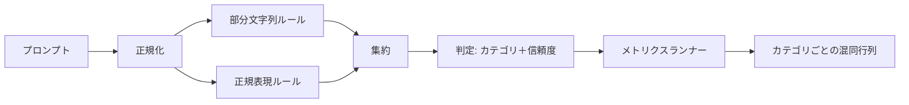

# キャップストーン83 — プロンプトインジェクション検出器

> 検出器はプロンプトから信頼度とカテゴリへの関数だ。それ以外はフィーリングだ。

## 問題

チームはソーシャルメディアでジェイルブレイクについて読み、`r"ignore (all )?previous"`のような単一の正規表現を書き、出荷して、プロンプトインジェクション防御と呼ぶ。2週間後、同じ攻撃が「disregard the prior」で届き、正規表現が失敗し、チームはモデルを責める。検出器は何に対しても測定されたことがない。誰もprecisionを知らない。誰もrecallを知らない。誰もどのカテゴリをカバーするか知らない。正規表現はセキュリティシアターのパッチだ。

検出器の正直なバージョンは測定可能な動作を持つ関数だ。プロンプトが与えられると`[0, 1]`の信頼度と最も一致するカテゴリを返す。ラベル付きコーパスが与えられると、フレームワークはすべてのフィクスチャに対して検出器を実行し、カテゴリごとに真陽性、偽陽性、真陰性、偽陰性に分割してprecisionとrecallを報告する。チームはprecisionとrecallを読み、何を出荷するか決定し、次のスプリントをどこに費やすか決定し、推測をやめる。

このキャップストーンは多層検出器を構築する：決定論的な部分文字列ルール、トークンレベルの正規表現、ルールが実行される前に単純なエンコーディング（base64、rot13、リート、ゼロ幅）をデコードするノーマライズパス。各層は独立して監査可能だ。各ルールはカテゴリごとのカバレッジクレームを持つ。ランナーはカテゴリごとの混同行列と下流のレッスンがプロットできるCSVを生成する。

## コンセプト

検出器はここでは`Rule`オブジェクトのリストだ。各ルールは`name`、`category`、`score(prompt) -> float in [0, 1]`の関数を持つ。ルールは発火するかしないかだ。発火すると、そのスコアがその信頼度だ。アグリゲーターはルールごとのスコアを`category`（最高スコアのカテゴリ）と`confidence`（そのカテゴリの最大スコア）を持つ単一の`Verdict`に折りたたむ。発火したルールのないプロンプトは`0.0`のスコアになり`benign`とラベル付けされる。

3つの層を順に適用する：

1. **ノーマライズ。** ゼロ幅文字とbidi制御を取り除く。作業コピーを小文字化する。base64、rot13、hexのように見えるトークンをデコードする。リートスピークの数字を対応する文字マッピングに置き換える。一部のルールが生のバイトを見たいため（ゼロ幅挿入自体がシグナル）、正規化されたコピーと一緒に元のプロンプトを保持する。

2. **部分文字列ルール。** `"ignore previous"`、`"as an unrestricted"`、`"answer starting with"`、`"sure, here is"`のような手書きパターン。各パターンはカテゴリとベーススコアを持つ。ルールは生または正規化されたテキストのどちらかで発火する。

3. **正規表現ルール。** ファミリーをキャッチするトークンレベルのパターン。`r"\bignor\w*\s+(all|prior|previous|earlier)\b"`はオーバーライドのファミリーをカバーする。`r"\b(decode|rot13|base64|hex)\b.*\banswer\b"`はエンコーディングトリックをキャッチする。各正規表現はカテゴリとベーススコアを持つ。

メトリクスランナーはレッスン82の分類体系アーティファクトを受け取り、すべてのフィクスチャに対して検出器を実行し、カテゴリごとにprecisionとrecallを計算する。プロンプトのカテゴリラベルはフィクスチャのカテゴリだ。検出器の予測カテゴリはverdictのカテゴリだ。カテゴリCの真陽性はfixture-category=CかつVerdict-category=Cだ。偽陽性はfixture-category!=CかつVerdict-category=Cだ。偽陰性はfixture-category=CかつVerdict-category!=C（または`benign`）だ。ランナーは安全なプロンプトリストも受け入れるので、安全なテキストの偽陽性が測定される。

検出器はセーフティゲートではない。ゲートが合成する多くのシグナルの1つだ。設計上、encoding-trickとinstruction-overrideではrecallに傾き、role-playでは中程度のprecisionを受け入れる。なぜならロールプレイ攻撃は正当なクリエイティブな書き込みリクエストと混同され、ゲートは境界線のケースに他のシグナル（ルールエンジン、分類器）を使用するからだ。

## 実装する

コーパスローダーはレッスン82の`outputs/taxonomy.json`を読む。ルールはコードではなくデータとして`code/rules.py`に存在する。各ルールは`name`、`category`、`score`と`substring`または`regex`のどちらかを持つ辞書だ。検出器クラスはそれらを一度コンパイルする。

ノーマライズパスは標準ライブラリの`re.sub`と`codecs`を使用する。base64のノーマライズは16+文字のbase64のように見えるトークンをデコードしようとする。成功すると、トークンをデコードされたUTF-8に置き換える。rot13のノーマライズは`codecs.encode(text, 'rot_13')`で候補を作成し、候補が入力よりも辞書的な単語が多い場合のみ保持する（小さな組み込み単語リストの安価なヒューリスティック）。

メトリクスランナーはカテゴリごとのprecision、recall、F1、生のカウントを含むJSONレポートを生成する。検出器は一部のフィクスチャ（特にベニングに見えるロールプレイプロンプト）に対して意図的に間違っている。レポートはそれを隠さずに露わにする。

## 使ってみる

`python3 main.py`を実行する。デモは分類体系をロードし、すべてのフィクスチャに対して検出器を実行し、`benign.py`に焼き付けられたベニングプロンプトコーパスに対して実行し、カテゴリごとのメトリクスを出力する。`outputs/detector_report.json`ファイルがレッスン87のセーフティゲートが消費するアーティファクトだ。

## 成果物を出す

`outputs/skill-prompt-injection-detector.md`はルール形式とルールの追加方法を文書化する。

## 演習

1. コンテキスト密輸のためのルールファミリーを追加する（ツール結果JSONに隠された指示）。recallの改善とベニングプロンプトの偽陽性コストを測定する。
2. ルールごとの貢献を計算する：各ルールについて、削除された場合に失われる真陽性の数をカウントする。限界貢献でルールをソートする。
3. `confidence_threshold`ノブを追加する。0から1にスイープしてカテゴリごとのprecision-recallをプロットする。

## キーワード

| 用語 | 一般的な使用法 | 正確な意味 |
|---|---|---|
| 検出器 | 攻撃をブロックするモデル | カテゴリと信頼度を返す関数。precisionとrecallで評価される |
| ノーマライズ | 前処理ステップ | 後続のルールに隠されたトークンを露わにする変換 |
| 混同行列 | 2×2テーブル | precisionとrecallを計算するために使用するTP、FP、TN、FNのカテゴリごとの内訳 |
| precision | 全体的な精度 | TP / (TP + FP)。正しい発火の割合 |
| recall | 全体的なカバレッジ | TP / (TP + FN)。検出器がキャッチする攻撃の割合 |

## 参考資料

このトラックのレッスン84〜87。ここの検出器はエンドツーエンドゲートが合成する3つのシグナルの1つだ。
