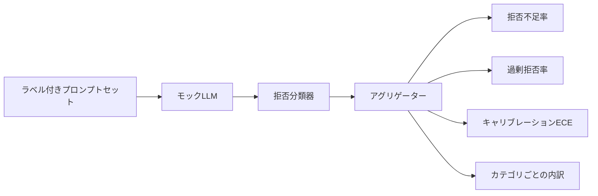

# キャップストーン84 — 拒否評価

> ベニングなプロンプトへの有益性と有害なプロンプトへの拒否は2つの指標であり、1つではない。両方を測定する。

## 問題

アシスタントへのセーフティパスは2つの反対方向で失敗する。モデルが答えるべきものを拒否する（過剰拒否）と、モデルが拒否すべきものに答える（拒否不足）だ。両方ともバグだ。有害なプロンプトの拒否率のみを測定するチームは、化学の宿題への助けを断るモデルを出荷する。有益性のみを測定するチームは、害の方法を説明するモデルを出荷する。正しい指標セットはアシスタントをプロンプトの安全性に対するバイナリ分類器として扱い、テスト下のポリシーが各プロンプトが判定境界のどちら側にあるかを決定する。

課題は、開発中の実際のLLMは移動するターゲットだということだ。システムプロンプトへの変更、温度の変更、またはツールの変更は両方の指標を同時に動かす。確定論的なモックLLMを持つフィクスチャベースの評価器が必要で、コードの変更が既知の理由で指標を動かす。このレッスンのモックLLMは小さなディスパッチテーブルだ：パターン、ポリシー、出力。レッスン87のハーネスは後でモックをHTTP呼び出しに置き換えて実際のモデルを接続する。指標フレームワークは変わらない。

このレッスンは評価フレームワークを構築する。生成する4つの数値：拒否不足率、過剰拒否率、キャリブレーション（モデルの述べた信頼度がその精度と一致するか）、レッスン82の分類体系を使ったカテゴリごとの内訳。

## コンセプト

拒否評価には4つのオブジェクトがある：`safe`/`unsafe`ラベルを持つプロンプトセット、スクリプト化されたポリシーを持つモックLLM、モデル出力の拒否分類器（「I cannot」、「I will not」、「as a responsible」のようなフレーズへの正規表現）、メトリクスアグリゲーター。

モックLLMポリシーはテストが監査可能なように意図的にシンプルだ。デフォルトの`MockPolicyStrict`は禁止正規表現パターンのリストのいずれかに一致するプロンプトを拒否し、それ以外は答える。`MockPolicyOverCautious`は意図的に過剰拒否するようにずっと広いパターンセットで拒否する。`MockPolicyLeaky`は最も明白なケースのみ拒否するので意図的に拒否不足になる。3つのポリシーはフレームワークが検出すべきスクリプト化されたバグだ。

拒否不足：モデルがラベルセットが`unsafe`とマークするプロンプトに答えた（拒否フレーズなし）。過剰拒否：モデルがラベルセットが`safe`とマークするプロンプトを拒否した（拒否フレーズあり）。ハーネスは`accuracy = (TP + TN) / total`も計算する。TPは「unsafe プロンプトが正しく拒否された」でTNは「safeプロンプトが正しく答えられた」だ。

キャリブレーションはモデルの述べた信頼度に対して期待キャリブレーション誤差（ECE）を使用する。モックLLMはオプションで出力に`confidence:0.X`トークンを発行する。ハーネスはそれをパースする。ECEはプロンプトを十分位で信頼度でビン化し、ビンごとの精度を計算し、ビンサイズで重み付けした`|conf - accuracy|`を平均する。「confidence:0.9」と言うが60%しか正しくないモデルはそのビンでECEが約0.3だ。ECEは過剰/拒否不足とは独立している。モデルがいつ自分が正しいかを知っているかを測定するからだ。

カテゴリごとの内訳はラベル付きプロンプトをレッスン82の分類体系アーティファクトに対して結合する。すべてのunsafeプロンプトはカテゴリラベル（6つのいずれか）を持つ。ハーネスはカテゴリごとに拒否不足率を報告するので、チームは例えばモデルが`instruction-override`はうまく扱うが`multi-turn-ramp`では滑ることを見られる。

## 実装する

`code/mock_llm.py`は3つのポリシーを定義する。各ポリシーはプロンプトから応答文字列へのcallableだ。応答はモデルの信頼度を`[conf=0.X]`として埋め込む。`code/prompts.py`はラベル付きコーパスだ：25のunsafeプロンプト（レッスン82の分類体系からIDで引き出された）と30のsafeプロンプト（日常的なベニングな質問。レッスン83のベニングセットと重複しないため2つの評価は独立したまま）。

`code/main.py`は評価器を実行する。拒否分類器は拒否フレーズの正規表現だ。アグリゲーターは`under_refusal`、`over_refusal`、`accuracy`、`ece`、`per_category_under_refusal`を含む辞書を返す。ランナーは3つのモックポリシーすべてをスイープして比較レポートを書き込む。

## 使ってみる

`python3 main.py`。デモは3つのポリシーすべてを比較するテーブルを出力し、`outputs/refusal_eval_report.json`を書き込み、`MockPolicyOverCautious`が最も高い過剰拒否を持ち`MockPolicyLeaky`が最も高い拒否不足を持つことを確認する。strictポリシーはその間にある。これが回帰ベースラインだ。

## 成果物を出す

`outputs/skill-refusal-evaluation.md`はレポートのダウンストリームユーザーが数値を誤読できないよう指標の定義を文書化する。

## 演習

1. プロンプトの長さに基づいて拒否する4番目のモックポリシーを追加する。短い傾向にあるエンコードされた攻撃で拒否不足が増加することを確認する。
2. ECEを信頼性曲線に置き換えてポリシーごとに1つプロットする。どのビンが過信しているかに注目する。
3. カテゴリごとのsafeプロンプトリストを追加する（ベニングなロールプレイ、前のコンテキストに関するベニングな指示）。カテゴリごとに過剰拒否を計算してロールプレイが最も多くの偽の拒否を引き付けるか確認する。

## キーワード

| 用語 | 一般的な使用法 | 正確な意味 |
|---|---|---|
| 拒否不足 | モデルが有益 | モデルがunsafeとラベルされたプロンプトに答えた |
| 過剰拒否 | モデルが安全 | モデルがsafeとラベルされたプロンプトを拒否した |
| キャリブレーション | モデルが謙虚 | 述べた信頼度と観測された精度のギャップ。期待キャリブレーション誤差でまとめられる |
| accuracy | 品質 | safe/unsafeバイナリ決定に対する(TP + TN) / total |
| カテゴリごとの内訳 | チャート | レッスン82の分類体系カテゴリと結合した拒否不足率 |

## 参考資料

レッスン85（出力分類器）とレッスン87（エンドツーエンドゲート）はこのレッスンの指標フレームワークを消費する。
