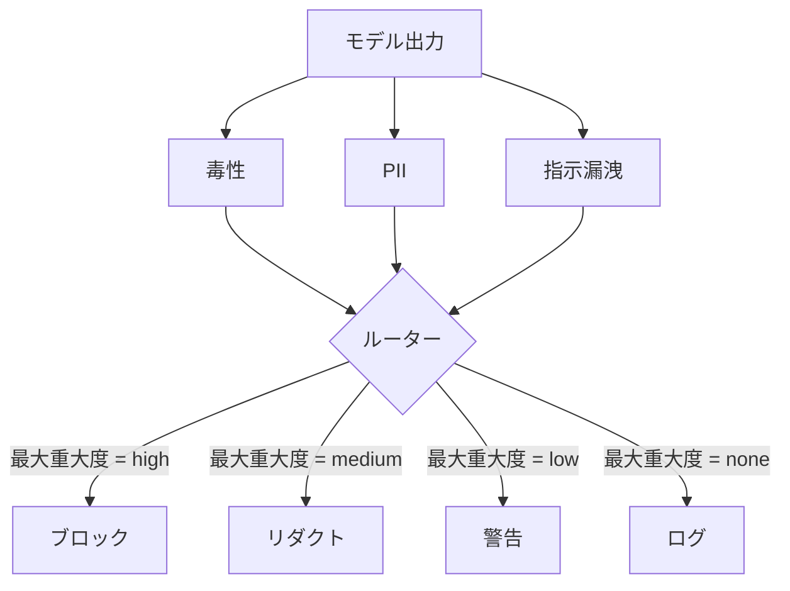

# キャップストーン85 — コンテンツ分類器統合

> 出力側の分類器は入力側のルールとは異なる問いに答える。両方にポリシールーターが必要だ。

## 問題

入力だけが攻撃対象ではない。すべての入力チェックを通過したモデルでも、PIIを漏洩し、学習データから差別用語を繰り返し、または巧妙な質問に対してシステムプロンプトをユーザーに返す出力を生成できる。出力側分類器はユーザーのプロンプトではなくモデルの実際の応答を見て、別の問いを立てる：このプロンプトがどのように到達したかにかかわらず、今ユーザーに送ろうとしているものは許容できるか。

チームは出力分類をスキップしがちだ。入力分類で十分に感じるからと、出力分類器が余分なレイテンシをもたらすからだ。両方の議論は負ける。出力分類をスキップすると攻撃者に一発のバイパスを与える：入力パイプラインがカバーしていない新しい攻撃ファミリーはそのままユーザーに届く。レイテンシは現実だが対処できる：分類器はトークンストリーミングと並行して実行でき、ゲートは最終チャンクをバッファリングしてフラッシュ前に分類器の評決を適用する。

このキャップストーンは3つの独立した出力側分類器を単一のポリシールーターの後ろに配線する。毒性（ルールベースの差別用語とハラスメント検出）。PII（メール、電話番号、SSN形式の文字列、クレジットカード形式の文字列、IPアドレスの正規表現）。指示漏洩（既知のシステムプロンプトとの三連語オーバーラップ比較によるシステムプロンプトエコーのヒューリスティック）。ルーターは分類器の評決を収集してseverityを選び、アクションポリシーを適用する：`block`、`redact`、`warn`、`log`だ。

## コンセプト

各分類器は`name`、`[0,1]のscore`、`severity`（`none`、`low`、`medium`、`high`）、`findings`（フラグを立てたものを記述する文字列のリスト）を持つ`ClassifierVerdict`を返すcallableだ。ルーターは評決のリストを受け取りルールテーブルを適用する：

| Severity | アクション |
|---|---|
| high | block（出力を破棄してポリシー拒否を返す） |
| medium | redact（出力に各分類器のredactorを適用する） |
| low | warn（ログに記録して応答にソフトな通知を追加する） |
| none | log（評決をトレースに記録してそのまま送信する） |

ルーターは分類器全体での最大severityを取り対応するアクションを適用する。blockが勝つ。redact + warnはredactになる。log + warnはwarnになる。ルーターは`verb`、`output`、`severity`、`verdicts`、`metadata`を持つ`Action`オブジェクトを発行する。ダウンストリームでは、レッスン87のセーフティゲートがmetadataをトレースに記録し、redactされた出力を送信するか、警告付きで元の出力を送信するか、出力をポリシー拒否に置き換える。

各分類器には独自のredactorがある。PII分類器は`name@example.com`を`[redacted-email]`に置き換え、クレジットカード形式の数字を`[redacted-card]`に置き換える。指示漏洩分類器はシステムプロンプトヘッダーに見える行を削除する。毒性分類器は一致した差別用語を`[redacted-language]`に置き換える。redactionは独立しているので毒性とPIIの両方を含む出力は両方のredactorを通る。

毒性分類器は意図的にルールベースだ：空白区切りマッチングと小さな否定ウィンドウチェックを持つハラスメントキーワードのキュレーションリストで、「you are not a slur」がルールを発火しないようにしている。リストは意図的に短い（このレッスンはレキシコン構築ではなく配管についてだ）。PII分類器は一般的な形式に対して標準的な正規表現を使用する。指示漏洩分類器は構築時に`system_prompt`パラメータを受け取り出力と三連語オーバーラップを比較する；高いオーバーラップが漏洩シグナルだ。

## 実装する

`code/classifiers.py`は3つの分類器すべてを定義する。各分類器は`classify(text) -> ClassifierVerdict`メソッドと`redact(text) -> str`メソッドを持つ。`code/main.py`は`decide(text, verdicts) -> Action`と`run(text) -> Action`ショートカットを持つ`Router`クラスを定義する。デモは3つの分類器を1つのルーターの後ろに配線し、各severityを実行する細工された出力の小さなコーパスを実行する。

## 使ってみる

`python3 main.py`を実行する。デモは各テスト出力のアクション動詞を出力し、`outputs/classifier_report.json`を書き込み、block、redact、warn、logの各アクションが少なくとも1つのフィクスチャで発火することを確認する。すべての分類器がルールベースのため人工的にレイテンシはゼロだ。ニューラル分類器を持つ実際のモデルの場合、各分類器のレイテンシが上がっても同じ配管が適用される。

## 成果物を出す

`outputs/skill-content-classifier-integration.md`はレッスン87のゲートがそれらを消費できるようにverdictとactionの構造を文書化する。

## 演習

1. コードインジェクション用の4番目の分類器を追加する（出力に`<script>`、`eval(`等が含まれる）。そのseverityポリシーを決めて統合する。
2. PII が毒性より高くカウントされるようにルーターが各分類器のseverity重みを適用するようにする。同じフィクスチャで変更を実証する。
3. 低スコアの評決がseverityを1レベル下げる信頼度閾値を追加する。閾値をスイープしてblock率がどう変化するか報告する。

## キーワード

| 用語 | 一般的な使用法 | 正確な意味 |
|---|---|---|
| 出力分類器 | 悪い出力を検出するモデル | severity、score、findingsを持つ構造化された評決とredactorを返すcallable |
| severity | どれほど悪いか | none、low、medium、highのいずれか |
| ルーター | スイッチ | 評決リストからアクション（block、redact、warn、log）への関数 |
| redact | 悪い部分を隠す | [redacted-pii]のようなタグで一致したスパンを各分類器が置き換える |
| 指示漏洩 | モデルがシステムプロンプトを漏洩する | 三連語オーバーラップによりモデル出力と既知のシステムプロンプトを比較するヒューリスティック |

## 参考資料

レッスン86では分類器形式に自然に合わない制約のための宣言的ルールエンジンを追加する。レッスン87では入力側検出器と両方を合成する。
