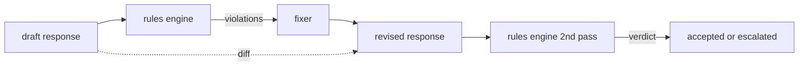

# キャップストーン86 — 憲法的ルールエンジン

> ルールとは、名前・述語・説明の3つで構成されるものだ。そのどれかが欠けていれば、それはルールではなく雰囲気にすぎない。


## 問題の背景

分類器は「よくある失敗」をカバーする。ルールエンジンは「契約的な失敗」をカバーする。コーディングアシスタントを開発するチームは、「コードを含むすべての応答は、実行可能なブロックか明示された仮定で終わらなければならない」といった制約を必要とする。カスタマーサポートボットを運用するチームは、「すべての拒否応答は次のステップを提示しなければならない」という要件を持つ。こうした制約は分類器の対象には自然に合わない。それらは応答・会話・システムポリシーに対する述語であり、エンジニア以外のメンバーも読めるものでなければならない。

正直な実装は宣言的ファイルだ。「憲法」はコードの隣にYAMLとしてバージョン管理され、独立したレビュープロセスを持つ。各ルールは `name`・`predicate`・`severity`・`explanation` テンプレートを持つ。エンジンはそのファイルをロードし、各ルールを候補出力に対して評価し、発火したルールごとに構造化された `Violation` を返す。このキャップストーンのルールエンジンは、`all_of`・`any_of`・`not_` で述語を合成するため、「応答にコードが含まれる場合、実行可能なブロックで終わり、かつ内部専用ライブラリを参照してはならない」といった単一ルールで複合条件を表現できる。

もう一つの柱は修正だ。ブロックするだけのルールエンジンは半分しか完成していない。修正案を提示するルールエンジンは運用上有用だ。アシスタントが応答を草案し、エンジンが違反を検出し、フィクサーが修正版を生成し、エンジンが修正後も規則を満たしているか確認する。このレッスンでは最小限のフィクサー（ルールごとの正規表現置換）と、草案と修正版の間の構造化差分（行単位の追加・削除・編集）を実装する。

## コンセプト



ルールの形式は次のとおりだ。

```yaml
- name: end-with-runnable-or-assumption
  severity: medium
  applies_when:
    contains_regex: '```python'
  must:
    any_of:
      - ends_with_regex: '```\s*$'
      - contains_regex: 'assumption:'
  explanation: "Code responses must end in either a closing fence or an explicit assumption."
  fix:
    append_if_missing: "\n\nAssumption: example inputs are valid."
```

述語はアトミックだ: `contains_regex`・`not_contains_regex`・`ends_with_regex`・`starts_with_regex`・`max_words`・`min_words`。合成演算子は `all_of`・`any_of`・`not_` だ。エンジンはまず `applies_when` を評価し、そのルールが適用対象でなければ違反を `not_applicable` として記録する。適用対象の場合は `must` を評価し、`pass` または `violation` を生成する。

重大度は `low`・`medium`・`high` の3段階で、レッスン85に対応する。ダウンストリームのゲート（レッスン87）は、`high` のルール違反を `high` の分類器判定と同様に扱い、ブロックする。

フィクサーは宣言的な操作リストだ: `append_if_missing`・`prepend_if_missing`・`replace_regex`。各操作はルール名を変換処理にマッピングする。フィクサーはローカル編集に意図的に限定されている。構造的な書き換えは、ここでは扱わない別の拒否・支援レイヤーに属する。

差分は元の草案と修正版の間で計算される。`op`（add・remove・edit）と対象テキストを持つ `Change` レコードのリストだ。ダウンストリームのゲートは差分をログに残し、人間のレビュアーが時系列でフィクサーの挙動を監査できる。

## 実装する

`code/rules.yml` に憲法が格納される。`code/main.py` のローダーは、PyYAMLが利用可能な場合はYAMLファイルを、そうでない場合はJSONファイル（標準ライブラリ）を受け付ける。レッスンには、レッスンのテストが両コードパスで解析する `rules.yml` が同梱されている。`code/main.py` は `Engine` クラス・`Fixer` クラス・`diff` 関数を定義する。合成は `any_of` の短絡評価を使って再帰的に評価される。

同梱される憲法の内容:

- `no-empty-refusal`（medium）— 拒否応答には提案またはリダイレクトを含めなければならない
- `end-with-runnable-or-assumption`（medium）— コード応答はきれいに閉じなければならない
- `no-pii-in-examples`（high）— サンプルデータにメールアドレスや電話番号の形式を含めてはならない
- `cite-when-asserting-fact`（low）— "According to" で始まる行には括弧書きの引用を含めなければならない
- `no-internal-library-leak`（high）— `internal-only` および `policybot-internal` という語句は出力に現れてはならない
- `bounded-length`（low）— 応答は800語を超えてはならない

## 使ってみる

`python3 main.py` を実行する。デモは3つの草案応答をエンジンに通し、違反を表示し、フィクサーを実行し、差分を表示して、`outputs/rules_report.json` に書き出す。1つのフィクスチャには適用外のルールがある（草案にコードブロックがない）ため、レポートにはそのルールの `not_applicable` が表示され、エンジンが明示的に評価したことがわかる。

## 成果物を出す

`outputs/skill-constitutional-rules-engine.md` にルールの文法とフィクサーの操作を文書化する。

## 演習

1. プロンプトに「safety」が含まれる場合、すべての応答に「If this is urgent」というフレーズを含めることを要求するルールを追加せよ。合成を使うこと。
2. 正規表現フィクサーを、名前付きスロットを持つテンプレートフィクサーに置き換えよ。新しい設計で書き直した1つのルールを例示すること。
3. 草案のコーパスを受け取り、ルールごとの違反率を返すメトリクスエンドポイントを追加し、どのルールが過剰に発火しているかをチームが確認できるようにせよ。

## キーワード

| 用語 | 一般的な使われ方 | 正確な意味 |
|---|---|---|
| constitution（憲法） | 漠然としたポリシー文書 | 述語・重大度・説明を持つルールのYAMLファイル |
| predicate（述語） | チェック | テキストからboolへの呼び出し可能なもの。アトミックまたはall_of/any_of/not_による合成 |
| violation（違反） | 失敗 | ルール名・重大度・説明・マッチしたスパンを持つ構造化レコード |
| fixer（フィクサー） | モデルのファインチューン | 草案を修正版にマッピングする、ルールごとの決定論的変換 |
| diff（差分） | 文字列比較 | 草案と修正版の間のadd・remove・edit操作の構造化リスト |

## 参考資料

レッスン87では、このエンジンを入力側の検出器と出力側の分類器と組み合わせて、単一のセーフティゲートを構成する。
