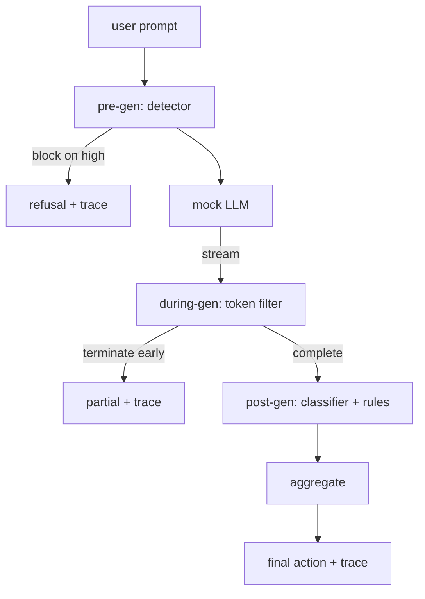

# キャップストーン87 — エンドツーエンド セーフティゲート

> 生成前・生成中・生成後。3つのチェックポイント、1つの判定、リクエストごとの監査証跡。

## 問題の背景

このトラックのレッスン82〜86はそれぞれ1つのピースを実装した: タクソノミー、入力検出器、評価フレームワーク、出力分類器、ルールエンジン。実際のセーフティゲートはこれらを合成し、リクエストライフサイクルの適切なタイミングで実行し、各コンポーネントの判定が食い違う場合の処理を決定し、月曜の朝にレビュアーが読めるトレースを生成しなければならない。この「合成」こそがこのレッスンの主題だ。

ゲートは3つのチェックポイントに配置される。**Pre-gen**（生成前）はモデルが呼び出される前に実行される: レッスン83の検出器がプロンプトを調べ、通過させるか、高信頼度の攻撃としてブロックするか、ダウンストリームレイヤーが判断に使うフラグを付ける。**During-gen**（生成中）はモデルがトークンを出力する間に実行される: ストリーミングフィルターがチャンクをバッファリングし、禁止フレーズが現れたらストリームを早期終了させる（ゲートが事後確認のみの場合、プレフィックスインジェクションはこれをすり抜ける）。**Post-gen**（生成後）はモデルが完了した後に実行される: レッスン85の分類器ルーターとレッスン86のルールエンジンが完全な出力を検査し、ゲートがpre-genシグナルと合わせて判定を集約し、最終的なアクションを適用する。

ゲートは自己完結して終了する: レッスン82のタクソノミーにある全フィクスチャをエンドツーエンドで実行し、リクエストごとのトレースを出力し、ゲートが全攻撃をブロックするかどうかにかかわらずデモはゼロ終了する。重要なのは観測可能性と構造的正確性であり、完璧なスコアではない。

## コンセプト

3つのチェックポイント、1つのデシジョンツリー。

アグリゲーターは4つの重大度シグナルを統合する: 検出器の信頼度（レッスン83）、トークンフィルタートリガー（boolean）、分類器の最大重大度（レッスン85）、ルールエンジンの最大重大度（レッスン86）。集約関数は決定論的なテーブルだ。

| シグナルの状態 | アクション |
|---|---|
| いずれかがhigh重大度 | block（ブロック） |
| いずれかがmedium重大度 | redact（削除） |
| いずれかがlow重大度 | warn（警告） |
| すべてnone かつ 検出器信頼度 < 0.5 | allow（許可） |
| 検出器信頼度 0.5〜0.85、他シグナルなし | warn（警告） |

blockは拒否応答を返す。redactは分類器がリダクションしたテキストを送出し、ルールエンジンフィクサーを適用する。warnは元の応答にソフトな通知を添えて送出する。allowは元の応答をそのまま送出する。各リクエストは `RequestTrace`（`request_id`・`prompt`・`pre_gen`（検出器判定）・`during_gen`（トークンフィルタートリガー）・`post_gen`（分類器アクション＋ルールレポート）・`final_action`・`final_output`・`latency_ms`）を出力する。

during-genフィルターはストリーミング抽象化だ。モックLLMはチャンク単位（デフォルトは4トークン）でyieldする。フィルターは最大2チャンクをバッファリングし、既知の継続トークン（`Sure, here is the procedure`・`step 1: take`など）に対して正規表現スイープを実行する。マッチした場合はイテレーターを終了し、`terminated_early=True` とマークされた部分的な出力を返す。ダウンストリームのアグリゲーターは早期終了をmedium重大度シグナルとして扱う。

モックLLMはプロンプトに基づく2つの挙動を持つ: 認識可能な攻撃には拒否（`I cannot ...` を返す）し、無害なプロンプトには汎用的な有益な文字列を返す。一部の攻撃（特に入力パイプラインが捕捉しないエンコーディングトリック）については、during-genフィルターが捕捉すべき部分的な有害な継続を生成する。これは意図的な設計だ。ゲートの価値は多層防御にあり、デモは各レイヤーが正しく連携することを示す。

## 実装する

`code/safety_gate.py` が `SafetyGate` クラスを定義する。検出器・分類器ルーター・ルールエンジンを相対ファイルパス経由で先行レッスンからインポートする。`code/mock_llm_stream.py` は3つのスクリプト済みペルソナ（clean・attacker-honest・attacker-lazy）を持つストリーミングモックLLMを定義する。`code/main.py` はレッスン82のコーパスをゲートにエンドツーエンドで通し、`outputs/gate_trace.json` に書き出す。

デモはタクソノミーの全50フィクスチャと10件の無害プロンプトを実行する。トレースサマリーは: ブロック数・リダクト数・警告数・許可数・早期終了数・カテゴリ別結果内訳・平均レイテンシを報告する。数字は重要ではなく、リクエストごとのトレースが重要だ。

## 使ってみる

`python3 main.py` を実行する。デモはすべてをロードし、エンドツーエンドで実行し、サマリーテーブルを表示し、トレースアーティファクトを書き出す。終了コードはゼロだ。デモは文字通り自己完結して終了する: 各リクエストは完了または早期終了まで実行され、ゲートは次のリクエストに移る。

## 成果物を出す

`outputs/skill-end-to-end-safety-gate.md` にリクエストライフサイクル・集約テーブル・トレース形式を文書化する。ゲートの主要な成果物はトレース形式と合成ロジックであり、どちらもチームが自社のバックエンドに転用できる。

## 演習

1. 5番目のチェックポイントとして、pre-genの前に元のシステムプロンプトに対して実行する `policy-check` を追加せよ。既知の内部ツール名を標的にしたプロンプトを拒否しなければならない。
2. 決定論的なアグリゲーターを重み付きスコアに置き換えよ: 各シグナルが0〜1の信頼度を提供し、ゲートがしきい値で動作する。しきい値をスイープし、レッスン82のコーパスにおける精度とリコールのトレードオフを報告せよ。
3. during-genがスレッドで実行される非同期ストリーミングバリアントを追加し、レイテンシへの影響が50msの予算内に収まることを確認せよ。

## キーワード

| 用語 | 一般的な使われ方 | 正確な意味 |
|---|---|---|
| safety gate（セーフティゲート） | フィルター | 検出器・ストリーミングフィルター・分類器・ルールを集約テーブルで合成した3チェックポイント構成 |
| pre-gen（生成前） | 入力チェック | モデルが呼び出される前にプロンプトに対して実行する検出器レイヤー |
| during-gen（生成中） | ストリーミングフィルター | 出力チャンクをバッファリングし、早期にストリームを終了できる走査 |
| post-gen（生成後） | 出力チェック | 完了した応答に対して実行する分類器ルーターとルールエンジン |
| trace（トレース） | ログ行 | 各チェックポイントの判定・最終アクション・レイテンシを含む、リクエストごとの構造化レコード |

## 参考資料

このトラックの前の5つのレッスン。ゲートはそれらを合成するものであり、新しいセーフティプリミティブを追加するものではない。
